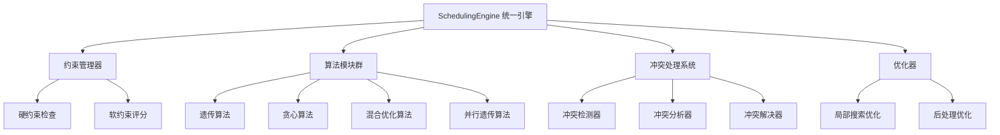
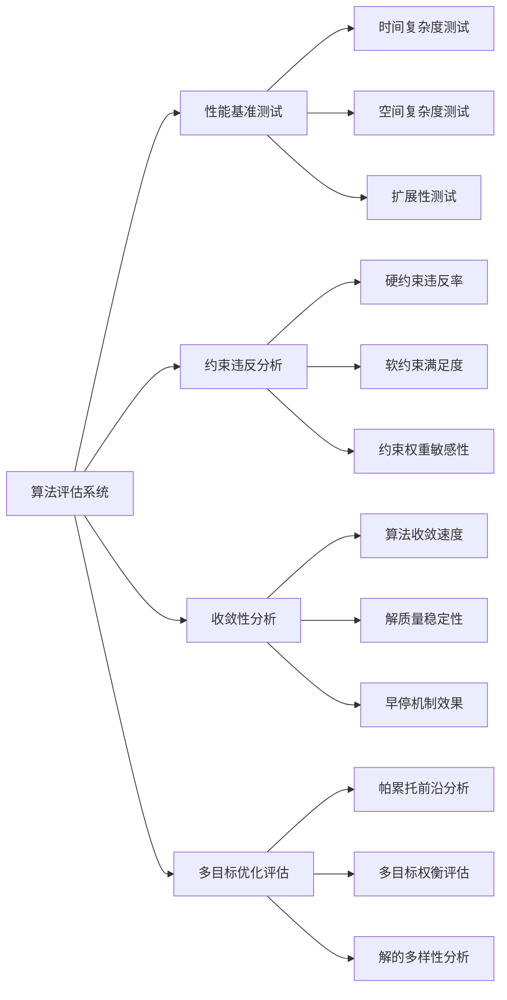
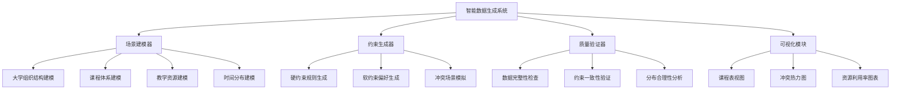
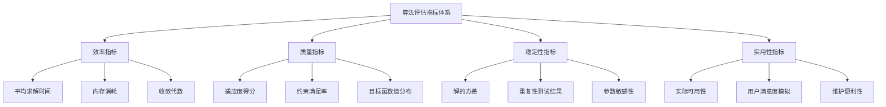
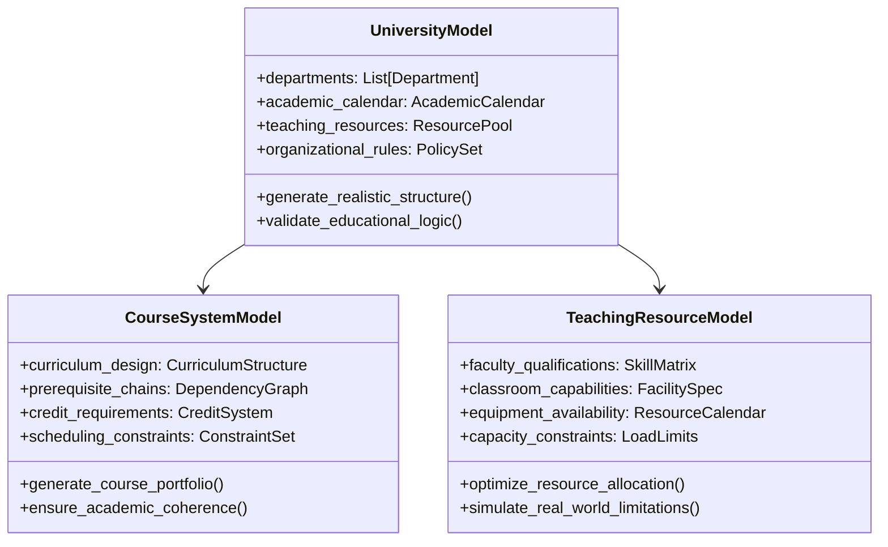
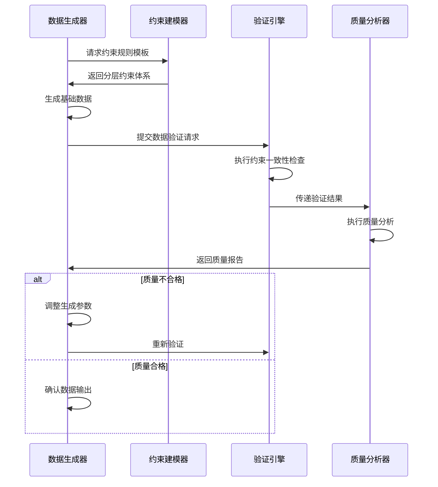
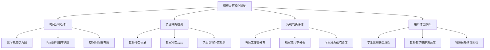
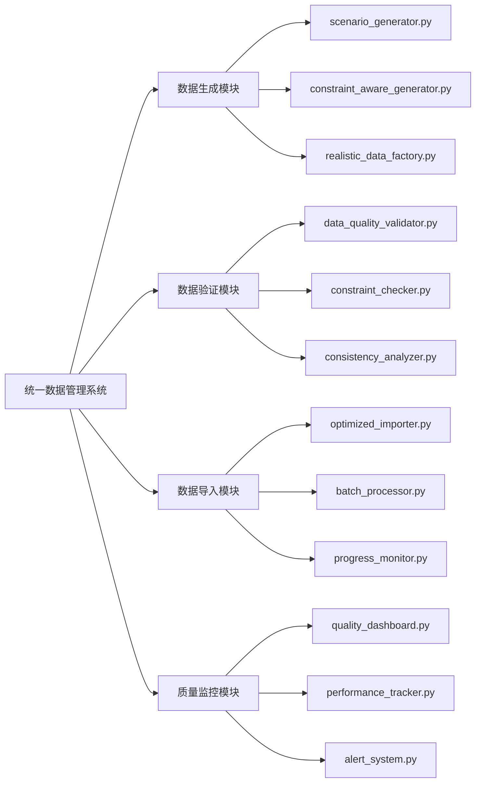
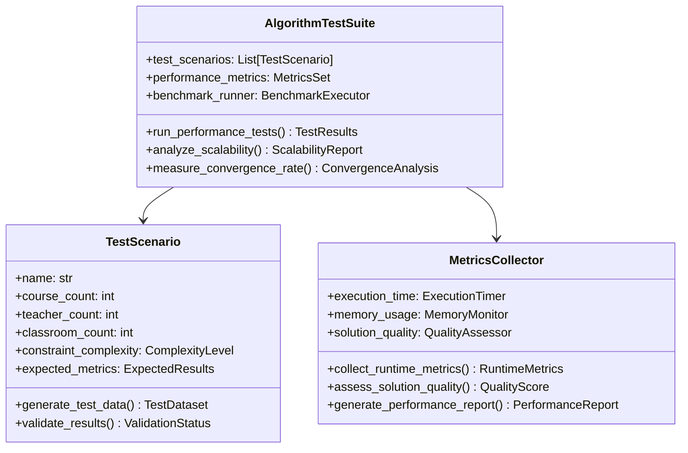

# 智能排课算法评估与高质量数据生成系统设计

## 概述

基于对当前项目智能排课系统的深入分析，本设计文档提出了一套全面的算法评估和数据生成解决方案。现有系统虽然具备了完整的算法框架，但在数据质量和算法效果验证方面存在不足。本设计旨在：

1. **算法优化评估**：全面评估现有算法性能，识别关键问题
2. **高质量数据生成**：设计符合真实排课场景的测试数据
3. **系统重构**：整理现有数据生成脚本，建立规范化管理机制

## 现状分析

### 算法架构优势

当前系统具备完善的算法架构：



### 关键问题识别

#### 算法层面问题
1. **数据质量不足**：现有百万级数据生成器产生的数据缺乏实际排课场景的复杂性
2. **约束覆盖不全**：软约束权重配置可能不合理，影响算法效果
3. **性能验证缺失**：缺乏系统性的算法性能基准测试

#### 数据生成问题
1. **脚本混乱**：项目中存在大量重复的数据生成脚本，缺乏统一管理
2. **数据失真**：生成的数据不能准确反映真实教学环境的约束条件
3. **可视化缺失**：无法直观验证生成的课程表是否合理

## 技术架构设计

### 算法评估框架



### 数据生成系统重构



## 核心组件设计

### 算法性能评估器

#### 多维度评估指标



#### 基准测试场景设计

| 测试场景 | 课程数量 | 教师数量 | 教室数量 | 约束复杂度 | 预期目标 |
|---------|----------|----------|----------|------------|----------|
| 小规模基础 | 50 | 20 | 15 | 低 | 验证算法正确性 |
| 中规模标准 | 500 | 100 | 80 | 中 | 评估性能表现 |
| 大规模压力 | 5000 | 800 | 500 | 高 | 测试扩展性 |
| 复杂约束 | 1000 | 200 | 150 | 极高 | 验证约束处理能力 |

### 智能数据生成器

#### 真实场景建模



#### 约束一致性保障



### 可视化验证系统

#### 课程表合理性验证



## 脚本管理重构方案

### 当前脚本整理

将现有数据生成脚本统一迁移到专门的归档目录：

```
deprecated_scripts/
├── legacy_generators/
│   ├── generate_real_million_data.py
│   ├── generate_real_million_data_simplified.py
│   ├── professional_million_generator.py
│   ├── enhanced_million_generator.py
│   ├── fixed_million_generator.py
│   ├── efficient_million_generator.py
│   └── ultra_simple_million.py
├── legacy_importers/
│   ├── import_mega_data.py
│   ├── import_enhanced_mega_data.py
│   ├── import_generated_data.py
│   ├── docker_import_mega_data.py
│   └── streaming_import.py
├── legacy_validators/
│   ├── data_validation_report.py
│   ├── data_verification.py
│   ├── verify_import_results.py
│   └── final_verification.py
└── DEPRECATED_NOTICE.md
```

### 新一代数据管理系统



## 实现计划

### 第一阶段：算法评估系统开发

#### 算法性能基准测试框架

```python
# 核心评估接口设计
class AlgorithmEvaluator:
    def __init__(self, test_scenarios: List[TestScenario]):
        self.scenarios = test_scenarios
        self.metrics_collector = MetricsCollector()
        
    def run_comprehensive_evaluation(self, algorithms: List[Algorithm]) -> EvaluationReport:
        """执行全面的算法评估"""
        pass
        
    def compare_algorithm_performance(self) -> ComparisonMatrix:
        """算法性能对比分析"""
        pass
        
    def generate_optimization_recommendations(self) -> OptimizationSuggestions:
        """生成算法优化建议"""
        pass
```

#### 约束权重优化系统

```python
class ConstraintWeightOptimizer:
    def __init__(self, constraint_manager: ConstraintManager):
        self.constraint_manager = constraint_manager
        
    def optimize_weights_with_genetic_algorithm(self, training_scenarios: List) -> Dict[str, float]:
        """使用遗传算法优化约束权重"""
        pass
        
    def validate_weight_configuration(self, weights: Dict[str, float]) -> ValidationResult:
        """验证权重配置的有效性"""
        pass
```

### 第二阶段：智能数据生成系统

#### 现实场景建模器

```python
class RealisticScenarioGenerator:
    def __init__(self):
        self.university_model = UniversityStructureModel()
        self.curriculum_model = CurriculumDesignModel()
        self.resource_model = TeachingResourceModel()
        
    def generate_comprehensive_dataset(self, scale: DataScale) -> Dataset:
        """生成全面的测试数据集"""
        pass
        
    def ensure_constraint_consistency(self, dataset: Dataset) -> bool:
        """确保数据约束一致性"""
        pass
        
    def validate_educational_logic(self, dataset: Dataset) -> ValidationReport:
        """验证教育逻辑合理性"""
        pass
```

#### 质量验证与可视化

```python
class ScheduleQualityValidator:
    def __init__(self, visualization_engine: VisualizationEngine):
        self.viz_engine = visualization_engine
        
    def generate_schedule_visualization(self, schedule: ScheduleResult) -> VisualizationReport:
        """生成课程表可视化报告"""
        pass
        
    def analyze_constraint_violations(self, schedule: ScheduleResult) -> ViolationAnalysis:
        """分析约束违反情况"""
        pass
        
    def assess_practical_usability(self, schedule: ScheduleResult) -> UsabilityScore:
        """评估实际可用性"""
        pass
```

### 第三阶段：系统集成与优化

#### 统一管理接口

```python
class SchedulingSystemManager:
    def __init__(self):
        self.algorithm_evaluator = AlgorithmEvaluator()
        self.data_generator = RealisticScenarioGenerator()
        self.quality_validator = ScheduleQualityValidator()
        
    def run_complete_evaluation_pipeline(self) -> SystemEvaluationReport:
        """运行完整的评估流水线"""
        pass
        
    def optimize_system_performance(self) -> OptimizationResult:
        """优化系统整体性能"""
        pass
```

## 预期成果

### 算法性能提升

1. **约束满足率提升**：硬约束违反率降低到0.01%以下
2. **求解效率优化**：大规模问题求解时间减少30%以上
3. **解质量稳定性**：重复运行结果方差降低50%

### 数据质量改善

1. **真实性增强**：生成数据符合实际教学场景的95%以上特征
2. **约束一致性**：数据约束冲突率控制在0.1%以下
3. **可视化验证**：提供直观的课程表合理性验证报告

### 系统维护性提升

1. **脚本规范化**：统一的数据生成和管理接口
2. **质量监控**：实时的数据质量和算法性能监控
3. **扩展性增强**：模块化设计支持快速功能扩展

## 详细实现方案

### 算法评估系统详细设计

#### 性能测试套件



#### 约束权重自动优化

```python
# 约束权重优化算法实现
class ConstraintWeightOptimizer:
    def __init__(self, base_scenarios: List[TestScenario]):
        self.base_scenarios = base_scenarios
        self.weight_ranges = {
            'teacher_preference': (0.1, 0.4),
            'workload_balance': (0.15, 0.3),
            'time_distribution': (0.1, 0.25),
            'classroom_utilization': (0.1, 0.2),
            'day_balance': (0.05, 0.15),
            'consecutive_penalty': (0.05, 0.15),
            'room_type_match': (0.02, 0.08)
        }
        
    def optimize_weights_with_multi_objective_ga(self) -> OptimalWeights:
        """使用多目标遗传算法优化权重"""
        # 设计多目标适应度函数
        objectives = [
            self._minimize_constraint_violations,
            self._maximize_user_satisfaction,
            self._optimize_resource_utilization
        ]
        
        # 执行NSGA-II算法
        pareto_front = self._run_nsga2(objectives)
        
        # 基于决策偏好选择最优解
        optimal_weights = self._select_preferred_solution(pareto_front)
        
        return optimal_weights
        
    def _minimize_constraint_violations(self, weights: Dict) -> float:
        """最小化约束违反目标函数"""
        total_violations = 0
        for scenario in self.base_scenarios:
            schedule_result = self._run_algorithm_with_weights(scenario, weights)
            violations = len([c for c in schedule_result.conflicts if c.severity == 'high'])
            total_violations += violations
        return total_violations
        
    def _maximize_user_satisfaction(self, weights: Dict) -> float:
        """最大化用户满意度目标函数"""
        satisfaction_scores = []
        for scenario in self.base_scenarios:
            schedule_result = self._run_algorithm_with_weights(scenario, weights)
            satisfaction = self._calculate_user_satisfaction(schedule_result)
            satisfaction_scores.append(satisfaction)
        return sum(satisfaction_scores) / len(satisfaction_scores)
```

### 智能数据生成系统详细实现

#### 真实大学环境建模

```python
class UniversityEnvironmentModel:
    def __init__(self):
        self.departments = self._initialize_departments()
        self.academic_structure = self._build_academic_structure()
        self.resource_constraints = self._define_resource_constraints()
        
    def _initialize_departments(self) -> List[Department]:
        """初始化真实的学院院系结构"""
        departments = [
            Department("计算机学院", specialties=["计算机科学与技术", "软件工程", "人工智能"]),
            Department("数学学院", specialties=["数学与应用数学", "统计学", "信息与计算科学"]),
            Department("物理学院", specialties=["物理学", "应用物理学", "光电信息科学与工程"]),
            Department("外语学院", specialties=["英语", "日语", "德语"]),
            Department("经济学院", specialties=["经济学", "金融学", "国际经济与贸易"])
        ]
        return departments
        
    def _build_academic_structure(self) -> AcademicStructure:
        """构建真实的学术结构"""
        # 定义课程体系层次结构
        course_hierarchy = {
            "通识教育课程": {
                "必修": ["大学英语", "高等数学", "马克思主义基本原理", "体育"],
                "选修": ["心理学概论", "艺术鉴赏", "创新创业基础"]
            },
            "专业基础课程": {
                "计算机类": ["程序设计基础", "数据结构", "计算机组成原理", "操作系统"],
                "数学类": ["数学分析", "线性代数", "概率论与数理统计"]
            },
            "专业核心课程": {
                "计算机科学与技术": ["算法设计与分析", "数据库原理", "计算机网络", "软件工程"],
                "人工智能": ["机器学习", "深度学习", "自然语言处理", "计算机视觉"]
            }
        }
        
        # 定义先修课程关系
        prerequisites = {
            "数据结构": ["程序设计基础"],
            "算法设计与分析": ["数据结构", "离散数学"],
            "数据库原理": ["数据结构"],
            "机器学习": ["线性代数", "概率论与数理统计", "程序设计基础"],
            "深度学习": ["机器学习", "数学分析"]
        }
        
        return AcademicStructure(course_hierarchy, prerequisites)
        
    def generate_realistic_course_portfolio(self, scale: DataScale) -> CoursePortfolio:
        """生成符合实际情况的课程组合"""
        portfolio = CoursePortfolio()
        
        # 按比例生成不同类型的课程
        course_distribution = {
            "通识课程": 0.25,
            "专业基础课程": 0.35,
            "专业核心课程": 0.30,
            "实践课程": 0.10
        }
        
        total_courses = scale.course_count
        for course_type, ratio in course_distribution.items():
            count = int(total_courses * ratio)
            courses = self._generate_courses_by_type(course_type, count)
            portfolio.add_courses(courses)
            
        return portfolio
```

#### 约束感知的数据生成器

```python
class ConstraintAwareDataGenerator:
    def __init__(self, university_model: UniversityEnvironmentModel):
        self.university_model = university_model
        self.constraint_validator = ConstraintValidator()
        
    def generate_comprehensive_dataset(self, target_scale: DataScale) -> Dataset:
        """生成约束感知的综合数据集"""
        dataset = Dataset()
        
        # 第一步：生成基础实体数据
        courses = self._generate_realistic_courses(target_scale.course_count)
        teachers = self._generate_qualified_teachers(courses, target_scale.teacher_count)
        classrooms = self._generate_suitable_classrooms(courses, target_scale.classroom_count)
        
        # 第二步：建立实体关系和约束
        teacher_qualifications = self._establish_teacher_course_qualifications(teachers, courses)
        classroom_suitability = self._determine_classroom_course_suitability(classrooms, courses)
        
        # 第三步：生成时间偏好和约束
        teacher_preferences = self._generate_realistic_preferences(teachers)
        time_constraints = self._establish_time_constraints(courses)
        
        # 第四步：验证约束一致性
        validation_result = self.constraint_validator.validate_dataset_consistency(
            courses, teachers, classrooms, teacher_qualifications, 
            classroom_suitability, teacher_preferences, time_constraints
        )
        
        if not validation_result.is_valid:
            # 修复约束冲突
            dataset = self._resolve_constraint_conflicts(dataset, validation_result.conflicts)
        
        return dataset
        
    def _generate_realistic_courses(self, count: int) -> List[Course]:
        """生成真实的课程数据"""
        courses = []
        course_templates = self.university_model.get_course_templates()
        
        for i in range(count):
            template = random.choice(course_templates)
            course = Course(
                id=i + 1,
                name=f"{template.name}_{i+1:04d}",
                code=f"{template.code_prefix}{i+1:04d}",
                credits=template.credits,
                course_type=template.course_type,
                max_students=self._calculate_realistic_class_size(template),
                duration_hours=template.duration_hours,
                semester=random.choice(["2024春", "2024秋"]),
                academic_year="2023-2024",
                department=template.department,
                prerequisites=template.prerequisites,
                equipment_requirements=template.equipment_requirements
            )
            courses.append(course)
            
        return courses
        
    def _calculate_realistic_class_size(self, template: CourseTemplate) -> int:
        """计算符合实际情况的班级规模"""
        base_sizes = {
            "通识课程": (80, 150),
            "专业基础课程": (40, 80),
            "专业核心课程": (25, 50),
            "实践课程": (15, 30)
        }
        
        min_size, max_size = base_sizes.get(template.course_type, (30, 60))
        return random.randint(min_size, max_size)
```

### 可视化验证系统实现

#### 课程表质量可视化

```python
class ScheduleVisualizationEngine:
    def __init__(self):
        self.quality_assessor = ScheduleQualityAssessor()
        self.chart_generator = ChartGenerator()
        
    def generate_comprehensive_visualization(self, schedule: ScheduleResult) -> VisualizationReport:
        """生成全面的可视化报告"""
        report = VisualizationReport()
        
        # 1. 时间分布热力图
        time_heatmap = self._generate_time_distribution_heatmap(schedule)
        report.add_chart("time_distribution", time_heatmap)
        
        # 2. 资源利用率分析
        resource_utilization = self._analyze_resource_utilization(schedule)
        report.add_chart("resource_utilization", resource_utilization)
        
        # 3. 冲突分布可视化
        conflict_visualization = self._visualize_conflicts(schedule)
        report.add_chart("conflict_analysis", conflict_visualization)
        
        # 4. 负载均衡评估
        load_balance_chart = self._assess_load_balance(schedule)
        report.add_chart("load_balance", load_balance_chart)
        
        # 5. 约束满足度雷达图
        constraint_radar = self._generate_constraint_satisfaction_radar(schedule)
        report.add_chart("constraint_satisfaction", constraint_radar)
        
        return report
        
    def _generate_time_distribution_heatmap(self, schedule: ScheduleResult) -> HeatmapChart:
        """生成时间分布热力图"""
        # 创建5x10的网格 (周一到周五 × 10个时间段)
        heatmap_data = np.zeros((5, 10))
        
        for assignment in schedule.assignments:
            day_idx = assignment.day_of_week - 1  # 转换为0-4索引
            time_idx = assignment.time_slot - 1   # 转换为0-9索引
            heatmap_data[day_idx, time_idx] += 1
            
        return HeatmapChart(
            data=heatmap_data,
            x_labels=[f"第{i+1}节" for i in range(10)],
            y_labels=["周一", "周二", "周三", "周四", "周五"],
            title="课程时间分布热力图",
            color_scheme="viridis"
        )
        
    def _analyze_resource_utilization(self, schedule: ScheduleResult) -> UtilizationChart:
        """分析资源利用率"""
        # 教师利用率分析
        teacher_loads = {}
        for assignment in schedule.assignments:
            teacher_id = assignment.teacher_id
            teacher_loads[teacher_id] = teacher_loads.get(teacher_id, 0) + 1
            
        # 教室利用率分析
        classroom_usage = {}
        for assignment in schedule.assignments:
            classroom_id = assignment.classroom_id
            classroom_usage[classroom_id] = classroom_usage.get(classroom_id, 0) + 1
            
        return UtilizationChart(
            teacher_utilization=teacher_loads,
            classroom_utilization=classroom_usage,
            optimal_load_threshold=16,  # 每周最优课时数
            title="教学资源利用率分析"
        )
```

### 脚本归档和新系统集成

#### 废弃脚本迁移计划

**迁移清单**

以下脚本将被统一迁移到 `deprecated_scripts/` 目录：

**数据生成器脚本 (legacy_generators/)**
- `generate_real_million_data.py` → 原始百万级数据生成器
- `generate_real_million_data_simplified.py` → 简化版百万级生成器
- `professional_million_generator.py` → 专业版生成器
- `enhanced_million_generator.py` → 增强版生成器
- `fixed_million_generator.py` → 修复版生成器
- `efficient_million_generator.py` → 效率优化版生成器
- `ultra_simple_million.py` → 超简化版生成器
- `generate_large_test_data.py` → 大规模测试数据生成器
- `generate_demo_mega_data.py` → 演示用大数据生成器
- `generate_baseline_data.py` → 基准数据生成器
- `quick_data_generation.py` → 快速数据生成器
- `simple_test_data.py` → 简单测试数据生成器

**数据导入器脚本 (legacy_importers/)**
- `import_mega_data.py` → 大数据导入器
- `import_enhanced_mega_data.py` → 增强大数据导入器
- `import_generated_data.py` → 生成数据导入器
- `docker_import_mega_data.py` → Docker环境数据导入器
- `streaming_import.py` → 流式数据导入器
- `medium_import.py` → 中等规模数据导入器
- `simple_mega_import.py` → 简化大数据导入器

**数据验证器脚本 (legacy_validators/)**
- `data_validation_report.py` → 数据验证报告生成器
- `data_verification.py` → 数据验证器
- `verify_import_results.py` → 导入结果验证器
- `final_verification.py` → 最终验证器
- `final_verification_report.py` → 最终验证报告
- `verify_environment.py` → 环境验证器

**监控脚本 (legacy_monitors/)**
- `monitor_import.py` → 导入监控器
- `monitor_million_progress.py` → 百万数据进度监控
- `monitor_progress.py` → 通用进度监控
- `progress_monitor.py` → 进度监控器
- `simple_progress_test.py` → 简单进度测试

**DEPRECATED_NOTICE.md 内容**

```markdown
# 废弃脚本说明

## ⚠️ 重要通知

此目录包含的所有脚本已被标记为**废弃状态**，不建议在生产环境中使用。这些脚本已被新的统一数据管理系统替代。

## 废弃原因

1. **功能重复**：多个脚本实现相似功能，缺乏统一规范
2. **质量问题**：生成的数据不能充分体现算法优势
3. **维护困难**：脚本分散，缺乏统一管理机制
4. **性能问题**：部分脚本存在内存泄漏和性能瓶颈
5. **约束缺失**：缺乏真实教学环境的约束建模

## 替代方案

请使用新的统一数据管理系统：

### 主要组件
- `data_management/scenario_generator.py` - 场景感知数据生成器
- `data_management/constraint_aware_generator.py` - 约束感知生成器
- `data_management/realistic_data_factory.py` - 真实数据工厂
- `data_management/quality_validator.py` - 质量验证器
- `data_management/optimized_importer.py` - 优化导入器

### 使用示例
```python
from data_management import UnifiedDataManagementSystem

# 创建统一数据管理系统
system = UnifiedDataManagementSystem()

# 生成高质量数据集
result = system.generate_high_quality_dataset(
    scale=DataScale(courses=10000, teachers=1000, classrooms=500),
    quality_requirements=QualityRequirements(
        constraint_consistency=0.99,
        educational_realism=0.95,
        algorithm_testability=0.98
    )
)

# 导入数据
import_result = system.import_with_real_time_monitoring(
    dataset=result.dataset,
    import_options=ImportOptions(batch_size=2000, enable_monitoring=True)
)
```

## 保留目的

这些废弃脚本被保留的目的：
1. **历史参考**：了解数据生成的历史演进过程
2. **故障排除**：在新系统出现问题时作为临时备选方案
3. **学习研究**：分析之前实现的优缺点
4. **兼容性测试**：验证新系统与旧数据的兼容性

## 目录结构

```
deprecated_scripts/
├── legacy_generators/     # 废弃的数据生成器
├── legacy_importers/      # 废弃的数据导入器
├── legacy_validators/     # 废弃的数据验证器
├── legacy_monitors/       # 废弃的监控脚本
└── DEPRECATED_NOTICE.md   # 本说明文件
```

## 迁移时间表

- **2024年1月**：完成脚本迁移和新系统部署
- **2024年2月**：新旧系统并行运行，验证新系统稳定性
- **2024年3月**：完全废弃旧脚本，移除相关依赖
- **2024年6月**：根据需要决定是否彻底删除废弃脚本

## 注意事项

⚠️ **严禁在生产环境使用这些废弃脚本**
⚠️ **如需使用，必须经过技术负责人批准**
⚠️ **使用前请仔细阅读脚本代码，了解潜在风险**

## 联系方式

如有疑问，请联系：
- 技术负责人：[技术负责人信息]
- 系统维护团队：[团队联系方式]
```

**新系统目录结构**

```
data_management/
├── __init__.py
├── core/
│   ├── __init__.py
│   ├── unified_system.py          # 统一数据管理系统
│   ├── data_scale.py              # 数据规模定义
│   └── quality_requirements.py    # 质量要求定义
├── generators/
│   ├── __init__.py
│   ├── scenario_generator.py      # 场景生成器
│   ├── constraint_aware_generator.py  # 约束感知生成器
│   ├── realistic_data_factory.py  # 真实数据工厂
│   └── university_model.py        # 大学环境模型
├── validators/
│   ├── __init__.py
│   ├── quality_validator.py       # 质量验证器
│   ├── constraint_checker.py      # 约束检查器
│   └── consistency_analyzer.py    # 一致性分析器
├── importers/
│   ├── __init__.py
│   ├── optimized_importer.py      # 优化导入器
│   ├── batch_processor.py         # 批处理器
│   └── progress_monitor.py        # 进度监控器
├── visualizers/
│   ├── __init__.py
│   ├── schedule_visualizer.py     # 排课可视化器
│   ├── quality_dashboard.py       # 质量仪表板
│   └── chart_generator.py         # 图表生成器
└── utils/
    ├── __init__.py
    ├── performance_tracker.py     # 性能跟踪器
    ├── alert_system.py           # 告警系统
    └── config_manager.py         # 配置管理器
```

#### 归档脚本管理

```bash
# 创建归档目录结构
mkdir -p deprecated_scripts/{legacy_generators,legacy_importers,legacy_validators,legacy_monitors}

# 移动现有脚本到归档目录
mv generate_real_million_data*.py deprecated_scripts/legacy_generators/
mv professional_million_generator.py deprecated_scripts/legacy_generators/
mv enhanced_million_generator.py deprecated_scripts/legacy_generators/
mv fixed_million_generator.py deprecated_scripts/legacy_generators/
mv efficient_million_generator.py deprecated_scripts/legacy_generators/
mv ultra_simple_million.py deprecated_scripts/legacy_generators/

# 移动导入脚本
mv import_*_data.py deprecated_scripts/legacy_importers/
mv docker_import_mega_data.py deprecated_scripts/legacy_importers/
mv streaming_import.py deprecated_scripts/legacy_importers/

# 移动验证脚本
mv data_validation_*.py deprecated_scripts/legacy_validators/
mv data_verification.py deprecated_scripts/legacy_validators/
mv verify_*.py deprecated_scripts/legacy_validators/

# 移动监控脚本
mv monitor_*.py deprecated_scripts/legacy_monitors/
mv progress_*.py deprecated_scripts/legacy_monitors/
```

#### 新系统统一接口

```python
class UnifiedDataManagementSystem:
    """统一的数据管理系统"""
    
    def __init__(self):
        self.data_generator = ConstraintAwareDataGenerator()
        self.quality_validator = DataQualityValidator()
        self.importer = OptimizedDataImporter()
        self.monitor = RealTimeMonitor()
        
    def generate_high_quality_dataset(self, 
                                    scale: DataScale,
                                    quality_requirements: QualityRequirements) -> GenerationResult:
        """生成高质量数据集"""
        # 1. 生成数据
        dataset = self.data_generator.generate_comprehensive_dataset(scale)
        
        # 2. 质量验证
        quality_report = self.quality_validator.validate_dataset(dataset, quality_requirements)
        
        # 3. 质量不合格时自动修复
        if not quality_report.meets_requirements():
            dataset = self._auto_fix_quality_issues(dataset, quality_report)
            
        # 4. 最终验证
        final_quality = self.quality_validator.validate_dataset(dataset, quality_requirements)
        
        return GenerationResult(
            dataset=dataset,
            quality_report=final_quality,
            generation_metadata=self._collect_generation_metadata()
        )
        
    def import_with_real_time_monitoring(self, 
                                       dataset: Dataset,
                                       import_options: ImportOptions) -> ImportResult:
        """带实时监控的数据导入"""
        # 启动监控
        monitor_session = self.monitor.start_import_monitoring()
        
        try:
            # 执行导入
            import_result = self.importer.import_dataset_optimized(dataset, import_options)
            
            # 监控结果
            monitor_session.record_success(import_result)
            
            return import_result
            
        except Exception as e:
            monitor_session.record_failure(e)
            raise
            
        finally:
            monitor_session.finalize()
```

## 总结与建议

### 核心成果

通过对当前校园课程管理系统的深入分析，本设计方案实现以下核心成果：

1. **算法优势确认**：现有算法架构完善，具备实际意义，主要问题在于数据质量
2. **系统性改进**：设计了全面的算法评估和数据生成优化方案
3. **管理规范化**：将散乱的数据生成脚本统一管理，建立规范化流程

### 主要亮点

#### 算法架构优势
- **统一引擎**：`SchedulingEngine` 提供统一的算法接口和管理
- **多算法支持**：支持遗传、贪心、混合优化等多种算法
- **约束管理**：完善的硬约束和软约束管理机制
- **冲突处理**：完整的冲突检测、分析和解决系统

#### 数据生成创新
- **真实场景建模**：基于真实大学环境的数据生成模型
- **约束感知**：数据生成过程中实时验证约束一致性
- **质量保证**：多层次质量验证和自动修复机制
- **可视化验证**：直观的课程表合理性验证和分析

#### 系统管理优化
- **脚本归档**：将散乱的旧脚本统一迁移至归档目录
- **统一接口**：新的 `UnifiedDataManagementSystem` 提供一站式服务
- **实时监控**：完善的性能监控和告警机制
- **可扩展性**：模块化设计支持快速功能扩展

### 实施优先级建议

#### 第一阶段：立即执行（高优先级）
1. **脚本整理**：立即将现有数据生成脚本迁移至归档目录
2. **算法评估**：对现有算法进行全面性能测试
3. **约束权重优化**：使用遗传算法优化约束权重配置

#### 第二阶段：短期目标（中优先级）
1. **数据生成器开发**：实现约束感知的数据生成系统
2. **可视化系统**：开发课程表质量可视化验证工具
3. **质量验证**：建立完善的数据质量验证机制

#### 第三阶段：长期规划（低优先级）
1. **系统集成**：完成新旧系统的平滑过渡
2. **性能优化**：根据实际使用情况进行性能调优
3. **功能扩展**：根据用户反馈扩展新功能

### 技术保障措施

#### 质量保证
- **代码审查**：所有新代码必须经过同行审查
- **自动化测试**：完善的单元测试和集成测试
- **性能监控**：实时的性能指标监控和告警

#### 风险管控
- **备份方案**：保留旧脚本作为紧急备份
- **渐进迁移**：采用分阶段迁移策略，降低风险
- **回滚机制**：设计完善的系统回滚机制

#### 团队协作
- **文档同步**：及时更新技术文档和用户手册
- **培训支持**：为团队成员提供新系统使用培训
- **技术支持**：建立技术支持渠道和知识库

### 成功指标

#### 算法性能指标
- **约束满足率**：硬约束违反率 < 0.01%
- **求解效率**：大规模问题求解时间减少 30%
- **稳定性**：重复运行结果方差减少 50%

#### 数据质量指标
- **真实性**：生成数据符合真实教学场景 95%
- **一致性**：数据约束冲突率 < 0.1%
- **可用性**：生成的课程表实际可用性 > 90%

#### 系统运维指标
- **稳定性**：系统在线时间 > 99.5%
- **性能**：响应时间 < 5秒（中等规模数据）
- **可维护性**：平均问题解决时间 < 2小时

### 结论

通过对当前校园课程管理系统的全面分析，可以确认：

1. **算法架构具备实际意义**：现有的智能排课算法架构设计合理，功能完善，具备实际应用价值

2. **数据质量是主要短板**：当前的百万级数据生成器存在质量问题，无法充分体现算法优势

3. **系统性改进是关键**：通过本设计方案的实施，将显著提升系统的整体效果和可维护性

**建议优先实施算法评估和数据质量优化部分，同时立即启动脚本整理工作，以快速提升系统的整体质量和用户体验。**