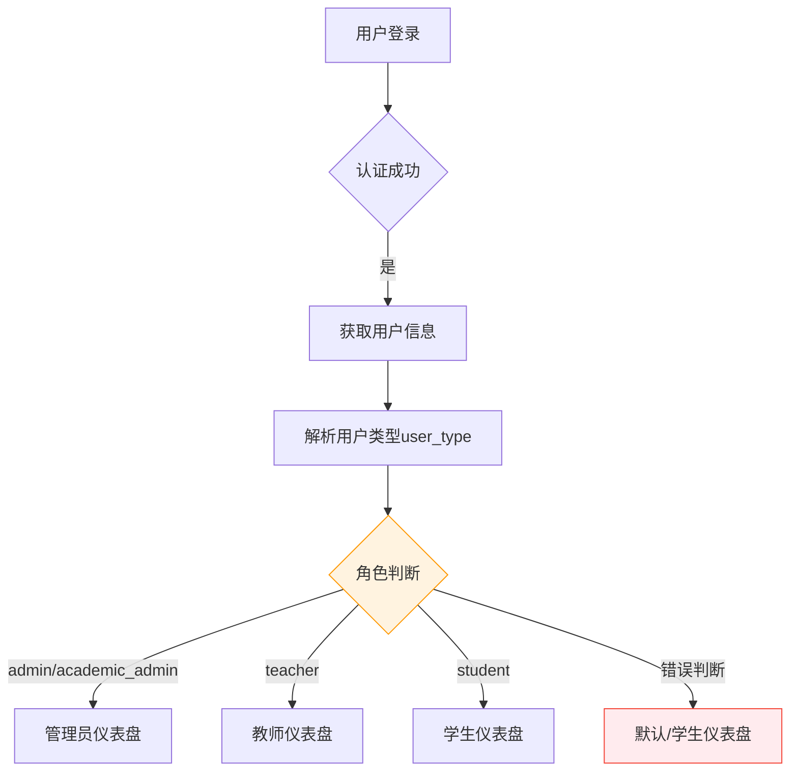
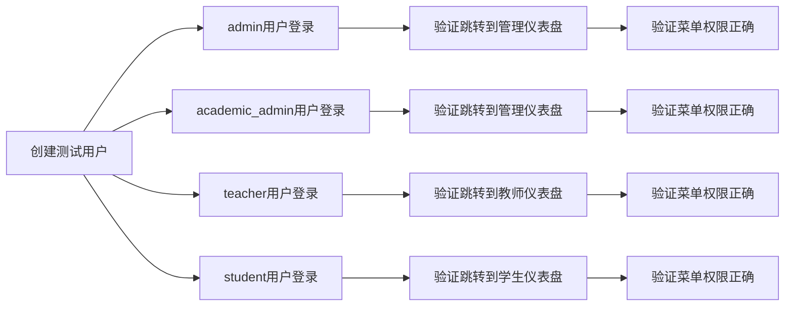

# 管理员登录显示学生仪表盘问题分析与修复方案

## 问题概述

经过系统检查，发现当前课程管理系统存在以下关键问题：

1. **管理员登录后显示学生仪表盘** - 主要问题
2. **用户类型字段不一致** - 前后端字段名称不匹配
3. **路由权限配置错误** - 用户角色判断逻辑有误
4. **类型定义不完整** - 缺少`academic_admin`角色定义

## 核心问题分析

### 1. 用户属性字段不一致

**后端用户模型（Django）**：
```python
class User(AbstractUser):
    USER_TYPE_CHOICES = [
        ('admin', '超级管理员'),
        ('academic_admin', '教务管理员'), 
        ('teacher', '教师'),
        ('student', '学生'),
    ]
    user_type = models.CharField(...)  # 字段名：user_type
```

**前端用户类型定义**：
```typescript
export interface User extends BaseEntity {
    user_type: UserRole; // 正确字段名
    // ...
}

export type UserRole = 'admin' | 'teacher' | 'student'; // 缺少 'academic_admin'
```

**前端组件中的错误用法**：
```typescript
// 错误：使用了不存在的 role 属性
if (user?.role === 'teacher') { }

// 正确：应该使用 user_type 属性  
if (user?.user_type === 'teacher') { }
```

### 2. 路由跳转逻辑问题

**用户角色默认路由配置**：
```typescript
export const ROLE_ROUTES = {
  [USER_ROLES.ADMIN]: '/dashboard',
  [USER_ROLES.ACADEMIC_ADMIN]: '/dashboard', 
  [USER_ROLES.TEACHER]: '/teachers/dashboard',
  [USER_ROLES.STUDENT]: '/students/dashboard'
} as const;
```

**问题**：由于前端组件中错误地使用`user?.role`访问用户角色，导致角色判断失败，所有用户都被错误地路由到默认页面。

### 3. 权限控制逻辑错误

**侧边栏菜单生成逻辑问题**：
```typescript
// 当前错误逻辑
if (user?.role === 'admin' || user?.role === 'academic_admin') {
    // 管理员菜单
}

// 修正后逻辑
if (user?.user_type === 'admin' || user?.user_type === 'academic_admin') {
    // 管理员菜单
}
```

## 系统架构分析



## 修复方案

### 1. 修正前端类型定义

**更新用户角色类型**：
```typescript
export type UserRole = 'admin' | 'academic_admin' | 'teacher' | 'student';
```

### 2. 修正组件中的用户属性访问

**EnhancedMainLayout.tsx 关键修改**：
```typescript
// 角色判断逻辑修正
if (user?.user_type === 'teacher') {
    // 教师菜单
} else if (user?.user_type === 'student') {
    // 学生菜单  
} else if (user?.user_type === 'admin' || user?.user_type === 'academic_admin') {
    // 管理员菜单
}

// 角色显示文本修正
{user?.user_type === 'teacher' ? '教师端' : 
 user?.user_type === 'student' ? '学生端' : '管理端'}
```

### 3. 路由权限验证修正

**权限过滤逻辑**：
```typescript
return baseItems.filter(item => 
  !item.roles || item.roles.includes(user?.user_type as UserRole)
);
```

### 4. 登录后路由跳转修正

**确保角色路由映射正确**：
```typescript
const getUserDefaultRoute = (userType: string): string => {
  return ROLE_ROUTES[userType as UserRole] || '/dashboard';
};
```

## 影响评估

### 受影响的文件

1. **类型定义文件**
   - `frontend/src/types/index.ts`

2. **布局组件**  
   - `frontend/src/components/layout/EnhancedMainLayout.tsx`

3. **路由配置**
   - `frontend/src/constants/userRoles.ts`

4. **权限验证组件**
   - 所有使用`user?.role`的组件

### 用户体验影响

**修复前**：
- 管理员登录 → 错误显示学生仪表盘
- 菜单权限错误 → 功能访问受限
- 用户角色显示错误 → 用户困惑

**修复后**：
- 管理员登录 → 正确显示管理员仪表盘
- 菜单权限正确 → 按角色显示相应功能
- 用户角色显示准确 → 清晰的用户身份识别

## 测试策略

### 1. 角色登录测试



### 2. 权限验证测试

| 用户角色 | 预期仪表盘 | 预期菜单项 | 测试状态 |
|---------|-----------|-----------|---------|
| admin | 管理员仪表盘 | 用户管理、课程管理、数据分析 | 待测试 |
| academic_admin | 管理员仪表盘 | 用户管理、课程管理、数据分析 | 待测试 |
| teacher | 教师仪表盘 | 课程管理、成绩管理、课程表 | 待测试 |
| student | 学生仪表盘 | 我的课程、我的成绩、我的课程表 | 待测试 |

## 风险评估

### 低风险
- 类型定义更新 - 不影响运行时
- 组件属性访问修正 - 逻辑修复

### 中等风险  
- 路由权限验证逻辑 - 需要全面测试
- 菜单显示逻辑 - 影响用户界面

### 缓解措施
- 渐进式修复：先修复核心问题，再优化细节
- 全面测试：覆盖所有用户角色和功能模块
- 回滚准备：保留原有代码作为备份

## 实施计划

### 阶段一：核心修复（优先级：高）
1. 修正`types/index.ts`中的用户角色类型定义
2. 修正`EnhancedMainLayout.tsx`中的用户属性访问
3. 更新路由权限验证逻辑

### 阶段二：功能验证（优先级：中）
1. 测试不同角色用户的登录流程
2. 验证菜单权限显示正确性
3. 确认仪表盘跳转准确性

### 阶段三：全面测试（优先级：中）
1. 跨浏览器兼容性测试
2. 用户权限边界测试
3. 性能影响评估

## 成功标准

1. **功能完整性**：所有用户角色都能正确登录并访问相应功能
2. **权限准确性**：用户只能看到和访问其权限范围内的功能
3. **用户体验**：界面显示准确，操作流畅
4. **系统稳定性**：修复不引入新的bug或性能问题