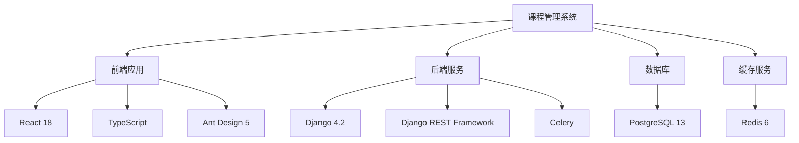
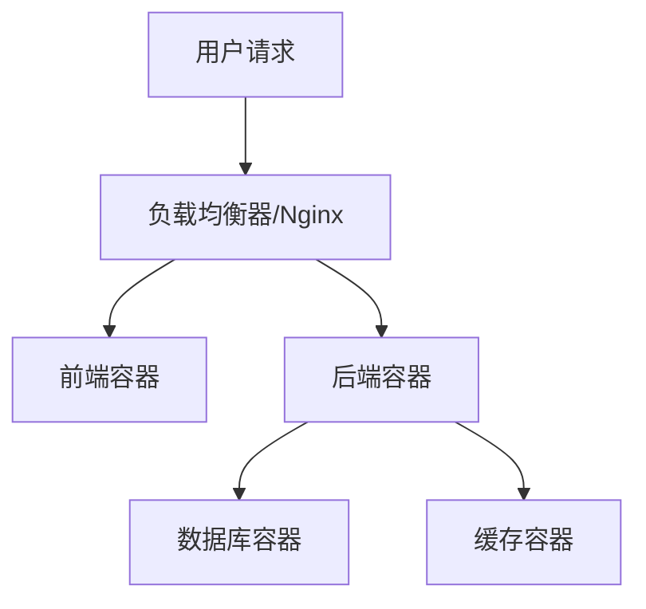
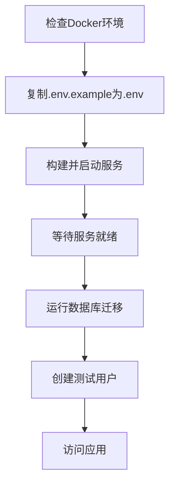

# 课程管理系统依赖检查与Docker启动方案

## 1. 概述

本文档详细说明了在Linux环境下检查课程管理系统依赖并使用Docker启动项目的完整流程。该系统是一个基于Django后端和React前端的现代化校园课程表管理工具，具有智能排课算法和大规模数据处理能力。

## 2. 项目结构分析

### 2.1 目录结构

课程管理系统项目具有清晰的目录结构，便于维护和部署：

```
course-management-system/
├── .env.example              # 环境变量示例文件
├── docker-compose.yml         # Docker编排配置
├── docker-compose.prod.yml    # 生产环境Docker编排配置
├── backend/                   # Django后端应用
│   ├── Dockerfile             # 后端Docker构建文件
│   ├── requirements.txt       # Python依赖列表
│   ├── manage.py              # Django管理脚本
│   ├── course_management/     # 主应用配置
│   ├── apps/                  # 业务模块
│   └── ...
├── frontend/                  # React前端应用
│   ├── Dockerfile             # 前端Docker构建文件
│   ├── package.json           # Node.js依赖配置
│   ├── vite.config.ts         # 构建配置
│   └── ...
├── algorithms/                # 智能排课算法模块
├── data-generator/            # 数据生成工具
├── deployment/                # 部署相关文件
└── ...
```

### 2.2 核心组件说明

1. **后端(backend)**: 基于Django框架，提供RESTful API接口
2. **前端(frontend)**: 基于React的现代化用户界面
3. **算法模块(algorithms)**: 包含遗传算法、启发式算法等智能排课算法
4. **数据生成器(data-generator)**: 用于生成测试数据的工具集

## 3. 环境准备与依赖检查

### 3.1 系统环境检查

在开始部署之前，需要确保Linux系统满足以下要求：

1. **操作系统**：Ubuntu 20.04+/Debian 11+/CentOS 8+/或其他现代Linux发行版
2. **硬件要求**：
   - 最低：2核CPU，4GB内存，20GB可用磁盘空间
   - 推荐：4核CPU，8GB内存，50GB可用磁盘空间
3. **软件依赖**：
   - Docker 20.0+
   - Docker Compose 1.29+
   - Git 2.20+
   - curl或wget工具

### 2.2 依赖检查脚本

执行以下命令检查系统依赖：

```bash
#!/bin/bash

# 检查Docker是否安装
if ! command -v docker &> /dev/null; then
    echo "❌ Docker未安装"
    echo "请参考官方文档安装Docker: https://docs.docker.com/engine/install/"
    exit 1
else
    echo "✅ Docker版本: $(docker --version)"
fi

# 检查Docker Compose是否安装
if ! command -v docker-compose &> /dev/null; then
    echo "❌ Docker Compose未安装"
    echo "请参考官方文档安装Docker Compose: https://docs.docker.com/compose/install/"
    exit 1
else
    echo "✅ Docker Compose版本: $(docker-compose --version)"
fi

# 检查当前用户是否在docker组
if groups $USER | grep -q '\bdocker\b'; then
    echo "✅ 当前用户 $USER 在docker组中"
else
    echo "⚠️  当前用户 $USER 不在docker组中，可能需要使用sudo运行docker命令"
fi

echo "✅ 环境检查通过，可以继续部署"
```

## 3. 系统架构

### 2.1 技术栈



### 2.2 Docker服务架构



## 4. 依赖检查

### 4.1 系统依赖

在Linux环境中，需要确保以下系统依赖已安装：

| 依赖项 | 版本要求 | 用途 |
|--------|---------|------|
| Docker | 20.0+ | 容器化运行环境 |
| Docker Compose | 1.29+ | 多容器编排 |

检查命令：
```bash
# 检查Docker版本
docker --version

# 检查Docker Compose版本
docker-compose --version
```

### 4.2 后端依赖

后端基于Python 3.9，主要依赖包括：

| 依赖项 | 版本 | 用途 |
|--------|------|------|
| Django | 4.2.7 | Web框架 |
| Django REST Framework | 3.14.0 | REST API框架 |
| PostgreSQL驱动 | psycopg2-binary 2.9.10 | 数据库连接 |
| Redis | redis 5.0.1 | 缓存 |
| Celery | 5.3.4 | 异步任务队列 |
| JWT | djangorestframework-simplejwt 5.3.0 | 认证 |

### 4.3 前端依赖

前端基于Node.js 18，主要技术栈包括：

| 依赖项 | 版本 | 用途 |
|--------|------|------|
| React | 18+ | 前端框架 |
| TypeScript | 4+ | 类型检查 |
| Ant Design | 5+ | UI组件库 |
| Vite | 4+ | 构建工具 |

## 5. Docker部署配置

### 5.1 docker-compose.yml配置

项目使用docker-compose.yml定义了5个服务：

1. **db**: PostgreSQL数据库服务
2. **redis**: Redis缓存服务
3. **backend**: Django后端服务
4. **frontend**: React前端服务
5. **nginx**: Nginx负载均衡器（可选）

### 5.2 环境变量配置

项目使用.env文件管理环境变量，示例配置包括：

- 数据库连接配置
- Redis连接配置
- Django安全配置
- CORS跨域配置

## 6. 启动流程

### 6.1 启动步骤



### 6.2 详细操作命令

1. 检查Docker环境：
```bash
docker --version
docker-compose --version
```

2. 复制环境变量文件：
```bash
cp .env.example .env
```

3. 构建并启动服务：
```bash
docker-compose up -d
```

4. 等待服务启动（约10秒）：
```bash
sleep 10
```

5. 运行数据库迁移：
```bash
docker-compose exec backend python manage.py migrate
```

6. 创建测试用户：
```bash
docker-compose exec backend python manage.py createsuperuser
```

### 6.3 快速启动脚本

项目提供了`quick-start.sh`脚本来简化部署流程：

```bash
#!/bin/bash

# 赋予脚本执行权限
chmod +x quick-start.sh

# 运行快速启动脚本
./quick-start.sh
```

该脚本会自动执行以下操作：
1. 检查Docker环境
2. 启动所有服务
3. 等待服务就绪
4. 运行数据库迁移
5. 创建默认测试用户（admin/teacher1/student1）
6. 显示访问信息

### 6.4 生产环境部署

对于生产环境部署，建议使用`docker-compose.prod.yml`配置文件：

```bash
# 使用生产环境配置启动
docker-compose -f docker-compose.prod.yml up -d
```

生产环境配置与开发环境的主要区别：
1. 启用Nginx负载均衡器
2. 更严格的网络安全配置
3. 生产级别的资源限制
4. SSL证书配置
5. 日志持久化存储

### 6.3 访问信息

服务启动后，可通过以下地址访问：

| 服务 | 地址 | 端口 |
|------|------|------|
| 前端应用 | http://localhost | 80 |
| 后端API | http://localhost:8000 | 8000 |
| API文档 | http://localhost:8000/api/docs/ | 8000 |
| 管理后台 | http://localhost:8000/admin | 8000 |
| 数据库 | localhost | 15432 |
| Redis | localhost | 16379 |

默认测试账号：
- 管理员: admin / admin123
- 教师: teacher1 / teacher123
- 学生: student1 / student123

## 7. 常用管理命令

### 7.1 服务管理

```bash
# 查看服务状态
docker-compose ps

# 查看日志
docker-compose logs -f

# 停止服务
docker-compose down

# 重启服务
docker-compose restart
```

### 7.2 数据库管理

```bash
# 运行数据库迁移
docker-compose exec backend python manage.py migrate

# 创建超级用户
docker-compose exec backend python manage.py createsuperuser

# 进入数据库容器
docker-compose exec db psql -U postgres -d course_management
```

### 7.3 应用管理

```bash
# 收集静态文件
docker-compose exec backend python manage.py collectstatic

# 进入后端容器
docker-compose exec backend bash

# 进入前端容器
docker-compose exec frontend sh
```

## 8. 故障排除

### 8.1 常见问题

1. **Docker权限问题**：
   ```bash
   sudo usermod -aG docker $USER
   # 重新登录或执行
   newgrp docker
   ```

2. **端口占用问题**：
   ```bash
   # 查看端口占用
   netstat -tuln | grep :8000
   # 或者
   lsof -i :8000
   ```

3. **数据库连接失败**：
   - 检查.env文件中的数据库配置
   - 确认数据库服务是否正常启动
   - 检查Docker网络连接

4. **服务启动失败**：
   ```bash
   # 查看具体哪个服务启动失败
docker-compose ps
   # 查看该服务的详细日志
docker-compose logs [service_name]
   ```

5. **前端页面无法访问**：
   - 检查Nginx配置
   - 确认前端构建是否成功
   - 检查容器间网络连接

6. **内存不足导致容器重启**：
   - 增加系统内存或交换空间
   - 调整Docker资源限制

### 8.2 日志查看

```bash
# 查看所有服务日志
docker-compose logs

# 查看特定服务日志
docker-compose logs backend

# 实时查看日志
docker-compose logs -f

# 查看最近的50行日志
docker-compose logs --tail=50

# 查看最近1小时的日志
docker-compose logs --since=1h
```

### 8.3 容器状态检查

```bash
# 查看所有容器状态
docker-compose ps

# 查看容器资源使用情况
docker stats

# 进入容器内部调试
docker-compose exec backend bash
docker-compose exec frontend sh
```

## 9. 性能优化建议

### 9.1 Docker优化

1. 清理未使用的镜像和容器：
   ```bash
   docker system prune -a
   ```

2. 使用多阶段构建减小镜像大小

3. 合理配置容器资源限制

### 9.2 应用优化

1. 启用Gzip压缩
2. 配置CDN加速静态资源
3. 使用Redis缓存热点数据
4. 数据库查询优化

## 10. 安全建议

### 10.1 环境变量安全

- 不要将敏感信息提交到版本控制系统
- 生产环境使用强密码
- 定期轮换密钥和密码

### 10.2 网络安全

- 限制数据库端口外部访问
- 使用HTTPS加密传输
- 配置防火墙规则

### 10.3 应用安全

- 启用CSRF保护
- 配置CORS策略
- 定期更新依赖包

## 11. 数据备份与恢复

### 11.1 数据库备份

```bash
# 备份数据库
docker-compose exec db pg_dump -U postgres course_management > backup_$(date +%Y%m%d_%H%M%S).sql

# 或使用docker卷备份
docker run --rm \
  -v course-management-system_postgres_data:/data \
  -v $(pwd):/backup \
  alpine tar czf /backup/postgres_backup_$(date +%Y%m%d_%H%M%S).tar.gz -C /data .
```

### 11.2 数据恢复

```bash
# 恢复数据库（需要先停止应用）
docker-compose down
docker-compose up -d db
# 等待数据库启动
docker-compose exec -T db psql -U postgres -c "DROP DATABASE course_management;"
docker-compose exec -T db psql -U postgres -c "CREATE DATABASE course_management;"
docker-compose exec -T db psql -U postgres -d course_management -f /backup/your_backup.sql

# 重启所有服务
docker-compose up -d
```

### 11.3 定期备份策略

建议设置定时任务定期备份重要数据：

```bash
# 添加到crontab中，每天凌晨2点备份
0 2 * * * cd /path/to/course-management-system && docker-compose exec db pg_dump -U postgres course_management > /backup/course_management_$(date +\%Y\%m\%d).sql 2>> /var/log/backup.log
```

## 12. 总结

本文档详细介绍了在Linux环境下使用Docker部署课程管理系统的完整流程。通过遵循本文档的指导，您可以：

1. 检查系统依赖并确保环境满足要求
2. 理解项目结构和各组件功能
3. 使用Docker Compose快速部署整个系统
4. 管理和监控容器化服务
5. 处理常见故障和问题
6. 实施安全和备份策略

该系统具有良好的可扩展性和维护性，支持从开发环境到生产环境的完整部署方案。通过容器化部署，确保了环境的一致性和部署的可靠性。