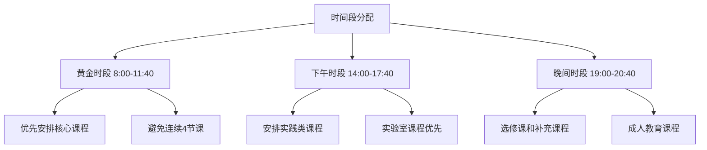
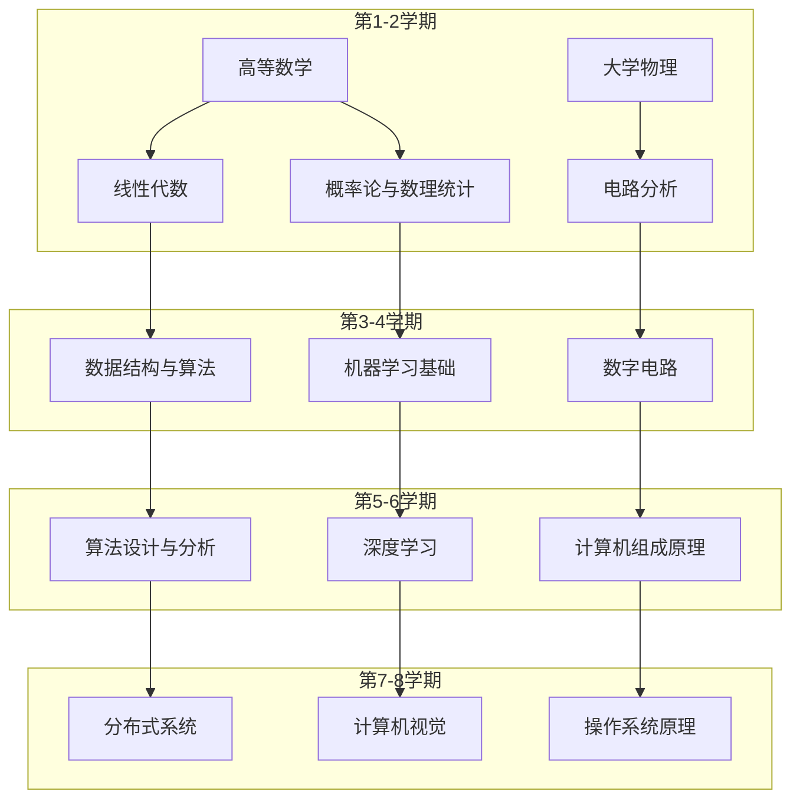
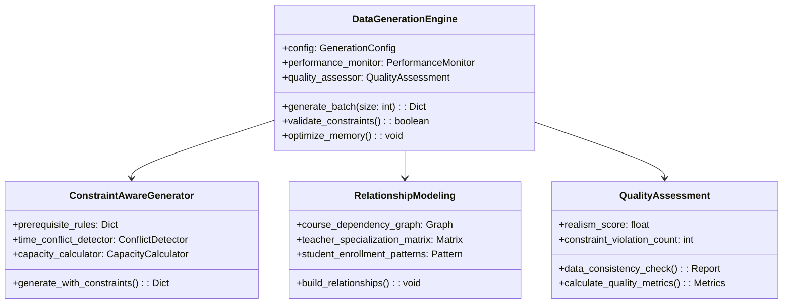
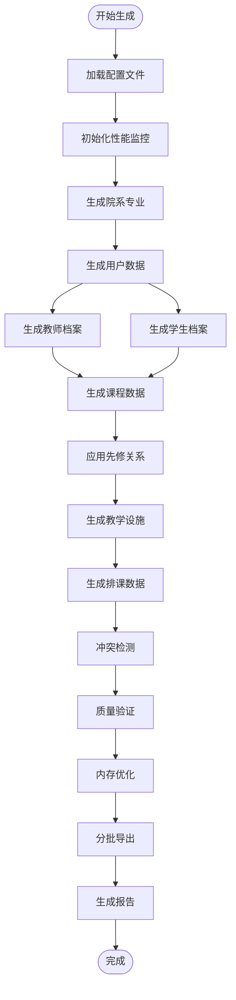
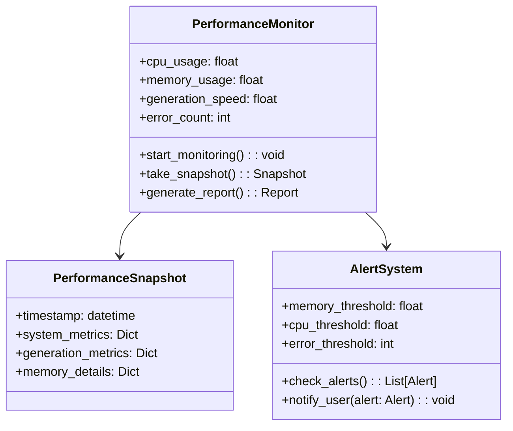
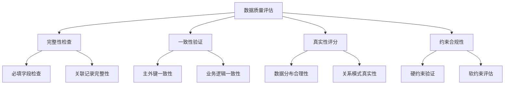
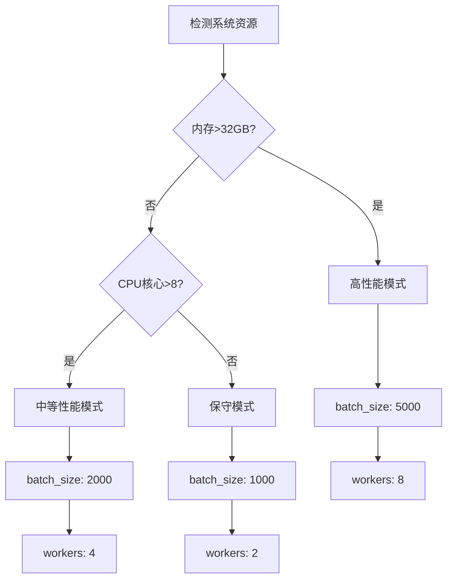
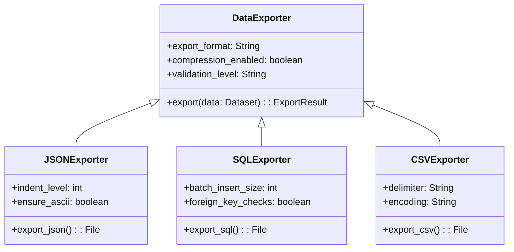
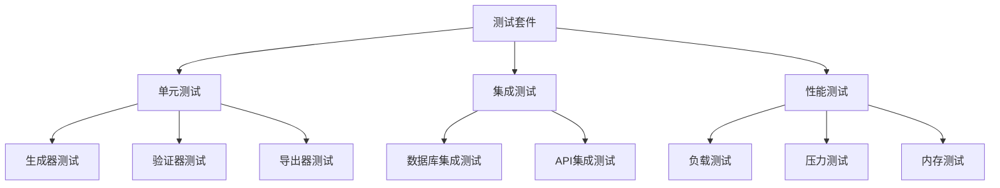

# 百万级课程数据生成系统设计

## 概述

基于课程管理系统的百万级数据生成器设计，旨在生成符合真实教学场景的大规模测试数据。系统通过智能约束感知生成、关联性建模和真实性验证，确保生成的课程数据具备业务逻辑合理性和教学场景真实性。

## 技术栈

- **核心语言**: Python 3.8+
- **数据处理**: Pandas, NumPy
- **性能监控**: psutil, rich
- **配置管理**: YAML, JSON
- **数据导出**: PostgreSQL, Django ORM
- **内存优化**: 分批处理、垃圾回收机制

## 课程安排合理性标准

### 教学时间约束

**时间段分布合理性**


**周学时分布规律**
- 必修课：每周2-4学时，分散在不同天
- 实验课：连续2-3学时，避免碎片化
- 理论课：单次1-2学时，总计不超过4学时/周
- 选修课：每周1-2学时，灵活安排

### 先修课程逻辑关系

**课程依赖关系建模**


**严格先修关系规则**
- 数学基础课程：高等数学 → 线性代数 → 概率论
- 编程课程：C语言 → 数据结构 → 算法设计
- 专业核心：计算机组成 → 操作系统 → 分布式系统
- 人工智能：线性代数 + 概率论 → 机器学习 → 深度学习

### 教师-课程匹配合理性

**专业匹配度评估**
```mermaid
classDiagram
    class Teacher {
        +department: String
        +title: String
        +specialization: List[String]
        +experience_years: int
        +max_courses: int
        +preferred_time_slots: List[String]
    }
    
    class Course {
        +category: String
        +difficulty_level: int
        +required_expertise: List[String]
        +student_capacity: int
        +time_requirements: String
    }
    
    class TeacherCourseMatch {
        +compatibility_score: float
        +specialization_match: boolean
        +workload_feasible: boolean
        +time_preference_score: float
    }
    
    Teacher ||--o{ TeacherCourseMatch
    Course ||--o{ TeacherCourseMatch
```

**匹配规则**
- 教授：承担研究生课程和核心专业课
- 副教授：专业必修课和部分选修课
- 讲师：基础课程和通识教育课程
- 助教：实验课和习题课辅导

### 资源容量约束

**教室-课程匹配**
- 理论课：普通教室，容量匹配选课人数的110%-120%
- 实验课：专用实验室，严格按实验台数量限制
- 大班课：阶梯教室，容量≥150人
- 研讨课：小型研讨室，容量20-30人

**设备需求匹配**
- 计算机课程：机房，确保一人一机
- 物理实验：实验室，配备相应仪器设备
- 多媒体课程：配备投影设备的教室
- 艺术课程：专业教室（画室、琴房等）

## 数据生成架构

### 核心生成引擎



### 数据生成流程



### 分层数据生成策略

**基础数据层**
- 院系专业：按照现实大学结构生成
- 用户档案：教师、学生基本信息
- 教学设施：教室、实验室、设备

**关系数据层**  
- 课程体系：基于专业培养方案
- 师资配置：专业匹配度优化
- 先修关系：学科知识图谱建模

**业务数据层**
- 选课记录：基于学生兴趣和专业要求
- 排课安排：时空资源优化分配
- 成绩评估：符合正态分布的合理成绩

## 百万级数据生成优化

### 内存管理策略

**分批处理机制**
```python
# 配置示例
BATCH_CONFIG = {
    'batch_size': 2000,           # 每批处理2000条记录
    'memory_threshold': 0.8,      # 内存使用率阈值80%
    'gc_frequency': 5,            # 每5批执行一次垃圾回收
    'checkpoint_interval': 10000  # 每10000条记录保存检查点
}
```

**内存优化技术**
- 预编译密码哈希，避免重复计算
- 对象池复用，减少内存分配开销
- 延迟加载策略，按需生成数据
- 智能垃圾回收，及时释放无用对象

### 性能监控体系



**实时监控指标**
- CPU使用率：目标<80%，告警阈值>90%
- 内存使用率：目标<70%，告警阈值>85%
- 生成速度：目标>1000条/秒
- 错误率：目标<0.1%，告警阈值>1%

### 数据质量保障

**多维度质量评估**


**质量评分算法**
- 完整性评分：(完整记录数 / 总记录数) × 100
- 一致性评分：(一致关系数 / 总关系数) × 100  
- 真实性评分：基于业务规则匹配度计算
- 综合质量分：加权平均，阈值≥85分

## 配置文件体系

### 主配置文件结构

```yaml
# mega_scale_config.yml
generation:
  scale: "huge"                    # 数据规模: huge, large, medium, small
  target_records:
    students: 1000000             # 目标学生数
    teachers: 50000               # 目标教师数  
    courses: 100000               # 目标课程数
    schedules: 5000000            # 目标排课记录数
  
constraints:
  prerequisite_strict: true        # 严格先修关系
  time_conflict_avoidance: true    # 避免时间冲突
  capacity_enforcement: true       # 强制容量限制
  realism_level: "high"           # 真实性要求等级

performance:
  batch_size: 2000                # 批处理大小
  memory_limit: "16GB"            # 内存限制
  parallel_workers: 4             # 并行工作进程
  checkpoint_enabled: true        # 启用检查点

output:
  formats: ["json", "sql", "csv"] # 输出格式
  compression: true               # 启用压缩
  validation_level: "strict"      # 验证级别
```

### 动态配置调整

**规模自适应配置**


## 数据导出与集成

### 多格式导出支持

**导出格式优化**


**PostgreSQL批量导入优化**
- 使用COPY命令替代INSERT提升性能
- 禁用外键检查加速导入过程
- 分表策略处理超大数据集
- 索引延迟创建优化导入速度

### Django ORM集成

**模型映射策略**
```python
# 批量创建优化示例
def bulk_create_optimized(model_class, data_list, batch_size=2000):
    """优化的批量创建方法"""
    for i in range(0, len(data_list), batch_size):
        batch = data_list[i:i + batch_size]
        model_class.objects.bulk_create(
            batch, 
            batch_size=batch_size,
            ignore_conflicts=True
        )
        # 强制垃圾回收
        gc.collect()
```

## 测试验证策略

### 单元测试框架

**核心组件测试**


### 数据验证测试

**约束验证测试用例**
- 先修关系验证：确保所有先修课程在合理学期
- 时间冲突检测：验证同一教师/学生无时间冲突
- 容量限制检查：确保选课人数不超过教室容量
- 专业匹配验证：确保教师专业与授课内容匹配

### 性能基准测试

**性能目标验证**
- 生成速度：≥1000条记录/秒
- 内存效率：峰值内存<系统总内存70%
- 数据质量：综合质量分≥85分
- 错误率：<0.1%
