# 大规模数据生成与导入设计方案

## 概述

针对系统当前的几十万学生数据，设计一套完整的课程、教室、排课数据生成与导入方案，确保生成的数据规模合理、约束关系正确，并能够支持智能排课算法的有效运行。

## 技术架构

### 数据生成架构

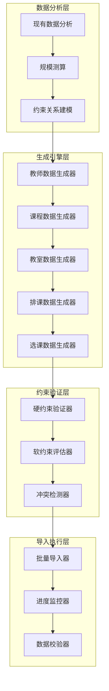

### 核心约束关系模型

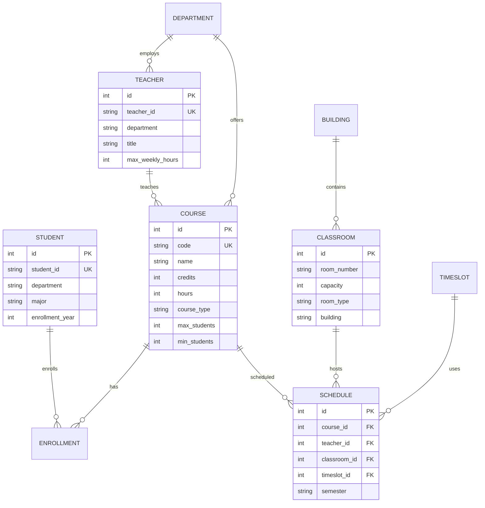

## 数据规模规划

### 基础数据规模计算

基于现有数据规模（851,064个学生），按照高校标准比例计算：

| 数据类型 | 计算依据 | 目标数量 | 说明 |
|---------|----------|----------|------|
| 学生 | 现有数据 | 851,064 | 保持现有规模 |
| 教师 | 师生比 1:15 | 56,738 | 标准师生比例 |
| 课程 | 专业课程配置 | 15,000 | 覆盖所有专业需求 |
| 教室 | 容量利用率 80% | 3,500 | 满足排课需求 |
| 排课记录 | 课程×时间段 | 180,000 | 学期课程安排 |
| 选课记录 | 学生×平均选课 | 5,950,448 | 每生平均7门课 |

### 分层数据生成策略

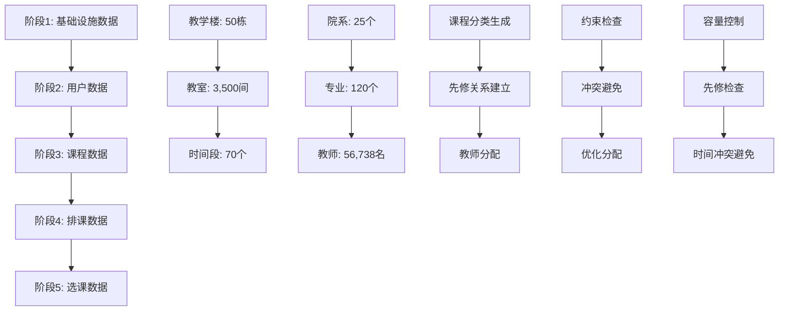

## 数据生成模型

### 教师数据生成器

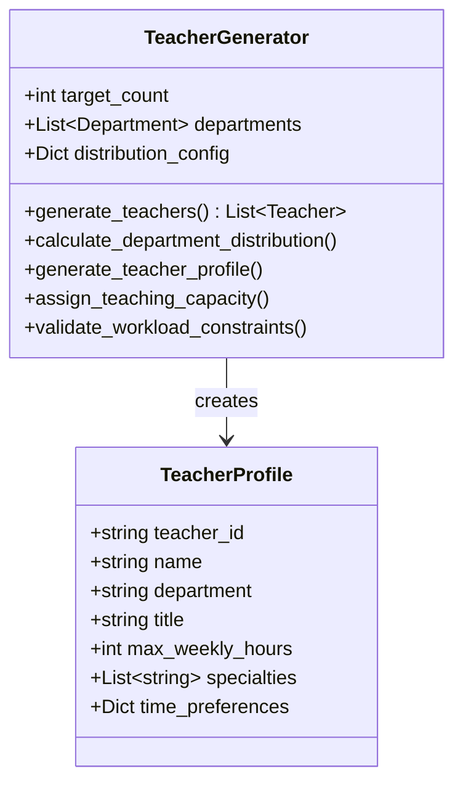

### 课程数据生成器

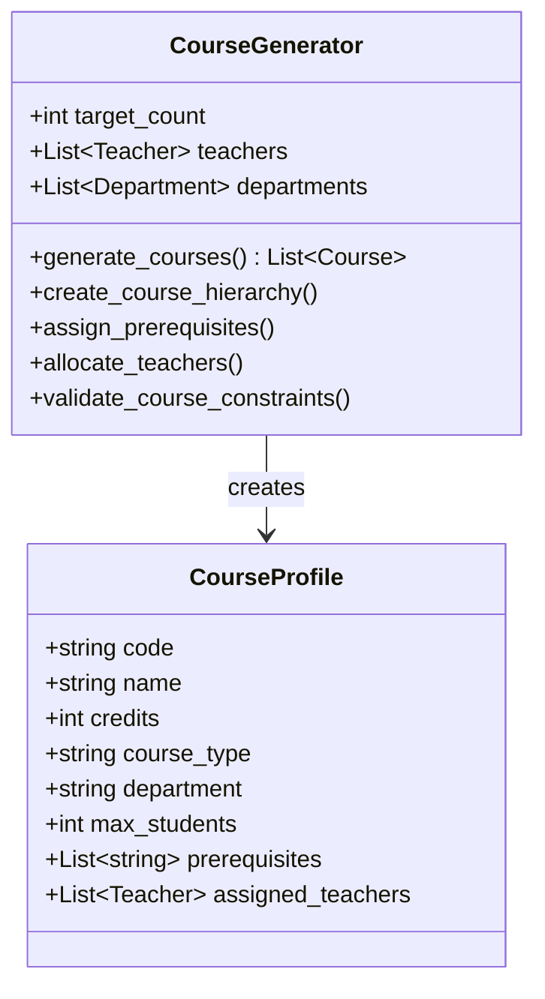

### 教室数据生成器

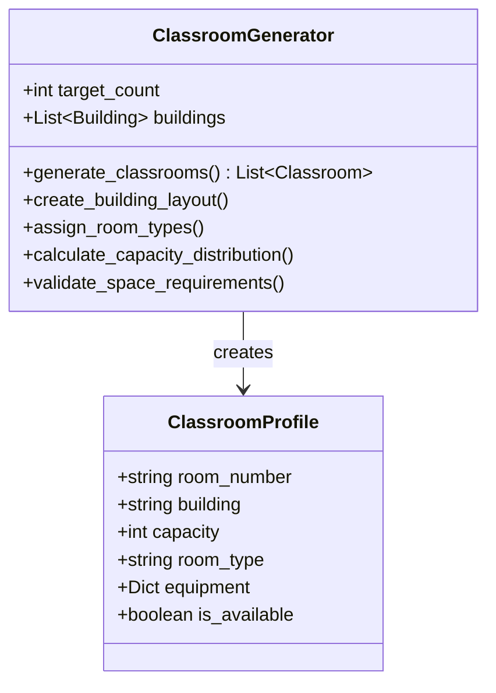

## 约束管理系统

### 硬约束验证

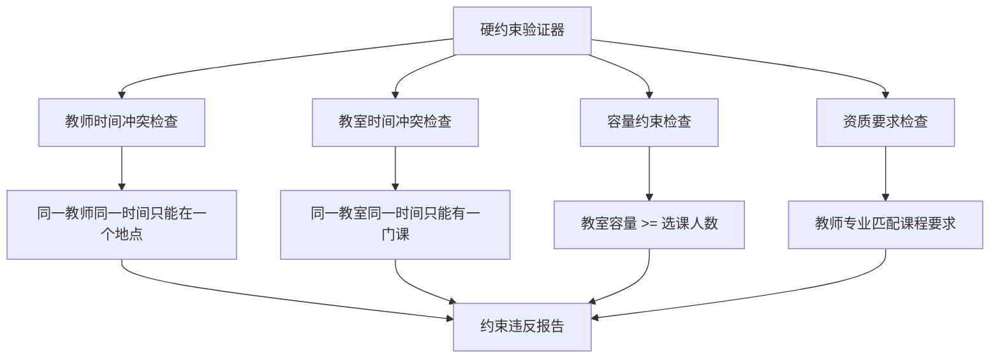

### 软约束优化

| 约束类型 | 权重 | 评分标准 | 优化目标 |
|---------|------|----------|----------|
| 教师时间偏好 | 0.3 | 偏好时间段分配率 | 最大化教师满意度 |
| 教室利用率 | 0.25 | 空间利用效率 | 均衡教室使用 |
| 学生课程分布 | 0.2 | 时间分散程度 | 避免课程集中 |
| 连续课程安排 | 0.15 | 相关课程邻近性 | 教学连贯性 |
| 跨校区移动 | 0.1 | 位置转换时间 | 减少移动成本 |

## 数据导入流程

### 批量导入策略

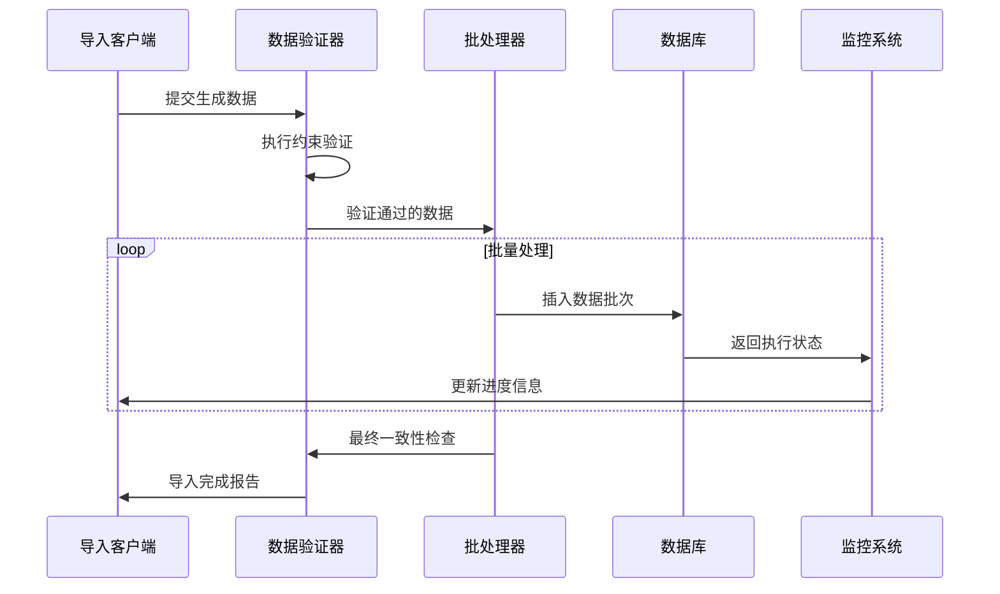

### 性能优化方案

| 优化策略 | 实施方法 | 预期效果 |
|---------|----------|----------|
| 批量插入 | 每批5000条记录 | 提升插入速度10倍 |
| 索引优化 | 导入前禁用，导入后重建 | 减少写入时间50% |
| 事务管理 | 分段提交，避免长事务 | 降低锁定时间 |
| 并行处理 | 多线程处理不同表 | 提升整体效率30% |
| 内存管理 | 数据流式处理 | 控制内存使用 |

## 数据质量保障

### 数据完整性验证

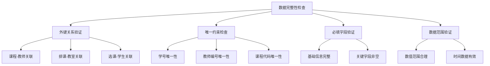

### 业务逻辑验证

| 验证项目 | 验证规则 | 错误处理 |
|---------|----------|----------|
| 师生比例 | 1:10 - 1:20 | 警告并调整 |
| 课程容量 | 20-200人 | 自动修正 |
| 教师工作量 | 每周8-20学时 | 重新分配 |
| 教室利用率 | 60%-85% | 优化调整 |
| 时间冲突 | 零冲突原则 | 强制解决 |

## 监控与报告

### 实时监控指标

```mermaid
dashboard
    title 数据生成导入监控面板
    
    section 进度监控
        生成进度: 75: [0, 100]
        导入进度: 45: [0, 100]
        验证进度: 60: [0, 100]
    
    section 性能指标
        生成速度: 15000: [0, 50000]
        导入速度: 8500: [0, 20000]
        错误率: 0.02: [0, 0.1]
    
    section 资源使用
        内存使用: 68: [0, 100]
        CPU使用: 45: [0, 100]
        磁盘IO: 75: [0, 100]
```

### 质量报告模板

| 指标类别 | 具体指标 | 目标值 | 实际值 | 状态 |
|---------|----------|-------|-------|------|
| 数据规模 | 教师总数 | 56,738 | - | 待生成 |
| 数据规模 | 课程总数 | 15,000 | - | 待生成 |
| 数据规模 | 教室总数 | 3,500 | - | 待生成 |
| 约束合规 | 硬约束违反率 | 0% | - | 待验证 |
| 约束合规 | 软约束满足率 | >80% | - | 待评估 |
| 性能指标 | 生成用时 | <2小时 | - | 待执行 |
| 性能指标 | 导入用时 | <1小时 | - | 待执行 |

## 实施计划

### 开发阶段

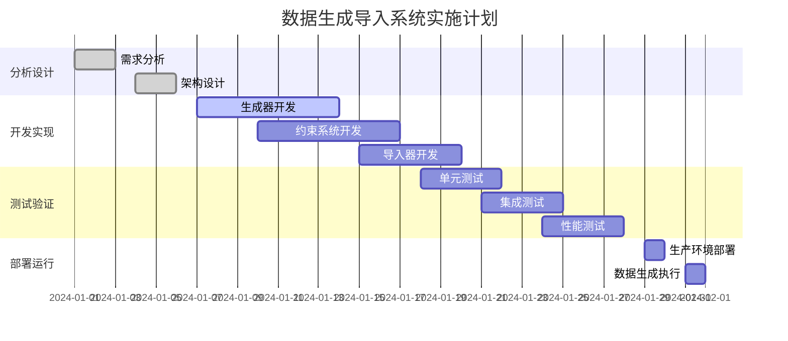

### 风险控制

| 风险类型 | 风险描述 | 影响程度 | 应对策略 |
|---------|----------|----------|----------|
| 性能风险 | 大数据量导致内存溢出 | 高 | 分批处理+内存监控 |
| 数据风险 | 约束冲突导致生成失败 | 中 | 智能约束解决器 |
| 时间风险 | 生成时间超出预期 | 中 | 并行化+性能优化 |
| 质量风险 | 生成数据不符合业务需求 | 高 | 多层验证+回滚机制 |

## 技术实现

### 核心算法

#### 智能排课算法集成

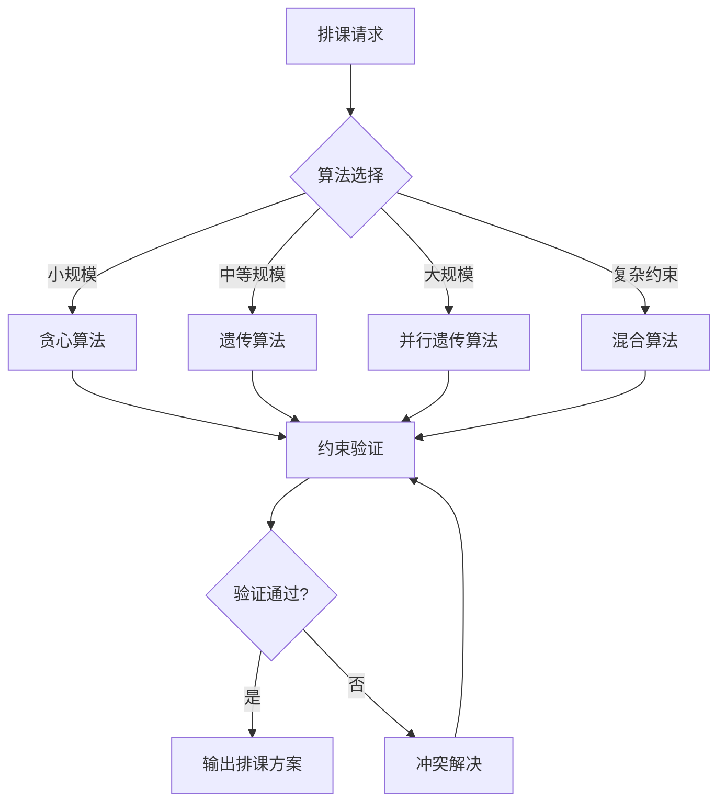

#### 数据一致性保证

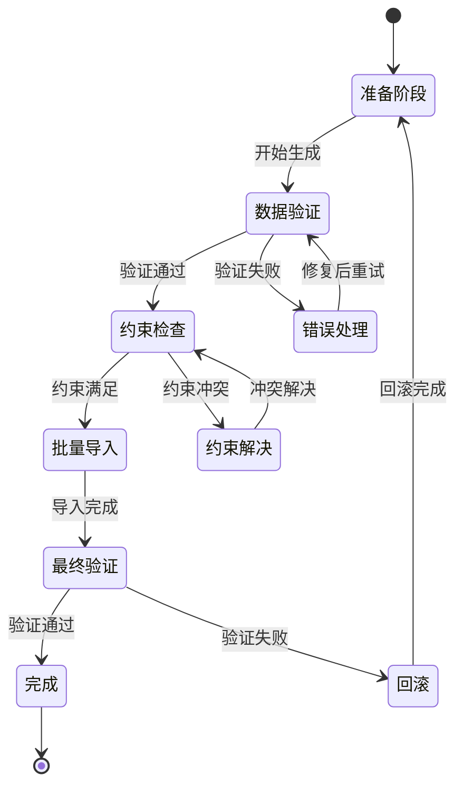

### 关键代码结构

#### 主生成器接口

```python
class MassDataGenerator:
    def __init__(self, config: GenerationConfig):
        self.config = config
        self.constraint_manager = ConstraintManager()
        self.progress_monitor = ProgressMonitor()
    
    def generate_complete_dataset(self) -> DatasetResult:
        """生成完整数据集"""
        pass
    
    def validate_constraints(self, dataset: Dataset) -> ValidationResult:
        """验证约束条件"""
        pass
    
    def import_to_database(self, dataset: Dataset) -> ImportResult:
        """导入到数据库"""
        pass
```

#### 约束管理器

```python
class ConstraintManager:
    def __init__(self):
        self.hard_constraints = HardConstraints()
        self.soft_constraints = SoftConstraints()
    
    def validate_schedule(self, schedule: Schedule) -> ConstraintResult:
        """验证排课方案"""
        pass
    
    def resolve_conflicts(self, conflicts: List[Conflict]) -> Resolution:
        """解决约束冲突"""
        pass
```

### 配置管理

#### 生成配置

```yaml
generation_config:
  scale:
    students: 851064
    teachers: 56738
    courses: 15000
    classrooms: 3500
    
  constraints:
    teacher_student_ratio: [10, 20]
    class_capacity: [20, 200]
    teacher_weekly_hours: [8, 20]
    
  optimization:
    algorithm: "genetic"
    population_size: 100
    max_generations: 500
    mutation_rate: 0.1
    
  import:
    batch_size: 5000
    max_retries: 3
    transaction_timeout: 300
```

## 验收标准

### 功能验收

| 功能项 | 验收标准 | 测试方法 |
|-------|----------|----------|
| 数据生成 | 按规模要求生成完整数据 | 自动化测试 |
| 约束验证 | 硬约束100%满足 | 约束检查器 |
| 性能要求 | 生成+导入<3小时 | 性能测试 |
| 数据质量 | 业务逻辑正确性>95% | 抽样验证 |
| 系统稳定 | 连续运行不出错 | 压力测试 |

### 质量验收

| 质量指标 | 目标值 | 验收方法 |
|---------|-------|----------|
| 代码覆盖率 | >85% | 单元测试 |
| 文档完整性 | 100% | 文档审查 |
| 错误处理 | 完整覆盖 | 异常测试 |
| 用户体验 | 操作简便 | 用户测试 |
| 可维护性 | 易于扩展 | 代码审查 |