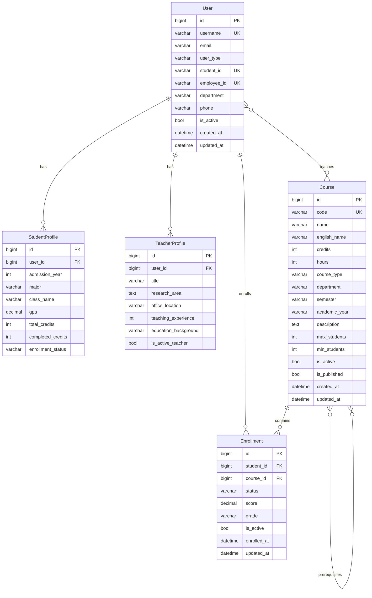
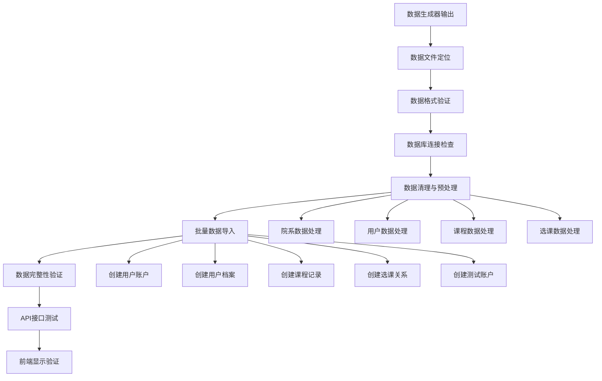
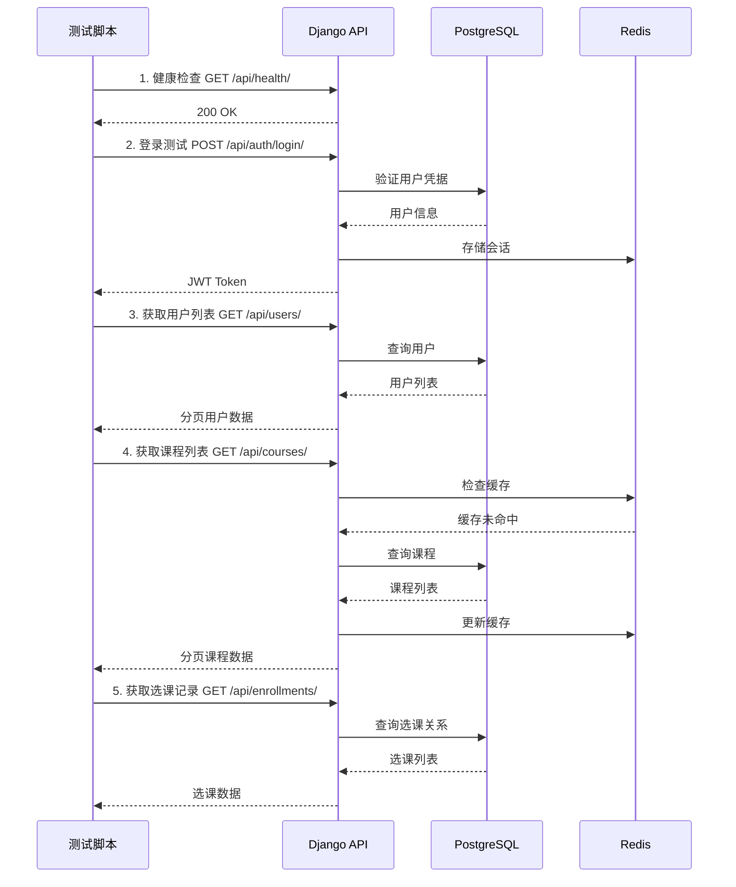
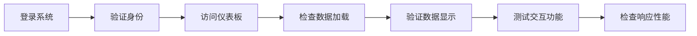

# 数据导入与API对接设计文档

## 概述

本设计文档旨在将已生成的测试数据导入到课程管理系统数据库中，并验证前后端API对接情况，确保前端能够正确显示实际数据。

## 技术栈分析

### 后端技术栈
- **框架**: Django 4.2.7 + Django REST Framework 3.14.0
- **数据库**: PostgreSQL 13
- **缓存**: Redis 6
- **身份认证**: JWT (djangorestframework-simplejwt)
- **API文档**: drf-spectacular
- **部署**: Docker + Docker Compose

### 前端技术栈
- **框架**: React 18.2.0 + TypeScript
- **UI库**: Ant Design 5.12.8
- **状态管理**: Redux Toolkit + React Query
- **图表库**: ECharts + Recharts
- **构建工具**: Vite 4.5.0

### 数据生成状态
- **小规模数据**: data_output/ (42.8MB)
- **中等规模数据**: data_output_medium/ (106.0MB)  
- **大规模数据**: data_output_large/ (215.1MB)
- **性能报告**: performance_reports/
- **检查点**: checkpoints/

## 数据模型架构

### 核心数据模型



## 数据导入流程设计

### 导入架构



### 数据导入策略

#### 1. 数据文件发现与验证
- 扫描数据输出目录（data_output、data_output_medium、data_output_large）
- 验证JSON文件格式和数据完整性
- 选择适当的数据集规模进行导入

#### 2. 数据预处理
- 字段映射：将生成器字段映射到Django模型字段
- 数据类型转换：确保数据类型与模型定义一致
- 外键关系建立：处理用户、课程、选课之间的关联关系

#### 3. 批量导入操作
- 使用Django事务确保数据一致性
- 采用批量创建优化导入性能
- 处理重复数据和冲突情况

#### 4. 数据验证
- 检查数据完整性约束
- 验证外键关系正确性
- 统计导入结果

## API接口验证

### 主要API端点

#### 认证API
```
POST /api/auth/login/          # 用户登录
POST /api/auth/logout/         # 用户登出
POST /api/auth/refresh/        # 刷新Token
GET  /api/auth/user/           # 获取当前用户信息
```

#### 用户管理API
```
GET    /api/users/             # 获取用户列表
GET    /api/users/{id}/        # 获取用户详情
PUT    /api/users/{id}/        # 更新用户信息
POST   /api/users/             # 创建用户
DELETE /api/users/{id}/        # 删除用户
```

#### 课程管理API
```
GET    /api/courses/           # 获取课程列表
GET    /api/courses/{id}/      # 获取课程详情
POST   /api/courses/           # 创建课程
PUT    /api/courses/{id}/      # 更新课程
DELETE /api/courses/{id}/      # 删除课程
GET    /api/courses/{id}/enrollments/  # 获取课程选课情况
```

#### 选课管理API
```
GET    /api/enrollments/       # 获取选课列表
POST   /api/enrollments/       # 创建选课记录
PUT    /api/enrollments/{id}/  # 更新选课状态
DELETE /api/enrollments/{id}/  # 取消选课
```

### API测试策略



## 前端数据显示验证

### 主要页面验证

#### 1. 用户管理页面
- 用户列表显示
- 用户详情查看
- 用户权限验证
- 分页功能测试

#### 2. 课程管理页面
- 课程列表展示
- 课程搜索过滤
- 课程详情显示
- 教师课程关联

#### 3. 选课管理页面
- 学生选课记录
- 课程选课统计
- 选课状态管理
- 成绩录入界面

#### 4. 数据可视化
- 选课统计图表
- 院系分布饼图
- 课程类型统计
- 学生成绩分析

### 前端验证流程



## 实施计划

### 阶段1：环境准备 (30分钟)
1. 启动Docker服务
2. 检查数据库连接
3. 验证Redis缓存
4. 确认API服务状态

### 阶段2：数据发现与准备 (20分钟)
1. 扫描数据输出目录
2. 选择合适的数据集
3. 验证数据格式
4. 准备导入脚本

### 阶段3：数据导入 (40分钟)
1. 创建数据导入管理命令
2. 执行批量数据导入
3. 验证导入结果
4. 处理导入异常

### 阶段4：API验证 (30分钟)
1. 编写API测试脚本
2. 测试主要端点
3. 验证数据返回
4. 检查性能表现

### 阶段5：前端验证 (40分钟)
1. 启动前端服务
2. 测试页面加载
3. 验证数据显示
4. 检查用户交互

## 核心脚本设计

### 1. 数据发现脚本
```python
def discover_data_files():
    """发现并验证数据文件"""
    data_dirs = [
        'data-generator/data_output',
        'data-generator/data_output_medium', 
        'data-generator/data_output_large'
    ]
    
    for data_dir in data_dirs:
        json_files = scan_json_files(data_dir)
        validate_data_structure(json_files)
    
    return select_optimal_dataset()
```

### 2. 批量导入脚本
```python
@transaction.atomic
def bulk_import_data(data_file_path):
    """批量导入数据到数据库"""
    data = load_json_data(data_file_path)
    
    # 导入院系数据
    departments = create_departments(data['departments'])
    
    # 导入用户数据
    students_count = bulk_create_students(data['students'])
    teachers_count = bulk_create_teachers(data['teachers'])
    
    # 导入课程数据
    courses_count = bulk_create_courses(data['courses'])
    
    # 导入选课数据
    enrollments_count = bulk_create_enrollments(data['enrollments'])
    
    return import_summary
```

### 3. API验证脚本
```python
def test_api_endpoints():
    """测试主要API端点"""
    client = APIClient()
    
    # 认证测试
    auth_token = test_authentication(client)
    
    # 用户API测试
    test_user_apis(client, auth_token)
    
    # 课程API测试
    test_course_apis(client, auth_token)
    
    # 选课API测试
    test_enrollment_apis(client, auth_token)
    
    return test_results
```

### 4. 前端验证脚本
```javascript
async function validateFrontendData() {
    // 登录验证
    await testLogin();
    
    // 页面数据加载验证
    await testUserListPage();
    await testCourseListPage();
    await testEnrollmentPage();
    
    // 数据交互验证
    await testDataInteractions();
    
    return validationResults;
}
```

## 性能优化考虑

### 数据导入优化
- 使用bulk_create减少数据库查询
- 批量处理避免内存溢出
- 预编译查询提高效率
- 事务管理确保一致性

### API性能优化
- Redis缓存热点数据
- 数据库查询优化
- 分页返回大量数据
- 异步处理耗时操作

### 前端性能优化
- 虚拟列表处理大量数据
- 懒加载优化首屏时间
- 数据缓存减少请求
- 防抖节流优化交互

## 错误处理与回滚

### 导入错误处理
- 数据格式验证
- 外键约束检查
- 重复数据处理
- 导入进度跟踪

### 回滚机制
- 事务回滚
- 数据备份恢复
- 增量更新支持
- 错误日志记录

## 验收标准

### 数据导入成功标准
- [ ] 所有用户数据正确导入
- [ ] 课程数据完整性验证通过
- [ ] 选课关系建立正确
- [ ] 数据统计结果一致

### API验证成功标准
- [ ] 所有主要端点响应正常
- [ ] 数据返回格式正确
- [ ] 认证授权机制正常
- [ ] 性能满足要求

### 前端显示成功标准
- [ ] 所有页面正常加载
- [ ] 数据正确显示
- [ ] 交互功能正常
- [ ] 响应时间acceptable

## 监控与维护

### 数据监控
- 数据完整性定期检查
- 性能指标监控
- 错误日志分析
- 用户行为统计

### 系统维护
- 定期数据备份
- 性能优化调整
- 安全更新维护
- 功能扩展支持