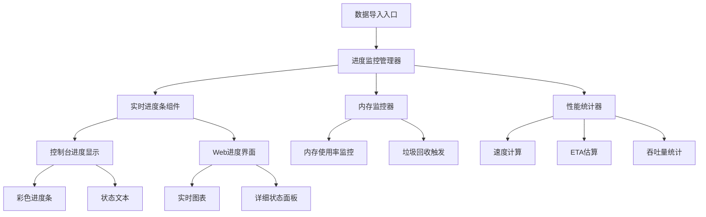
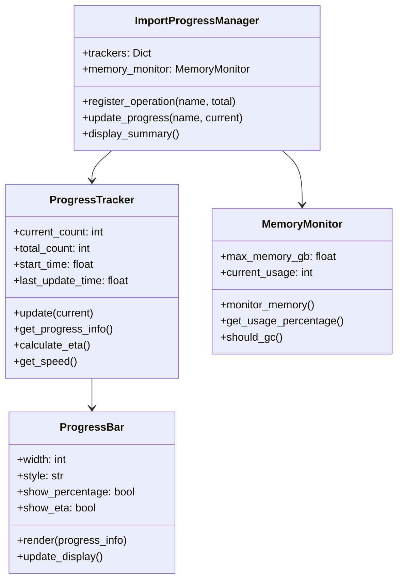
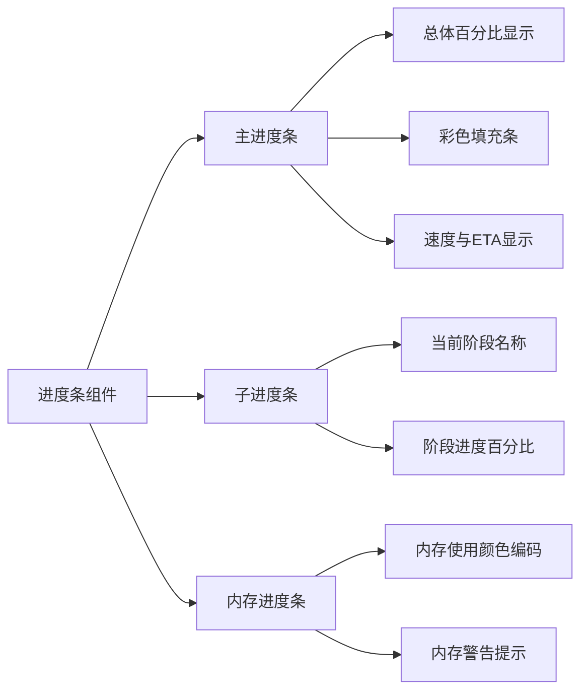
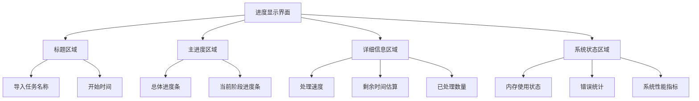
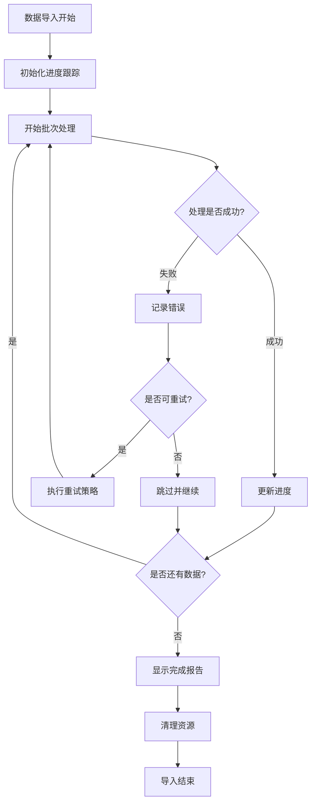
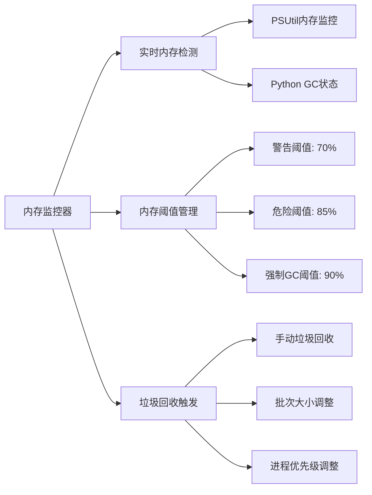
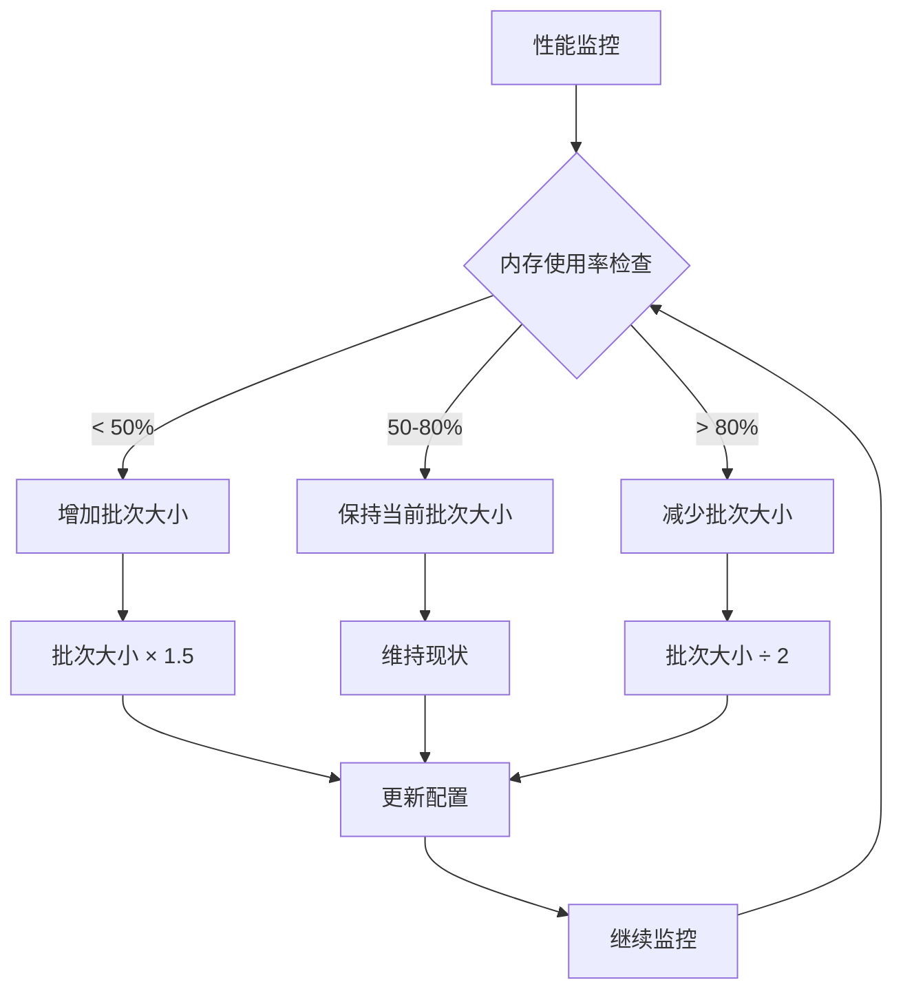
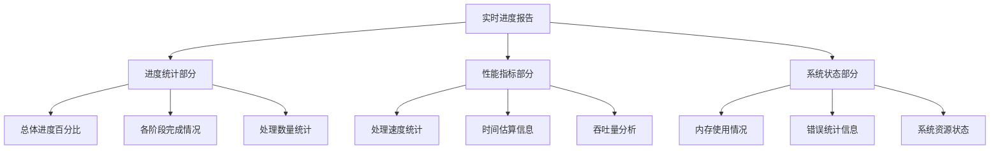
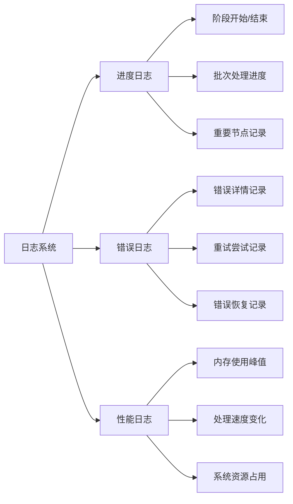
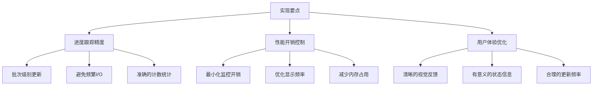

# 数据导入进度优化设计文档

## 概述

针对百万级数据导入过程中缺乏进度可视化的问题，设计一套完整的进度监控与用户体验优化方案。当前导入脚本在处理大规模数据时等待时间过长且无法判断系统运行状态，需要加入详细的进度条和状态反馈机制。

## 技术架构

### 核心组件架构

### 进度监控系统设计

## 进度监控功能设计

### 多维度进度跟踪

| 监控维度 | 指标内容 | 显示方式 |
|---------|---------|---------|
| 总体进度 | 整体完成百分比 | 主进度条 + 百分比 |
| 分阶段进度 | 各导入阶段进度 | 子进度条 + 阶段名称 |
| 性能指标 | 处理速度、ETA | 实时数值显示 |
| 内存监控 | 内存使用率 | 内存条 + 百分比 |
| 错误统计 | 成功/失败计数 | 状态计数器 |

### 进度条样式设计

### 实时状态反馈机制

| 状态类型 | 显示内容 | 更新频率 |
|---------|---------|---------|
| 处理状态 | 当前正在处理的操作 | 实时 |
| 数量统计 | 已处理/总数量 | 每批次更新 |
| 时间信息 | 已用时间/预计剩余时间 | 每秒更新 |
| 性能指标 | 处理速度（条/秒） | 每5秒更新 |
| 内存状态 | 内存使用率和警告 | 每10秒更新 |

## 用户体验优化

### 进度显示界面设计

### 交互式控制功能

| 控制功能 | 实现方式 | 用途 |
|---------|---------|------|
| 暂停/继续 | 信号量控制 | 允许用户暂停导入过程 |
| 取消导入 | 优雅退出机制 | 安全终止导入并清理资源 |
| 详细日志 | 实时日志输出 | 查看详细处理信息 |
| 性能调节 | 动态批次大小调整 | 根据系统性能自适应调整 |

### 错误处理与重试机制

## 性能监控设计

### 内存使用监控

### 性能指标计算

| 性能指标 | 计算公式 | 更新策略 |
|---------|---------|---------|
| 处理速度 | 已处理数量 / 已用时间 | 移动平均，每5秒更新 |
| 剩余时间 | (总数量 - 已处理数量) / 当前速度 | 基于最近处理速度计算 |
| 内存效率 | 已处理数量 / 内存使用量 | 每批次计算 |
| 错误率 | 错误数量 / 总处理数量 * 100% | 实时计算 |

### 自适应性能调优

## 输出报告设计

### 实时进度报告格式

### 完成报告内容

| 报告部分 | 包含内容 | 格式 |
|---------|---------|------|
| 导入摘要 | 总数量、成功数、失败数 | 表格形式 |
| 时间统计 | 总用时、各阶段用时、平均速度 | 数值 + 图表 |
| 性能分析 | 峰值速度、平均内存使用、效率指标 | 统计图表 |
| 错误详情 | 错误类型分布、错误样本 | 列表 + 饼图 |
| 建议优化 | 性能优化建议、配置调整建议 | 文本说明 |

### 日志记录策略

## 实施方案

### 实现优先级

| 优先级 | 功能模块 | 实现难度 | 预期效果 |
|--------|---------|---------|---------|
| P0 | 基础进度条显示 | 低 | 立即可见进度反馈 |
| P0 | 速度计算与ETA | 低 | 提供时间预期 |
| P1 | 内存监控显示 | 中 | 防止内存溢出 |
| P1 | 分阶段进度跟踪 | 中 | 详细进度了解 |
| P2 | 交互式控制 | 高 | 用户控制能力 |
| P2 | Web界面显示 | 高 | 更好的用户体验 |

### 技术实现要点

### 兼容性考虑

| 运行环境 | 显示方式 | 技术方案 |
|---------|---------|---------|
| 控制台环境 | 字符型进度条 | rich/tqdm库 |
| SSH远程环境 | 文本进度显示 | 标准输出 |
| Docker容器 | 日志流输出 | 结构化日志 |
| Web界面 | 图形化进度 | WebSocket实时推送 |

通过这套完整的进度监控优化方案，用户将能够清楚地了解数据导入的实时状态，避免因等待时间未知而产生的焦虑，同时提供了系统性能监控和优化能力。