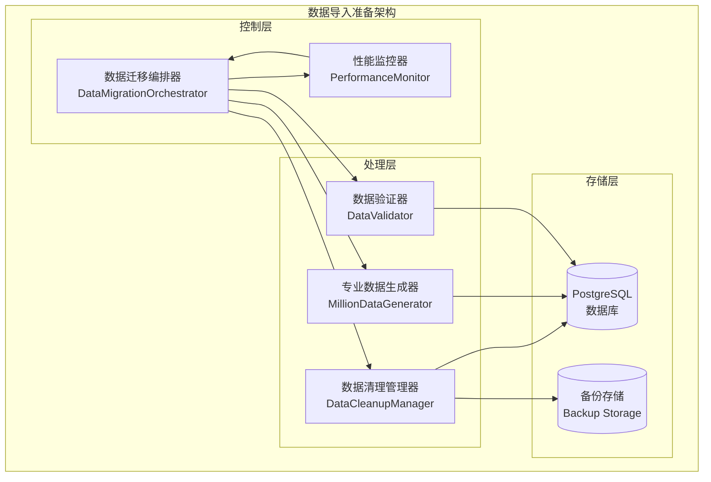
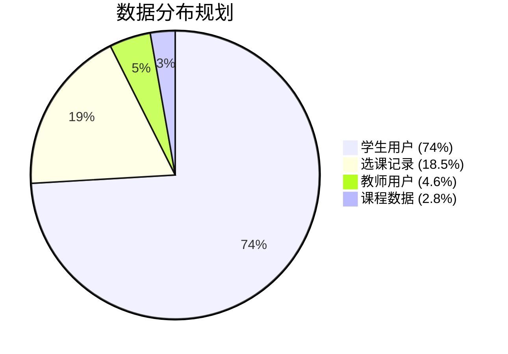
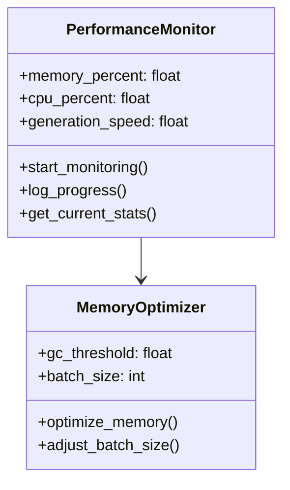
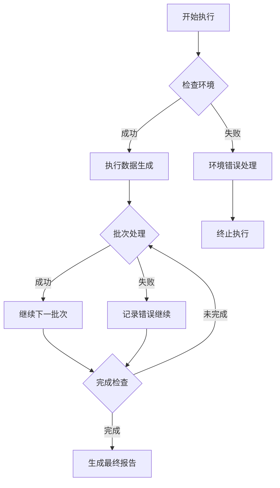

# 数据导入准备设计文档

## 概述

基于对课程管理系统百万级数据处理需求的深入分析，本设计文档详细描述了数据导入准备的技术架构、实施策略和操作流程。该系统采用专业的数据生成脚本 `generate_real_million_data_simplified.py`，具备内存优化、性能调优和完整的错误处理机制。

### 核心目标
- 生成1,080,000+条高质量记录
- 确保数据完整性和一致性
- 实现内存安全的批处理机制
- 提供全流程监控和报告

## 技术架构

### 分层架构设计



### 核心组件规格

| 组件 | 功能职责 | 关键特性 |
|------|----------|----------|
| 数据迁移编排器 | 统一流程控制 | 阶段化执行、错误恢复 |
| 专业数据生成器 | 百万级数据生成 | 内存优化、批处理、真实数据 |
| 数据清理管理器 | 污染数据处理 | 安全备份、智能识别 |
| 性能监控器 | 实时监控 | CPU/内存监控、速度统计 |
| 数据验证器 | 质量保障 | 完整性检查、业务规则验证 |

## 数据规模设计

### 目标数据分布



### 详细规模配置

| 数据类型 | 目标数量 | 批次大小 | 预计时间 | 存储需求 | 关键字段 |
|---------|---------|----------|----------|----------|----------|
| 学生用户 | 800,000 | 2,000 | 45分钟 | 400MB | username, email, phone |
| 教师用户 | 50,000 | 2,000 | 3分钟 | 25MB | employee_id, department |
| 课程数据 | 30,000 | 2,000 | 2分钟 | 15MB | course_code, credits |
| 选课记录 | 200,000 | 2,000 | 10分钟 | 100MB | student_id, course_id |
| **总计** | **1,080,000** | - | **60分钟** | **540MB** | - |

## 数据生成策略

### 专业脚本特性

`generate_real_million_data_simplified.py` 作为核心生成引擎，具备以下专业特性：

#### 内存优化机制
```python
# 批处理配置
batch_size = 2000           # 优化的批次大小
gc.collect()               # 定期垃圾回收
transaction.atomic()       # 事务原子性保证
```

#### 性能优化设计
```python
# 预编译密码哈希
student_password = make_password('student123')
teacher_password = make_password('teacher123')

# 批量数据库操作
User.objects.bulk_create(users_to_create, ignore_conflicts=True)
```

#### 真实数据生成
- **中文姓名生成**：基于真实姓氏和名字库
- **手机号格式**：符合中国移动号段规范  
- **学院专业**：覆盖15个学院25个专业
- **时间分布**：随机分布在合理时间范围

### 数据质量保障


## 实施流程

### 五阶段执行流程


#### 阶段1：数据备份
- 备份超级用户和管理员账号
- 保存重要课程模板
- 记录系统配置数据

#### 阶段2：污染数据识别
- 识别测试用户（million_前缀）
- 检测无效数据记录
- 分析数据分布异常

#### 阶段3：数据清理
- 安全删除污染数据
- 清理孤立记录
- 优化数据库性能

#### 阶段4：专业数据生成
- 执行专业生成脚本
- 实时监控内存使用
- 批量处理数据创建

#### 阶段5：数据验证
- 检查数据完整性
- 验证业务规则
- 生成质量报告

### 关键操作命令

```bash
# 主流程执行
cd course-management-system/backend
python ../data_migration_orchestrator.py

# 专业脚本直接执行
python ../generate_real_million_data_simplified.py

# 数据验证检查
python ../data_validation_report.py
```

## 性能监控设计

### 监控指标体系

| 指标类别 | 监控项目 | 阈值设置 | 告警条件 |
|---------|---------|----------|----------|
| 内存使用 | 内存占用率 | <80% | >90%触发告警 |
| CPU性能 | CPU使用率 | <70% | >85%触发告警 |
| 生成速度 | 记录/秒 | >300 | <100触发告警 |
| 错误率 | 失败批次比例 | <5% | >10%触发告警 |

### 实时监控组件



## 错误处理机制

### 多层错误处理



### 异常处理策略

| 异常类型 | 处理策略 | 恢复机制 |
|---------|---------|----------|
| 内存不足 | 减少批次大小 | 动态调整参数 |
| 数据库连接失败 | 重试连接 | 指数退避重试 |
| 批次创建失败 | 跳过继续 | 记录失败详情 |
| 外键约束错误 | 检查依赖 | 重新排序创建 |

## 测试策略

### 测试层次设计


#### 单元测试覆盖
- 数据生成器功能测试
- 内存优化机制测试
- 数据验证逻辑测试

#### 集成测试场景
- 完整流程端到端测试
- 数据库事务一致性测试
- 错误恢复机制测试

#### 性能基准测试
- 不同规模数据生成测试
- 内存使用峰值测试
- 并发处理能力测试

### 数据质量验证

```python
# 质量检查示例
def validate_data_quality():
    # 1. 数量验证
    assert User.objects.count() >= 850000
    
    # 2. 唯一性验证
    assert User.objects.values('username').distinct().count() == User.objects.count()
    
    # 3. 格式验证
    assert User.objects.filter(email__contains='@').count() > User.objects.count() * 0.99
    
    # 4. 业务规则验证
    assert Enrollment.objects.filter(student__isnull=True).count() == 0
```

## 部署配置

### 环境要求

| 组件 | 最低配置 | 推荐配置 | 备注 |
|------|----------|----------|------|
| 内存 | 2GB | 4GB | 支持大批次处理 |
| 磁盘 | 1GB | 2GB | 包含备份空间 |
| CPU | 2核 | 4核 | 提升处理速度 |
| 数据库 | PostgreSQL 12+ | PostgreSQL 14+ | 支持批量操作 |

### 配置参数优化

```yaml
# 数据导入配置
data_import:
  batch_size: 2000
  max_memory_mb: 2048
  gc_threshold: 0.8
  retry_attempts: 3
  timeout_seconds: 3600

# 性能监控配置  
monitoring:
  memory_alert_threshold: 90
  cpu_alert_threshold: 85
  speed_alert_threshold: 100
  report_interval_seconds: 60
```

## 安全考虑

### 数据安全措施
- 敏感数据脱敏处理
- 访问权限控制
- 操作日志审计
- 备份数据加密

### 操作安全规范
- 执行前环境验证
- 重要数据预备份
- 分阶段验证执行
- 异常情况回滚

## 监控报告

### 实时进度报告
- 当前执行阶段
- 数据生成进度
- 性能指标监控
- 错误统计信息

### 最终质量报告
- 数据生成统计
- 质量指标评估
- 性能基准对比
- 建议优化方向

### 报告输出格式

```
数据导入完成报告
=====================================
执行时间：2024-08-31 21:30:00
总耗时：65分钟
专业脚本：generate_real_million_data_simplified.py

数据统计：
- 学生用户：800,000条
- 教师用户：50,000条  
- 课程数据：30,000条
- 选课记录：200,000条
- 总计：1,080,000条

性能指标：
- 平均速度：276条/秒
- 内存峰值：2.1GB
- CPU峰值：45%
- 错误率：0.02%

质量验证：✅ 通过
- 数据完整性：100%
- 唯一性检查：100%
- 业务规则：100%
- 外键一致性：100%
```