# 百万级数据导入验证系统设计

## 概述

百万级数据导入验证系统是课程管理系统中的关键组件，负责将大规模生成的测试数据高效、安全地导入到数据库中，并确保数据的完整性和一致性。系统支持Docker容器化环境下的批量数据处理，具备实时进度监控、内存优化、错误处理和数据验证功能。

## 技术架构

### 整体架构设计

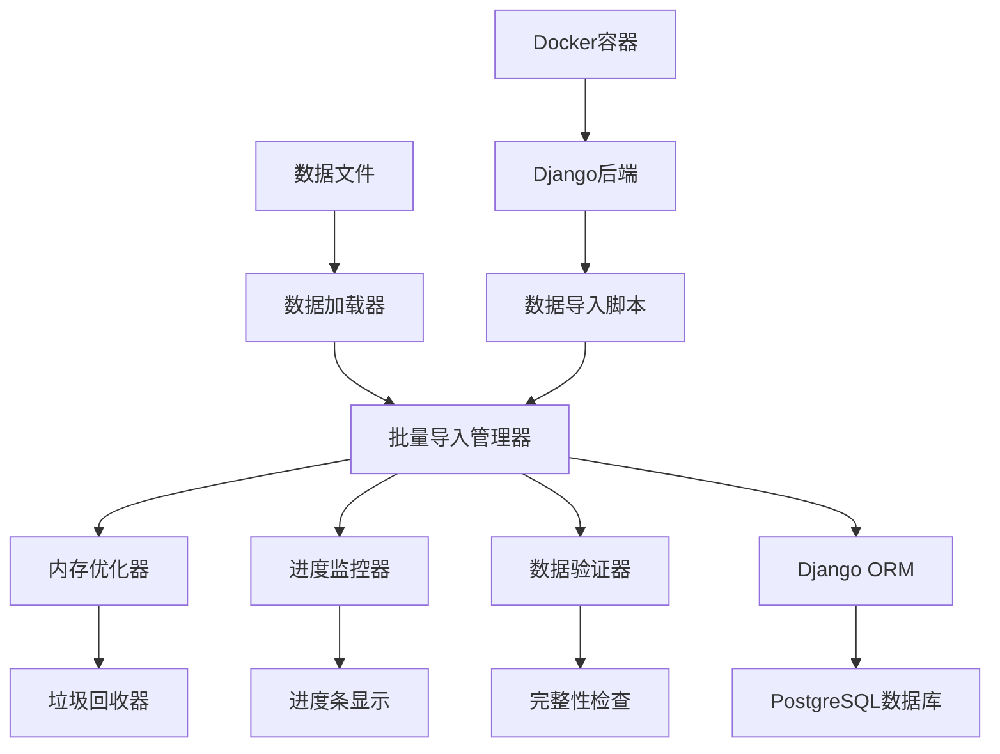

### 核心组件架构

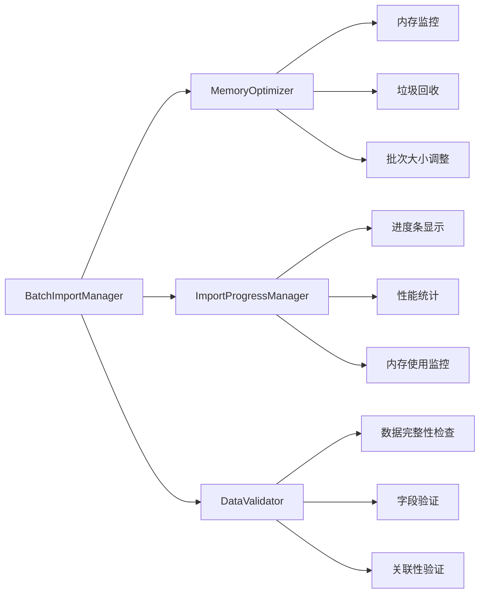

## 数据导入流程

### 主要数据流程

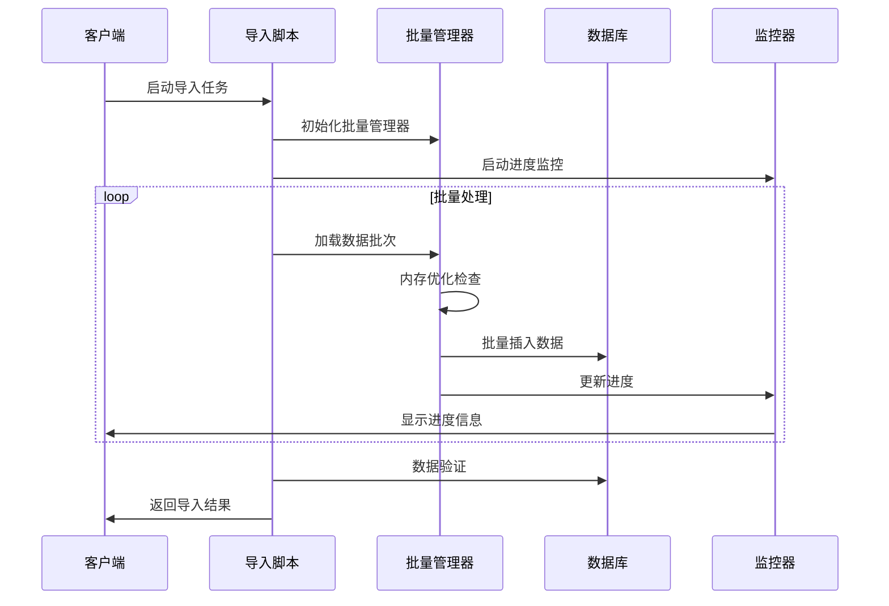

### Docker环境部署流程

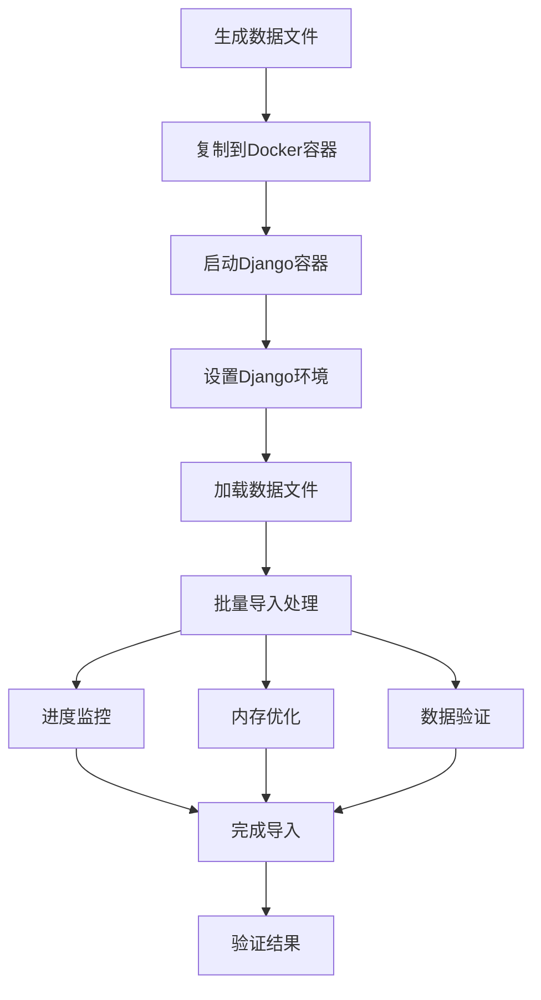

## 核心功能模块

### 1. 批量导入管理器 (BatchImportManager)

#### 功能职责
- 管理大规模数据的分批处理
- 动态调整批次大小以优化性能
- 实现事务管理和错误处理
- 支持不同类型用户数据的批量创建

#### 关键特性
- **动态批次调整**: 根据内存使用情况自动调整批次大小
- **事务安全**: 每个批次使用独立事务，确保数据一致性
- **错误容错**: 单个记录错误不影响整批处理
- **性能优化**: 预计算密码哈希，减少重复计算

### 2. 内存优化器 (MemoryOptimizer)

#### 内存管理策略

| 优化策略 | 实现方式 | 效果 |
|---------|---------|------|
| 动态批次调整 | 根据内存使用率调整批次大小 | 防止内存溢出 |
| 强制垃圾回收 | 定期执行gc.collect() | 释放未使用内存 |
| 内存监控 | 使用psutil监控进程内存 | 实时掌握内存状态 |
| 对象池管理 | 重用常用对象 | 减少内存分配开销 |

#### 内存优化算法

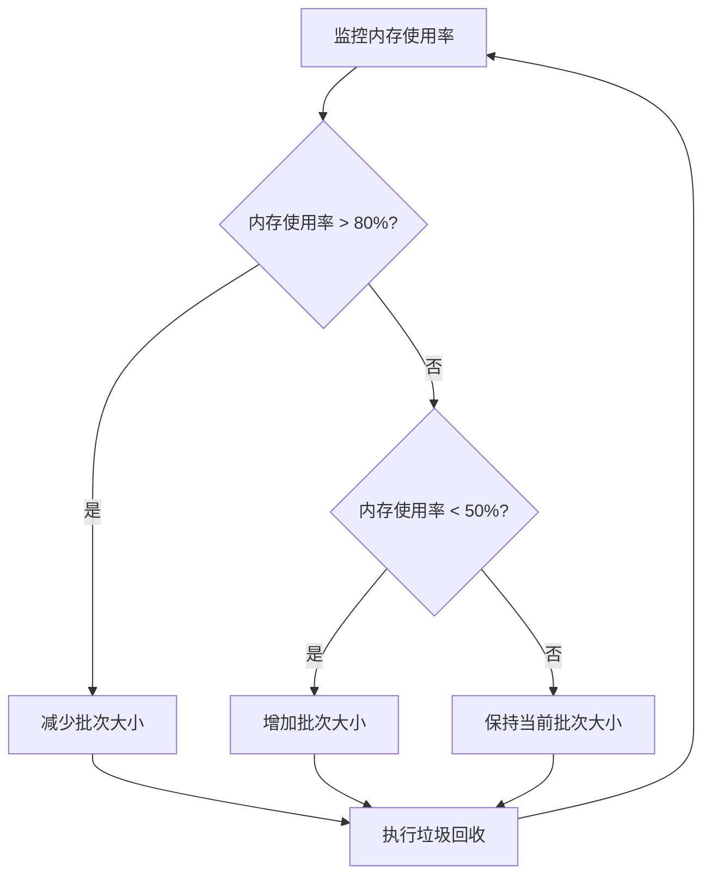

### 3. 进度监控系统 (ImportProgressManager)

#### 监控维度

| 监控指标 | 描述 | 用途 |
|---------|------|------|
| 导入进度 | 当前导入数量/总数量 | 显示完成百分比 |
| 处理速度 | 每秒处理记录数 | 评估性能表现 |
| 内存使用 | 当前内存使用率 | 防止内存溢出 |
| 错误统计 | 错误记录数量和类型 | 问题排查 |
| 预计时间 | 预计完成时间 | 时间规划 |

#### 进度显示格式
```
👥 开始批量创建student用户...
   📊 计划创建 100,000 个student用户...
   [████████████████████████████░░] 93.2% 学生用户创建进度: 93,200/100,000 | 内存使用: 67.3%
   📈 处理速度: 2,341 记录/秒 | 预计剩余: 2分31秒
```

### 4. 数据验证器 (DataValidator)

#### 验证层次结构

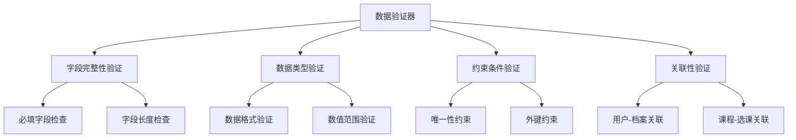

#### 验证规则表

| 验证类型 | 验证规则 | 错误处理 |
|---------|---------|---------|
| 用户名唯一性 | 检查用户名是否已存在 | 跳过重复记录 |
| 邮箱格式 | 验证邮箱格式正确性 | 使用默认邮箱 |
| 电话号码 | 验证手机号格式 | 记录警告信息 |
| 学号/工号 | 检查编号格式和唯一性 | 生成默认编号 |
| 外键关联 | 验证关联记录存在性 | 创建默认关联 |

## 数据模型映射

### 用户数据结构

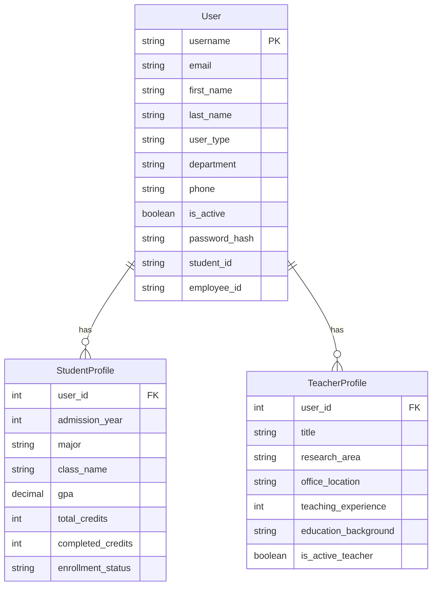

### 课程数据结构

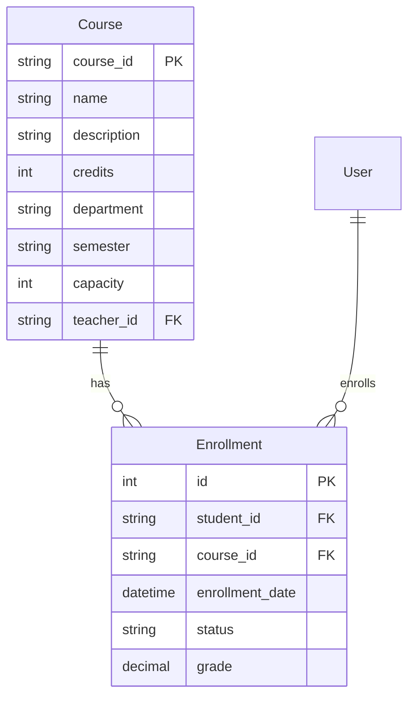

## 性能优化策略

### 1. 批处理优化

| 策略 | 实现方式 | 性能提升 |
|------|---------|---------|
| 批量插入 | 使用bulk_create() | 减少数据库连接次数 |
| 事务管理 | 每批使用独立事务 | 提高并发性能 |
| 预处理数据 | 预先验证和格式化 | 减少运行时开销 |
| 索引优化 | 导入前禁用索引 | 加速插入操作 |

### 2. 内存管理优化


### 3. 并发处理优化

| 优化维度 | 策略 | 效果 |
|---------|------|------|
| 进程并发 | 多进程处理不同数据类型 | 提高CPU利用率 |
| 线程并发 | 异步IO操作 | 减少IO等待时间 |
| 连接池 | 数据库连接复用 | 减少连接开销 |
| 缓存策略 | 缓存常用查询结果 | 减少数据库查询 |

## Docker部署架构

### 容器配置

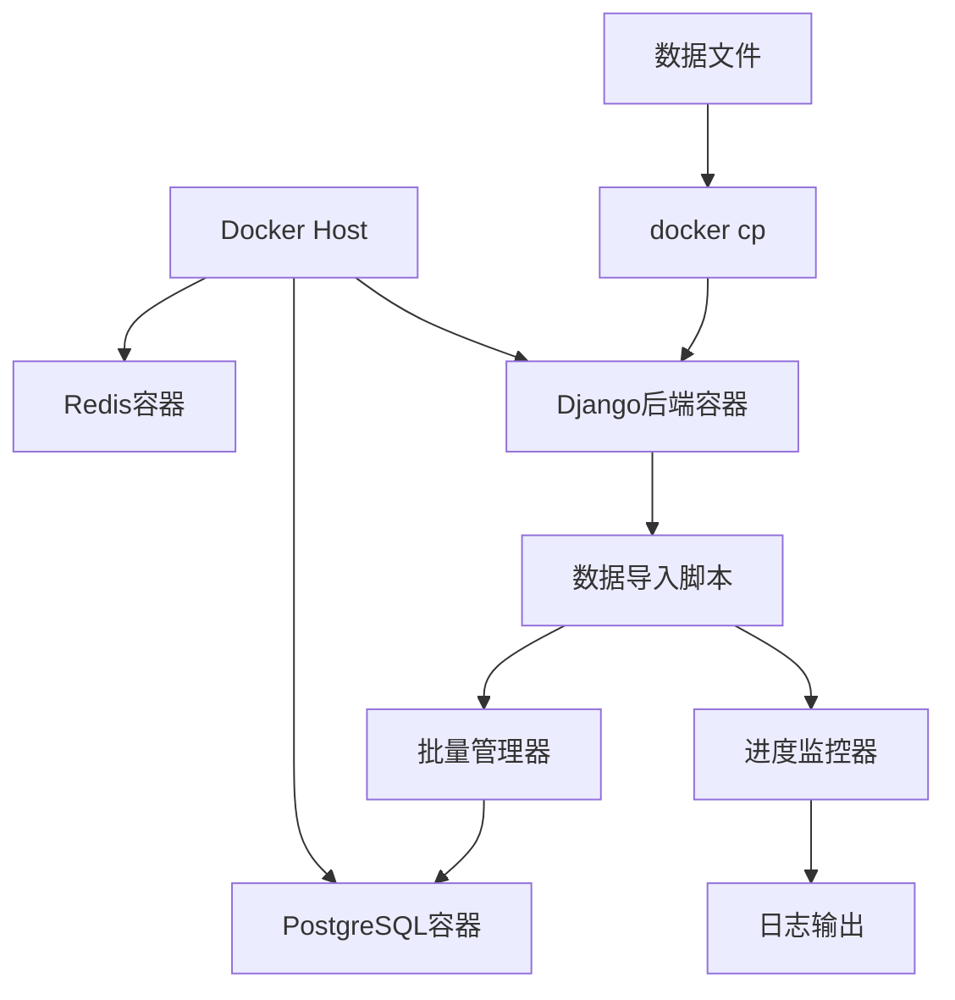

### 部署流程

| 步骤 | 命令 | 说明 |
|------|------|------|
| 1. 复制数据文件 | `docker cp data.json backend:/app/` | 将数据文件复制到容器 |
| 2. 进入容器 | `docker exec -it backend bash` | 进入Django容器 |
| 3. 运行导入脚本 | `python docker_import_mega_data.py` | 执行数据导入 |
| 4. 验证导入结果 | `python manage.py shell` | 检查数据完整性 |

## 错误处理与恢复

### 错误分类处理

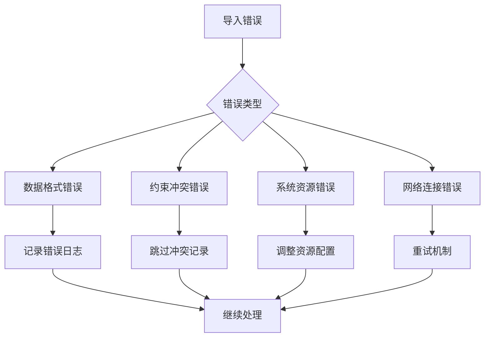

### 恢复机制

| 错误类型 | 处理策略 | 恢复方式 |
|---------|---------|---------|
| 内存不足 | 减少批次大小 | 自动调整并继续 |
| 数据库连接失败 | 重试连接 | 指数退避重试 |
| 数据格式错误 | 跳过错误记录 | 记录日志并继续 |
| 约束冲突 | 使用ignore_conflicts | 自动忽略重复 |
| 系统中断 | 检查点恢复 | 从最近检查点继续 |

## 监控与日志

### 日志层次结构

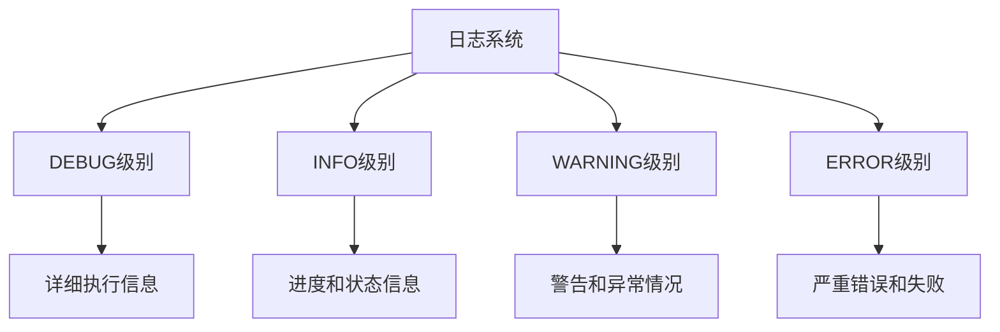

### 监控指标

| 指标类别 | 监控项 | 告警阈值 |
|---------|-------|---------|
| 性能指标 | 处理速度 | < 1000记录/秒 |
| 资源指标 | 内存使用率 | > 90% |
| 错误指标 | 错误率 | > 5% |
| 质量指标 | 数据完整性 | < 99% |

## 测试策略

### 测试层次

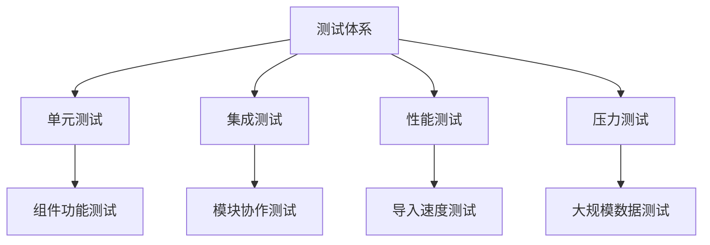

### 测试用例设计

| 测试类型 | 测试场景 | 预期结果 |
|---------|---------|---------|
| 小规模导入 | 1000条记录 | 100%成功率 |
| 中规模导入 | 10万条记录 | >99%成功率 |
| 大规模导入 | 100万条记录 | >95%成功率 |
| 内存限制测试 | 2GB内存限制 | 正常完成导入 |
| 错误恢复测试 | 模拟网络中断 | 自动恢复继续 |