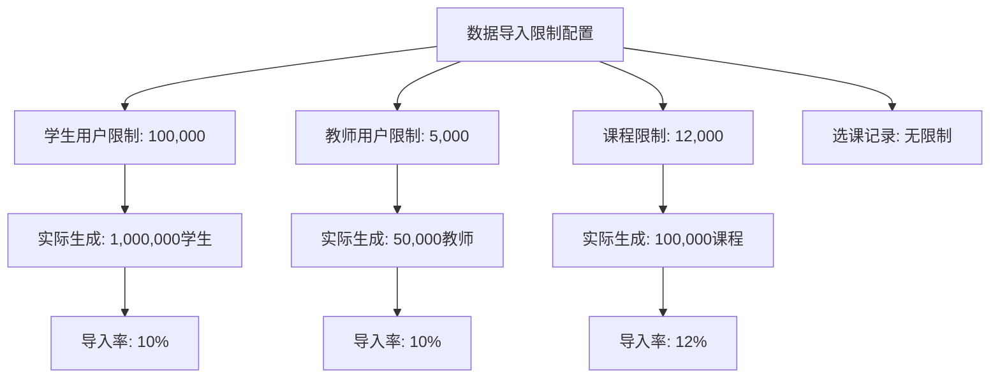
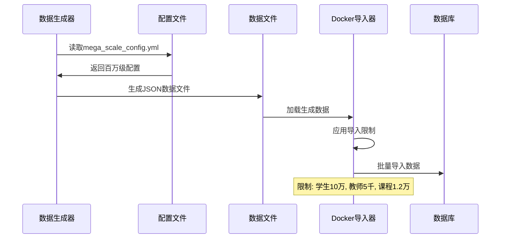
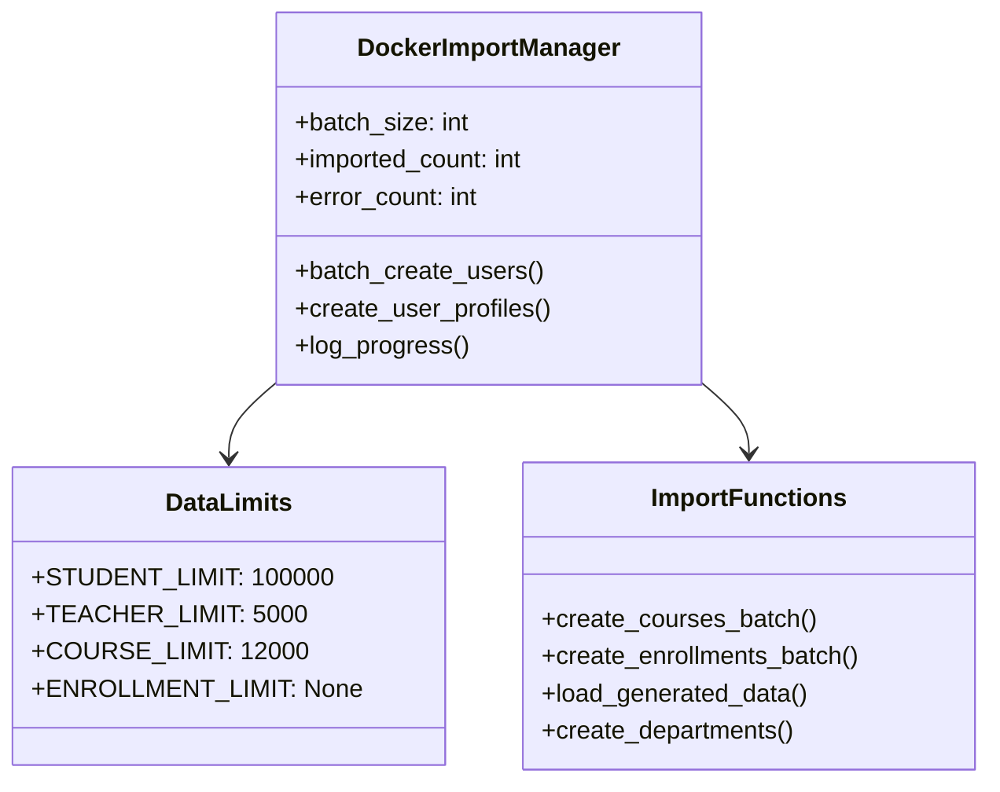
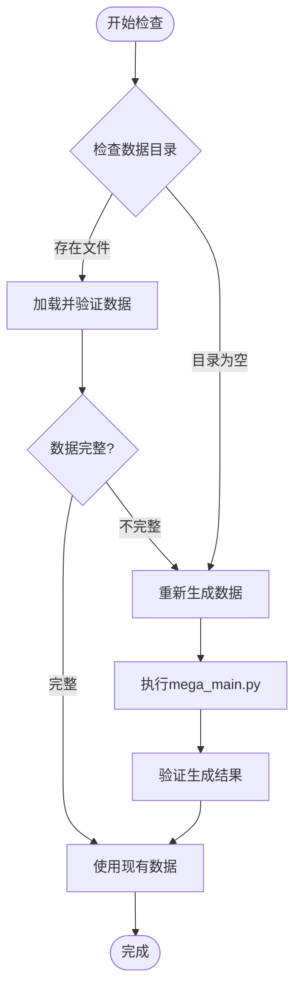
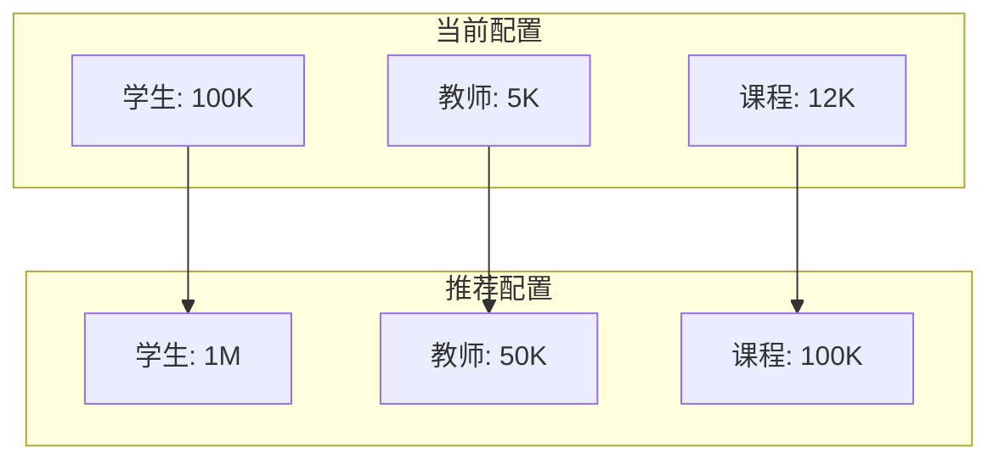
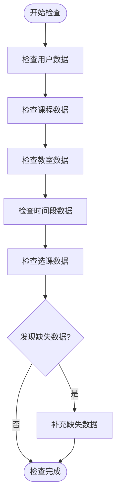

# 百万级数据初始化状态检查与修复设计

## 概述

本设计文档分析校园课程管理系统百万级数据导入的当前状态，识别课程数据和其他参数的初始化问题，并提供完整的修复方案。

## 问题分析

### 当前数据导入状态

根据用户反馈和系统分析，百万级数据导入存在以下问题：

1. **学生和教师数据**：已成功导入
2. **课程数据**：未完整导入或存在限制
3. **其他参数**：包括教室、时间段、选课记录等可能未初始化

### 数据导入限制发现

通过分析 `docker_import_mega_data.py` 脚本，发现以下导入限制配置：



### 数据规模配置分析

百万级数据生成配置 (`mega_scale_config.yml` 和 `config.py`) 中的期望规模：

| 数据类型 | 配置规模 | 当前导入限制 | 导入比例 |
|---------|----------|--------------|----------|
| 学生 | 1,000,000 | 100,000 | 10% |
| 教师 | 50,000 | 5,000 | 10% |
| 课程 | 100,000 | 12,000 | 12% |
| 教室 | 5,000 | 未明确限制 | ? |
| 院系 | 100 | 无限制 | 100% |
| 专业 | 500 | 无限制 | 100% |

## 数据初始化架构

### 数据生成流程



### 数据导入组件分析



## 问题识别

### 1. 数据文件缺失问题

当前数据生成目录状态：
- `optimized_large_output/json/`: 空目录
- `conservative_large_output/json/`: 空目录
- 缺少实际的百万级JSON数据文件

### 2. 导入限制过于严格

导入脚本中的限制远小于配置的生成规模：
- 学生数量被限制为原计划的10%
- 教师数量被限制为原计划的10%  
- 课程数量被限制为原计划的12%

### 3. 未完成的数据组件

可能缺失的数据组件包括：
- 教室数据 (Classroom)
- 时间段数据 (TimeSlot)
- 选课关系数据 (Enrollment)
- 课程评价数据 (CourseEvaluation)

## 解决方案设计

### 解决方案1: 数据文件检查与重新生成

#### 步骤1: 检查现有数据文件


#### 步骤2: 数据重新生成命令
```python
# 执行百万级数据生成
python data-generator/mega_main.py --scale huge --output optimized_large_output

# 或使用优化版生成器
python data-generator/generate_optimized_data.py
```

### 解决方案2: 导入限制调整

#### 修改导入脚本限制

将 `docker_import_mega_data.py` 中的限制调整为：

| 参数 | 原限制 | 建议限制 | 说明 |
|------|--------|----------|------|
| STUDENT_LIMIT | 100,000 | 1,000,000 | 导入所有学生 |
| TEACHER_LIMIT | 5,000 | 50,000 | 导入所有教师 |
| COURSE_LIMIT | 12,000 | 100,000 | 导入所有课程 |
| ENROLLMENT_LIMIT | None | None | 保持无限制 |

#### 导入限制配置表



### 解决方案3: 数据完整性检查与补充

#### 数据完整性检查流程



#### 缺失数据生成策略

1. **教室数据生成**：
   - 根据配置生成5,000个教室
   - 包含不同类型：普通教室、多媒体教室、实验室等
   
2. **时间段数据生成**：
   - 生成标准作息时间段
   - 支持12个时间段配置

3. **选课记录生成**：
   - 基于已有学生和课程生成选课关系
   - 控制每个学生选课数量合理分布

## 实施计划

### 阶段1: 问题诊断 (预计1小时)

1. **数据文件状态检查**
   - 扫描所有数据输出目录
   - 验证JSON文件完整性
   - 评估现有数据规模

2. **数据库状态检查**
   - 运行 `django_data_check.py` 脚本
   - 统计各表记录数量
   - 分析数据分布情况

### 阶段2: 数据重新生成 (预计2-3小时)

1. **执行百万级数据生成**
   ```bash
   cd course-management-system/data-generator
   python mega_main.py --config mega_scale_config.yml
   ```

2. **数据文件验证**
   - 检查生成文件大小和结构
   - 验证数据字段完整性
   - 确认记录数量符合预期

### 阶段3: 导入配置优化 (预计30分钟)

1. **修改导入限制**
   ```python
   # 在docker_import_mega_data.py中修改
   STUDENT_LIMIT = None  # 移除限制
   TEACHER_LIMIT = None  # 移除限制  
   COURSE_LIMIT = None   # 移除限制
   ```

2. **批处理大小调整**
   - 根据系统内存调整batch_size
   - 优化批处理性能参数

### 阶段4: 数据导入执行 (预计3-4小时)

1. **准备数据文件**
   ```bash
   # 复制数据文件到Docker容器
   docker cp optimized_large_output/json/course_data_*.json course_management_backend:/app/course_data.json
   ```

2. **执行导入**
   ```bash
   # 在Docker容器中执行导入
   docker exec -it course_management_backend python docker_import_mega_data.py
   ```

3. **监控导入进度**
   - 实时查看导入日志
   - 监控系统资源使用
   - 记录导入统计信息

### 阶段5: 数据验证与优化 (预计1小时)

1. **数据完整性验证**
   ```bash
   # 运行数据检查脚本
   python django_data_check.py
   ```

2. **性能基准测试**
   - 测试查询响应时间
   - 验证API接口性能
   - 评估前端加载速度

## 监控指标

### 数据量指标

| 指标名称 | 期望值 | 实际值 | 状态 |
|---------|--------|--------|------|
| 学生数量 | 1,000,000 | 待检查 | ⏳ |
| 教师数量 | 50,000 | 待检查 | ⏳ |
| 课程数量 | 100,000 | 待检查 | ⏳ |
| 选课记录 | ~3,000,000 | 待检查 | ⏳ |
| 总记录数 | ~4,000,000+ | 待检查 | ⏳ |

### 性能指标

- **数据导入速度**: 目标 >10,000 条/秒
- **查询响应时间**: 目标 <200ms
- **内存使用**: 目标 <4GB
- **存储空间**: 预期 ~10-20GB

## 风险控制

### 潜在风险识别

1. **系统资源不足**
   - 内存溢出风险
   - 磁盘空间不足
   - CPU过载导致系统卡顿

2. **数据导入失败**  
   - 网络连接中断
   - 数据库连接超时
   - 数据格式错误

3. **数据一致性问题**
   - 外键约束冲突
   - 数据重复导入
   - 字段映射错误

### 风险缓解措施

1. **资源监控**
   - 实时监控系统资源使用
   - 设置内存和CPU使用阈值
   - 自动清理临时文件

2. **断点续传**
   - 支持导入进度保存
   - 失败后可从断点继续
   - 数据一致性检查机制

3. **数据备份**
   - 导入前备份现有数据
   - 支持快速数据回滚
   - 多重验证确保数据正确性

## 成功标准

### 功能验证标准

1. **数据完整性**
   - 所有表数据导入完成
   - 外键关系正确建立
   - 数据格式符合模型定义

2. **业务功能正常**
   - 用户登录功能正常
   - 课程查询功能正常  
   - 选课功能正常运作
   - 数据统计功能准确

3. **性能表现**
   - 页面加载时间<3秒
   - 查询响应时间<500ms
   - 系统并发支持>100用户

### 数据质量标准

1. **数据准确性**: 99.9%以上记录格式正确
2. **数据完整性**: 0%缺失必填字段
3. **关联一致性**: 100%外键关系有效
4. **业务逻辑**: 符合实际业务场景

通过以上设计方案的实施，可以全面解决百万级数据初始化中的课程数据缺失和参数配置问题，确保系统数据的完整性和功能的正常运作。