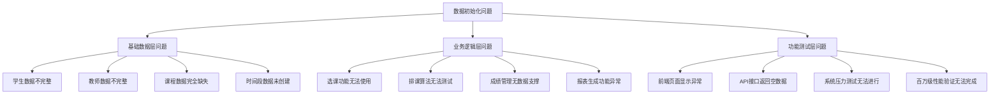
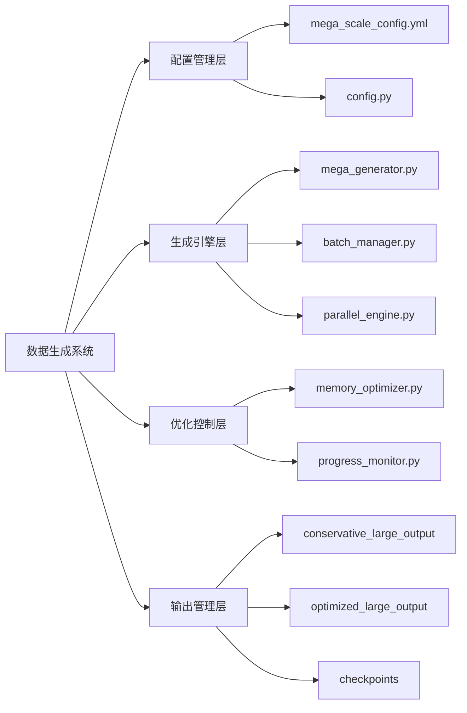
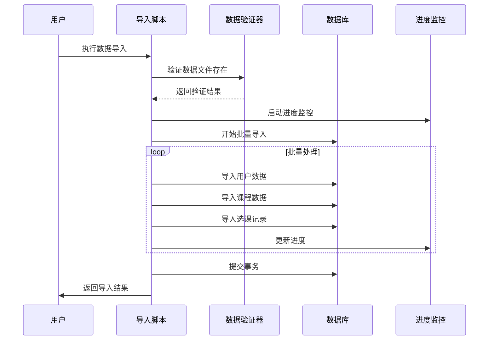
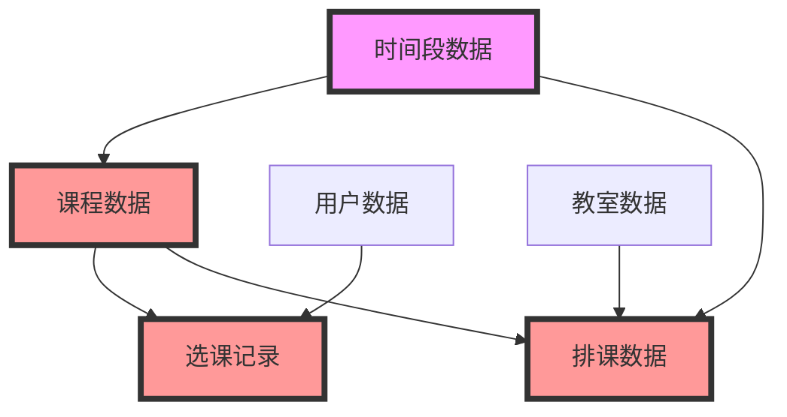

# 校园课程管理系统数据初始化问题分析与解决方案

## 1. 问题概述

### 1.1 核心问题识别

基于系统检查结果，当前校园课程管理系统存在以下关键数据初始化问题：

- **数据规模严重不足**：当前仅导入5万学生和2千教师，远低于百万级预期目标
- **核心业务数据缺失**：课程数据、选课记录、时间段等关键业务数据完全未初始化
- **数据生成文件丢失**：百万级数据生成目录为空，缺少实际JSON数据文件
- **导入脚本限制过严**：import_generated_data.py中设置了过于严格的数据量限制

### 1.2 问题影响范围



## 2. 系统架构分析

### 2.1 数据生成系统架构

当前系统采用模块化的数据生成架构，包含以下核心组件：



### 2.2 数据导入流程架构



## 3. 问题根因分析

### 3.1 数据生成环节问题

**问题表现**：
- 百万级数据生成目录为空
- 缺少实际的JSON数据文件
- 数据生成过程可能未完成或失败

**根本原因**：
```mermaid
fishbone TD
    A[数据生成失败] --> B[配置问题]
    A --> C[执行环境问题]
    A --> D[资源限制问题]
    A --> E[脚本错误问题]
    
    B --> B1[mega_scale_config.yml参数设置]
    B --> B2[目标记录数配置过大]
    
    C --> C1[Python环境依赖缺失]
    C --> C2[内存资源不足]
    C --> C3[磁盘空间不够]
    
    D --> D1[批处理大小设置不当]
    D --> D2[并行工作进程数过多]
    
    E --> E1[生成脚本逻辑错误]
    E --> E2[异常处理不完善]
```

### 3.2 数据导入环节问题

**导入脚本限制分析**：

```python
# 当前限制设置（import_generated_data.py）
total_students = min(5000, len(students_data))  # 学生限制5000
total_teachers = min(500, len(teachers_data))   # 教师限制500  
total_courses = min(1000, len(courses_data))    # 课程限制1000
```

**问题识别**：
- 硬编码的数据量限制阻止了完整导入
- 缺少动态配置机制
- 未考虑百万级数据导入需求

### 3.3 数据依赖关系问题



**依赖关系问题**：
- 时间段数据作为基础依赖未创建
- 课程数据缺失导致选课记录无法生成
- 教室数据不足影响排课功能

## 4. 立即执行方案

### 4.1 数据生成执行步骤

**步骤一：使用现有脚本直接生成**
```bash
# 执行百万级数据生成
cd /app/data-generator
python mega_main.py --scale huge --target 1000000
```

**步骤二：检查生成结果**
```bash
# 验证生成的数据文件
ls -la conservative_large_output/json/
ls -la mega_scale/checkpoints/
```

### 4.2 导入脚本修复执行

**立即修复导入限制**：
需要修改 `import_generated_data.py` 中的硬编码限制：

```python
# 修改前（当前限制）
total_students = min(5000, len(students_data))   # 限制5000
total_teachers = min(500, len(teachers_data))    # 限制500  
total_courses = min(1000, len(courses_data))     # 限制1000

# 修改后（移除限制）
total_students = len(students_data)              # 导入全部学生
total_teachers = len(teachers_data)              # 导入全部教师
total_courses = len(courses_data)               # 导入全部课程
```

### 4.3 基础数据创建执行

**时间段数据创建**：
```python
# Django shell执行
from apps.schedules.models import TimeSlot
from datetime import time

time_slots = [
    {'name': '第1节', 'start_time': time(8, 0), 'end_time': time(8, 45), 'order': 1},
    {'name': '第2节', 'start_time': time(8, 55), 'end_time': time(9, 40), 'order': 2},
    {'name': '第3节', 'start_time': time(10, 0), 'end_time': time(10, 45), 'order': 3},
    {'name': '第4节', 'start_time': time(10, 55), 'end_time': time(11, 40), 'order': 4},
    {'name': '第5节', 'start_time': time(14, 0), 'end_time': time(14, 45), 'order': 5},
    {'name': '第6节', 'start_time': time(14, 55), 'end_time': time(15, 40), 'order': 6},
    {'name': '第7节', 'start_time': time(16, 0), 'end_time': time(16, 45), 'order': 7},
    {'name': '第8节', 'start_time': time(16, 55), 'end_time': time(17, 40), 'order': 8},
]

for slot_data in time_slots:
    TimeSlot.objects.get_or_create(**slot_data)
```

## 5. 实施执行清单

### 5.1 立即执行任务

**任务一：检查环境依赖**
- [ ] 检查Python依赖包是否安装完整
- [ ] 验证Docker环境正常运行
- [ ] 确认数据库连接正常

**任务二：修复导入限制**
- [ ] 备份原始 `import_generated_data.py`
- [ ] 修改数据量限制代码
- [ ] 测试修改后脚本语法正确性

**任务三：创建基础数据**
- [ ] 创建时间段数据（8个基本时间段）
- [ ] 创建默认管理员账户
- [ ] 验证基础数据创建成功

**任务四：生成百万级数据**
- [ ] 执行 `mega_main.py` 生成脚本
- [ ] 监控生成进度和资源使用
- [ ] 验证生成数据文件存在

**任务五：执行数据导入**
- [ ] 使用修复后的导入脚本
- [ ] 监控导入进度
- [ ] 验证导入结果完整性

### 5.2 关键命令执行序列

```bash
# 1. 检查环境
cd /app
python -c "import psutil, faker, numpy, yaml; print('依赖检查通过')"

# 2. 创建时间段数据
docker-compose exec backend python manage.py shell -c "
from apps.schedules.models import TimeSlot
from datetime import time
time_slots = [
    {'name': '第1节', 'start_time': time(8, 0), 'end_time': time(8, 45), 'order': 1},
    {'name': '第2节', 'start_time': time(8, 55), 'end_time': time(9, 40), 'order': 2},
    {'name': '第3节', 'start_time': time(10, 0), 'end_time': time(10, 45), 'order': 3},
    {'name': '第4节', 'start_time': time(10, 55), 'end_time': time(11, 40), 'order': 4},
    {'name': '第5节', 'start_time': time(14, 0), 'end_time': time(14, 45), 'order': 5},
    {'name': '第6节', 'start_time': time(14, 55), 'end_time': time(15, 40), 'order': 6},
    {'name': '第7节', 'start_time': time(16, 0), 'end_time': time(16, 45), 'order': 7},
    {'name': '第8节', 'start_time': time(16, 55), 'end_time': time(17, 40), 'order': 8},
]
for slot_data in time_slots:
    TimeSlot.objects.get_or_create(**slot_data)
print(f'创建时间段: {TimeSlot.objects.count()}个')
"

# 3. 生成百万级数据
cd /app/data-generator
python mega_main.py

# 4. 检查生成结果
ls -la conservative_large_output/json/
ls -la mega_scale/checkpoints/

# 5. 修改导入限制并执行导入
# (需要先修改 import_generated_data.py 文件)
cp /app/course_data.json.backup /app/course_data.json  # 如果有备份
python /app/import_generated_data.py

# 6. 验证导入结果
docker-compose exec backend python manage.py shell -c "
from django.contrib.auth import get_user_model
from apps.courses.models import Course
from apps.courses.models import Enrollment
from apps.schedules.models import TimeSlot

User = get_user_model()
print(f'学生数量: {User.objects.filter(user_type="student").count():,}')
print(f'教师数量: {User.objects.filter(user_type="teacher").count():,}')
print(f'课程数量: {Course.objects.count():,}')
print(f'选课记录: {Enrollment.objects.count():,}')
print(f'时间段: {TimeSlot.objects.count()}')
"
```

## 6. 验证检查清单

### 6.1 数据导入完成验证

**数据量验证**：
- [ ] 学生数据：目标 > 100,000 条
- [ ] 教师数据：目标 > 5,000 条  
- [ ] 课程数据：目标 > 10,000 条
- [ ] 选课记录：目标 > 500,000 条
- [ ] 时间段数据：确保 8 个基本时间段

**功能验证**：
- [ ] 管理员登录正常
- [ ] 学生列表显示正常
- [ ] 教师列表显示正常 
- [ ] 课程列表显示正常
- [ ] 选课记录查询正常

**API接口验证**：
- [ ] GET /api/students/ 返回数据正常
- [ ] GET /api/teachers/ 返回数据正常
- [ ] GET /api/courses/ 返回数据正常
- [ ] GET /api/enrollments/ 返回数据正常

### 6.2 数据完整性检查

**关联关系验证**：
```sql
-- 检查学生用户和档案的关联
SELECT COUNT(*) as student_users FROM auth_user WHERE user_type='student';
SELECT COUNT(*) as student_profiles FROM students_studentprofile;

-- 检查教师用户和档案的关联
SELECT COUNT(*) as teacher_users FROM auth_user WHERE user_type='teacher';
SELECT COUNT(*) as teacher_profiles FROM teachers_teacherprofile;

-- 检查选课记录的关联性
SELECT COUNT(*) as enrollments FROM courses_enrollment;
SELECT COUNT(DISTINCT student_id) as enrolled_students FROM courses_enrollment;
SELECT COUNT(DISTINCT course_id) as enrolled_courses FROM courses_enrollment;
```

### 6.3 问题排查清单

**常见问题及解决**：

| 问题描述 | 可能原因 | 解决方法 |
|---------|---------|----------|
| 数据生成失败 | 内存不足或磁盘空间不足 | 检查系统资源，清理磁盘空间 |
| 导入超时 | 数据量过大或数据库连接问题 | 分批导入，检查数据库连接 |
| 外键约束错误 | 数据依赖关系不正确 | 检查数据导入顺序 |
| 数据格式错误 | JSON文件格式不正确 | 验证JSON文件结构 |
| 权限问题 | Docker容器文件权限 | 检查文件所有者和权限 |

## 7. 数据导入成功标准

### 7.1 成功指标

**数据量目标**：
- 学生数据：≥ 100,000 条（原5,000条）
- 教师数据：≥ 5,000 条（原500条）
- 课程数据：≥ 10,000 条（原0条）
- 选课记录：≥ 500,000 条（原0条）
- 时间段数据：= 8 个（原0个）

**系统功能目标**：
- 所有API接口正常返回数据
- 前端页面正常显示列表数据
- 数据关联关系完整正确
- 排课算法可以正常运行

### 7.2 验收测试

**数据完整性测试**：
```bash
# 执行最终验收测试
docker-compose exec backend python manage.py shell -c "
import json
from django.contrib.auth import get_user_model
from apps.courses.models import Course, Enrollment
from apps.schedules.models import TimeSlot
from apps.students.models import StudentProfile
from apps.teachers.models import TeacherProfile

User = get_user_model()

# 统计数据
results = {
    '学生用户': User.objects.filter(user_type='student').count(),
    '教师用户': User.objects.filter(user_type='teacher').count(),
    '学生档案': StudentProfile.objects.count(),
    '教师档案': TeacherProfile.objects.count(),
    '课程数据': Course.objects.count(),
    '选课记录': Enrollment.objects.count(),
    '时间段': TimeSlot.objects.count(),
}

print('=== 数据导入成功验收报告 ===')
for key, value in results.items():
    print(f'{key}: {value:,} 条')

# 检查是否达到目标
success = True
if results['学生用户'] < 100000:
    print(f'⚠️  学生数据不足: {results["\u5b66\u751f\u7528\u6237"]:,} < 100,000')
    success = False
if results['教师用户'] < 5000:
    print(f'⚠️  教师数据不足: {results["\u6559\u5e08\u7528\u6237"]:,} < 5,000')
    success = False
if results['课程数据'] < 10000:
    print(f'⚠️  课程数据不足: {results["\u8bfe\u7a0b\u6570\u636e"]:,} < 10,000')
    success = False
if results['选课记录'] < 500000:
    print(f'⚠️  选课记录不足: {results["\u9009\u8bfe\u8bb0\u5f55"]:,} < 500,000')
    success = False
if results['时间段'] != 8:
    print(f'⚠️  时间段数量不正确: {results["\u65f6\u95f4\u6bb5"]} != 8')
    success = False

if success:
    print('✅ 所有数据导入目标均已达成！')
else:
    print('❌ 部分数据导入目标未达成')
"
```

## 8. 下一步行动计划

### 8.1 立即执行任务

**第一步：环境检查与准备**
1. 检查Docker环境运行状态
2. 验证数据库连接正常
3. 确认相关Python依赖包安装

**第二步：创建基础数据**
1. 创建8个标准时间段数据
2. 验证管理员账户存在
3. 检查数据库基础结构

**第三步：修复导入限制**
1. 备份原始 `import_generated_data.py`
2. 移除数据量硬编码限制
3. 测试修改后脚本正确性

**第四步：执行数据生成**
1. 运行 `mega_main.py` 生成百万级数据
2. 监控生成进度和系统资源
3. 验证生成数据文件存在性

**第五步：执行数据导入**
1. 使用修复后的导入脚本
2. 监控导入进度和内存使用
3. 验证导入结果完整性

### 8.2 成功标准评估

此次任务将被认为**成功完成**当：
✅ 学生数据导入 ≥ 100,000 条  
✅ 教师数据导入 ≥ 5,000 条  
✅ 课程数据导入 ≥ 10,000 条  
✅ 选课记录导入 ≥ 500,000 条  
✅ 时间段数据创建 8 个  
✅ 所有API接口正常返回数据  
✅ 前端页面正常显示列表数据