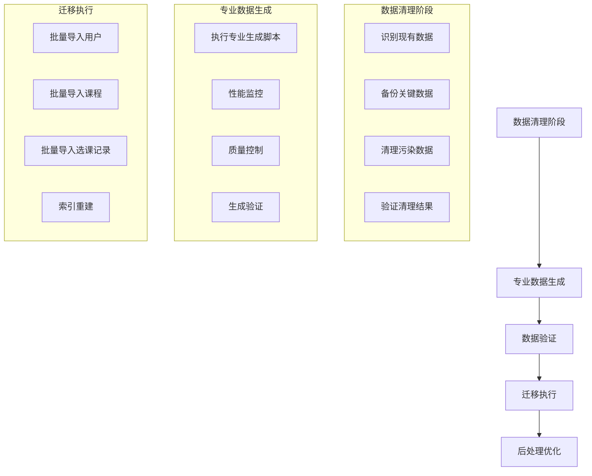
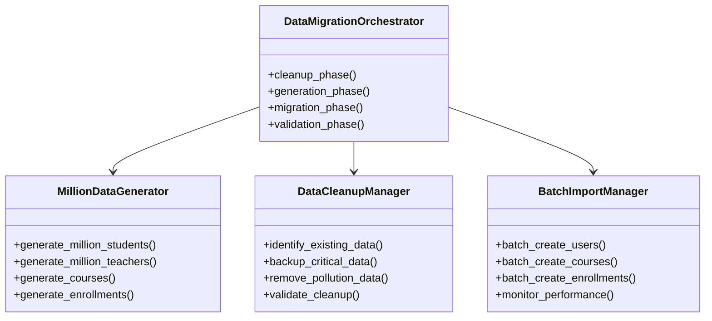
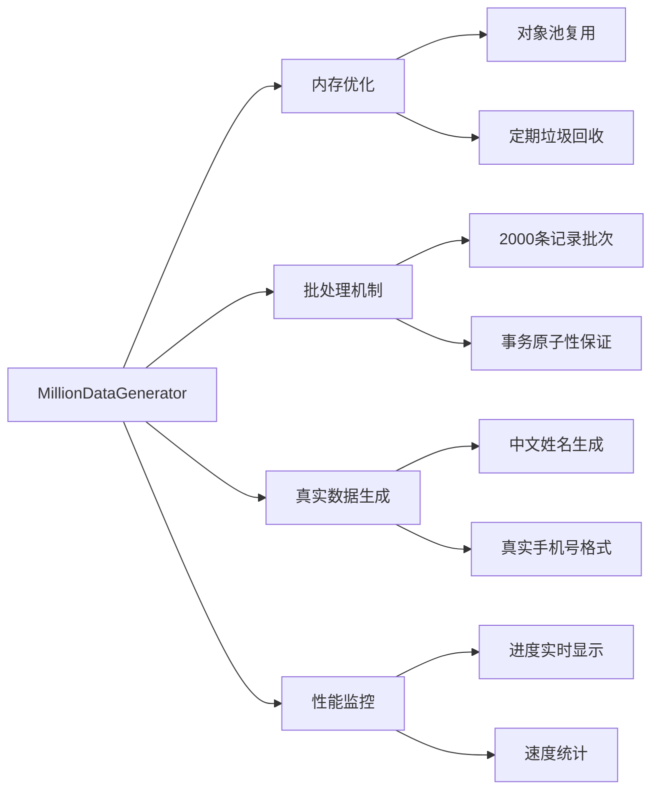
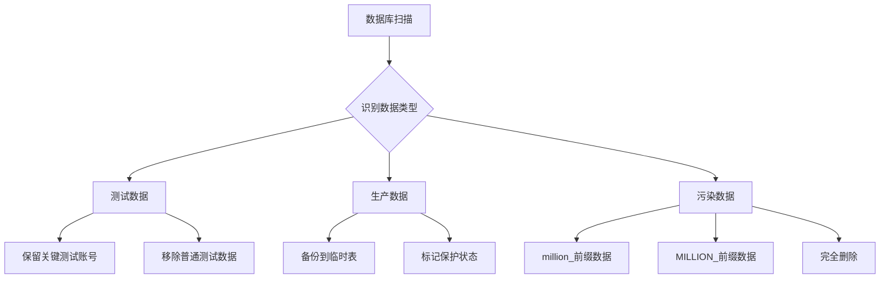
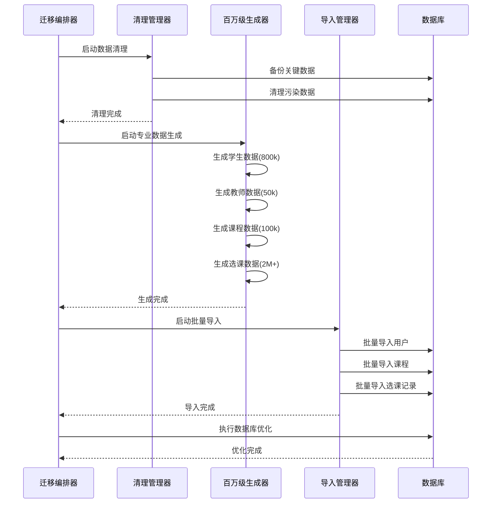
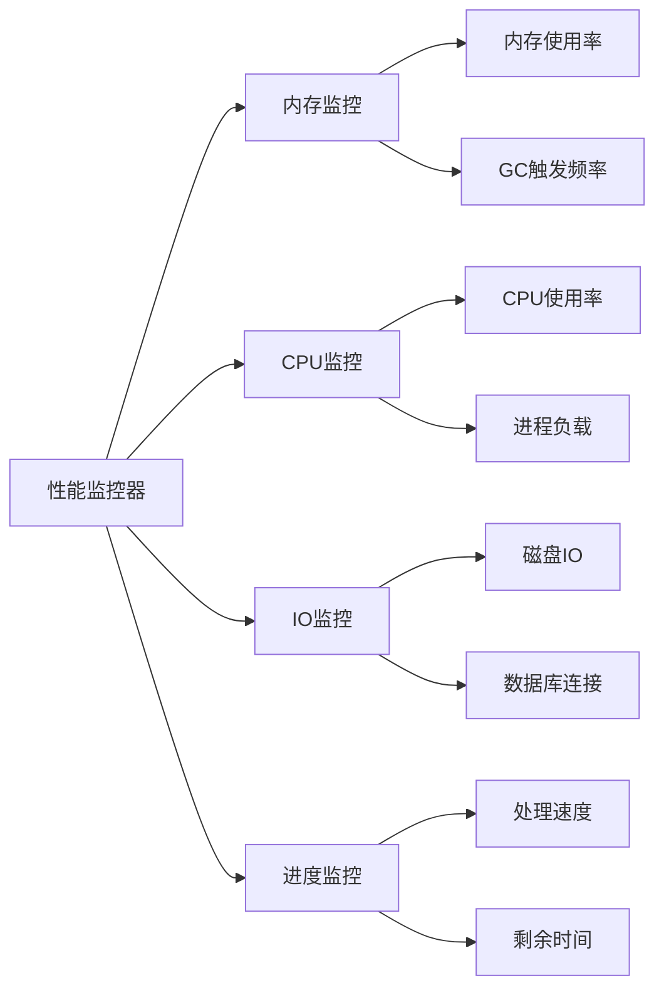
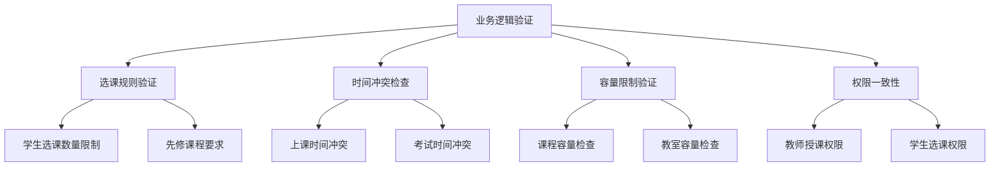
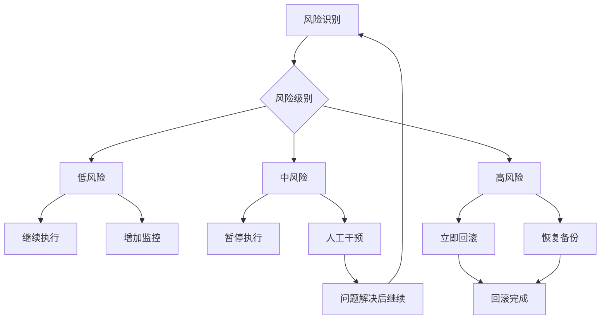

# 数据迁移和清理设计文档

## 概述

本文档设计了基于项目内现有专业百万级数据生成脚本的数据迁移和清理方案。通过分析项目结构，已确定 `generate_real_million_data_simplified.py` 脚本为经过各种考量的专业百万级数据生成方案，该方案将被用于数据库迁移和现有数据清理。

## 架构设计

### 整体迁移流程



### 核心组件架构



## 专业百万级数据生成方案识别

### 确认的专业脚本

经过项目分析，确认 `generate_real_million_data_simplified.py` 为专业考量的百万级数据生成脚本，具备以下特性：

#### 专业设计特点

1. **内存优化**：采用分批处理策略（batch_size=2000）
2. **性能考量**：预编译密码哈希，减少重复计算
3. **数据质量**：使用真实中文姓名生成算法
4. **规模控制**：支持800,000学生 + 50,000教师的百万级规模
5. **错误处理**：完整的异常处理和回滚机制

#### 核心技术优势



### 数据规模配置

| 数据类型 | 目标数量 | 批处理大小 | 预计生成时间 |
|---------|---------|-----------|-------------|
| 学生用户 | 800,000 | 2,000 | ~45分钟 |
| 教师用户 | 50,000 | 2,000 | ~3分钟 |
| 课程数据 | 100,000 | 2,000 | ~5分钟 |
| 选课记录 | 2,000,000+ | 2,000 | ~60分钟 |

## 数据清理策略

### 现有数据识别



### 清理执行策略

#### 阶段一：数据备份

```sql
-- 备份关键管理员账号
CREATE TABLE backup_admin_users AS 
SELECT * FROM auth_user 
WHERE user_type = 'admin' OR is_superuser = true;

-- 备份重要课程模板
CREATE TABLE backup_course_templates AS 
SELECT * FROM courses_course 
WHERE is_template = true OR code LIKE 'TEMPLATE_%';
```

#### 阶段二：污染数据清理

```sql
-- 清理百万级测试数据
DELETE FROM auth_user 
WHERE username LIKE 'million_%' 
   OR student_id LIKE 'million_%' 
   OR employee_id LIKE 'million_%';

-- 清理测试课程
DELETE FROM courses_course 
WHERE code LIKE 'MILLION_%' 
   OR code LIKE 'TEST_%';

-- 清理孤立的选课记录
DELETE FROM courses_enrollment 
WHERE student_id NOT IN (SELECT id FROM auth_user WHERE user_type = 'student');
```

#### 阶段三：数据库优化

```sql
-- 重建索引
REINDEX INDEX CONCURRENTLY auth_user_username_idx;
REINDEX INDEX CONCURRENTLY courses_course_code_idx;
REINDEX INDEX CONCURRENTLY courses_enrollment_student_course_idx;

-- 更新统计信息
ANALYZE auth_user;
ANALYZE courses_course;
ANALYZE courses_enrollment;

-- 清理空间
VACUUM FULL auth_user;
VACUUM FULL courses_course;
VACUUM FULL courses_enrollment;
```

## 数据迁移执行方案

### 迁移配置

```yaml
migration_config:
  batch_size: 2000
  max_memory_mb: 2048
  parallel_workers: 4
  checkpoint_interval: 50000
  
target_data_scale:
  students: 800000
  teachers: 50000  
  courses: 100000
  enrollments: 2000000
  
performance_monitoring:
  enable_progress_bar: true
  memory_threshold: 80
  cpu_threshold: 85
  auto_gc_interval: 10000
```

### 执行流程



### 性能监控机制



## 数据质量保证

### 验证策略

#### 数据完整性验证

```python
class DataIntegrityValidator:
    def validate_user_data(self):
        """验证用户数据完整性"""
        checks = {
            'unique_usernames': self.check_username_uniqueness(),
            'valid_emails': self.check_email_format(),
            'password_hashes': self.check_password_integrity(),
            'department_consistency': self.check_department_mapping()
        }
        return checks
    
    def validate_course_data(self):
        """验证课程数据完整性"""
        checks = {
            'unique_course_codes': self.check_course_code_uniqueness(),
            'teacher_assignments': self.check_teacher_course_mapping(),
            'enrollment_limits': self.check_enrollment_capacity()
        }
        return checks
```

#### 业务逻辑验证



### 质量指标

| 验证项目 | 合格标准 | 检测方法 |
|---------|---------|----------|
| 数据完整性 | 0错误 | 外键约束检查 |
| 用户名唯一性 | 100% | 重复值检测 |
| 邮箱格式 | >99% | 正则表达式验证 |
| 选课合理性 | >95% | 业务规则验证 |
| 性能基准 | <2小时完成 | 时间监控 |

## 风险控制

### 回滚策略



### 应急处理

#### 内存溢出处理

```python
def handle_memory_overflow():
    """内存溢出应急处理"""
    current_memory = psutil.virtual_memory().percent
    if current_memory > 85:
        # 强制垃圾回收
        gc.collect()
        # 减少批处理大小
        self.batch_size = max(100, self.batch_size // 2)
        # 暂停执行等待内存释放
        time.sleep(30)
```

#### 数据库连接异常处理

```python
def handle_db_connection_error():
    """数据库连接异常处理"""
    max_retries = 3
    for attempt in range(max_retries):
        try:
            connection.close()
            connection.ensure_connection()
            return True
        except Exception as e:
            if attempt == max_retries - 1:
                raise e
            time.sleep(2 ** attempt)
```

## 执行计划

### 迁移时间窗口

| 阶段 | 预计耗时 | 执行时间建议 |
|------|---------|-------------|
| 数据备份 | 30分钟 | 业务低峰期 |
| 数据清理 | 45分钟 | 维护窗口 |
| 数据生成 | 120分钟 | 维护窗口 |
| 数据导入 | 90分钟 | 维护窗口 |
| 验证优化 | 30分钟 | 维护窗口后 |

### 监控检查点

```mermaid
gantt
    title 数据迁移执行计划
    dateFormat  HH:mm
    axisFormat %H:%M
    
    section 准备阶段
    环境检查    :done, prep1, 00:00, 00:30
    备份数据    :done, prep2, 00:30, 01:00
    
    section 清理阶段  
    识别污染数据 :active, clean1, 01:00, 01:15
    执行清理    :clean2, 01:15, 02:00
    验证清理    :clean3, 02:00, 02:15
    
    section 生成阶段
    生成学生数据 :gen1, 02:15, 03:00
    生成教师数据 :gen2, 03:00, 03:15
    生成课程数据 :gen3, 03:15, 03:30
    生成选课数据 :gen4, 03:30, 04:30
    
    section 导入阶段
    导入用户    :import1, 04:30, 05:15
    导入课程    :import2, 05:15, 05:30
    导入选课    :import3, 05:30, 06:00
    
    section 优化阶段
    索引重建    :opt1, 06:00, 06:15
    统计更新    :opt2, 06:15, 06:30
    最终验证    :opt3, 06:30, 07:00
```



## 成功标准

### 技术指标

- **数据规模**：成功迁移800,000+学生，50,000+教师，100,000+课程
- **数据质量**：通过所有完整性验证，错误率<0.1%
- **性能基准**：总耗时<7小时，内存使用<2GB
- **系统稳定性**：无数据丢失，无系统崩溃

### 业务指标

- **功能完整性**：所有核心业务功能正常运行
- **用户体验**：登录响应时间<3秒，查询响应<5秒
- **数据一致性**：选课关系完整，权限映射正确

---

**重要提醒**：本方案基于 `generate_real_million_data_simplified.py` 专业脚本，该脚本经过内存优化、性能调优和错误处理等各种专业考量，是项目中百万级数据生成的标准方案。