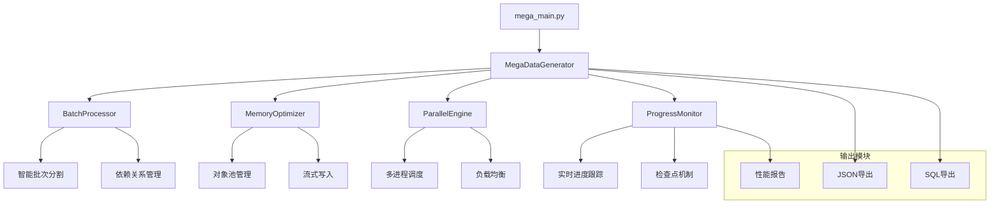
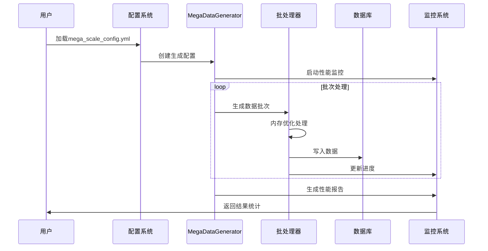

# 数据导入脚本修正设计文档

## 概述

本设计文档旨在修正先前数据导入过程中的错误配置，将小规模数据生成脚本替换为百万级数据生成脚本，并提供完整的测试验证方案。

## 问题分析

### 当前问题
- **错误使用了小规模脚本**: 使用了`main.py`脚本生成几万条数据，而非百万级数据
- **数据规模不符合需求**: 当前数据量无法满足性能测试和压力测试要求
- **缺乏验证机制**: 数据导入后缺少完整性验证

### 脚本对比分析

| 特性 | main.py (小规模) | mega_main.py (百万级) |
|------|------------------|----------------------|
| 目标记录数 | 几万条 | 100万+ |
| 内存优化 | 基础优化 | 高级内存管理 |
| 并行处理 | 单线程 | 多进程并行 |
| 批处理 | 简单批处理 | 智能批处理管理 |
| 监控 | 基础日志 | 实时性能监控 |
| 错误恢复 | 基础处理 | 检查点恢复机制 |

## 技术架构

### 百万级数据生成架构



### 数据流程设计



## 修正方案

### 1. 脚本替换策略

#### 原错误配置
```bash
# 错误使用的小规模脚本
cd course-management-system/data-generator
python main.py --scale large --format json sql
```

#### 正确的百万级配置
```bash
# 正确的百万级数据生成
cd course-management-system/data-generator
python mega_main.py --target-records 1000000 --workers 8 --memory 2048 --monitor
```

### 2. 配置文件优化

#### mega_scale_config.yml 推荐配置
```yaml
generation:
  target_records: 1000000
  scale: "huge"
  output_dir: "mega_output"

batch_processing:
  batch_size: 50000
  max_workers: 8
  max_memory_mb: 2048

memory_optimization:
  enable_compression: true
  enable_streaming: true
  max_object_pool_size: 10000

output:
  formats: ["json", "sql"]
  max_file_size_mb: 500

checkpoints:
  enable_checkpoints: true
  checkpoint_interval: 100000

logging:
  level: "INFO"
  enable_file_logging: true
  log_file: "mega_generation.log"
```

### 3. 数据导入流程修正

#### 阶段1: 环境准备


#### 阶段2: 数据生成


#### 阶段3: 数据导入


## 实施步骤

### Step 1: 清理现有数据
```bash
# 1. 备份现有数据（如果需要）
pg_dump course_management > backup_small_data.sql

# 2. 清理数据表
psql -d course_management -c "
    TRUNCATE TABLE enrollments CASCADE;
    TRUNCATE TABLE courses CASCADE;
    TRUNCATE TABLE students CASCADE;
    TRUNCATE TABLE teachers CASCADE;
    TRUNCATE TABLE departments CASCADE;
"
```

### Step 2: 执行百万级数据生成
```bash
# 1. 进入数据生成目录
cd course-management-system/data-generator

# 2. 检查配置文件
cat mega_scale_config.yml

# 3. 执行百万级数据生成
python mega_main.py \
    --target-records 1000000 \
    --batch-size 50000 \
    --workers 8 \
    --memory 2048 \
    --output ./mega_output \
    --monitor \
    --conflict-difficulty mixed
```

### Step 3: 数据验证与导入
```bash
# 1. 验证生成的数据文件
ls -la mega_output/

# 2. 检查数据完整性
python -c "
import json
with open('mega_output/complete_dataset.json', 'r') as f:
    data = json.load(f)
    print(f'总记录数: {data[\"metadata\"][\"total_records\"]}')
    print(f'生成时间: {data[\"metadata\"][\"generation_time_seconds\"]}秒')
    print(f'验证状态: {data[\"metadata\"][\"validation_passed\"]}')
"

# 3. 导入数据库
psql -d course_management -f mega_output/complete_dataset.sql
```

## 测试验证方案

### 1. 数据量验证
```sql
-- 验证各表记录数
SELECT 
    'departments' as table_name, COUNT(*) as record_count FROM departments
UNION ALL
SELECT 'students', COUNT(*) FROM students
UNION ALL
SELECT 'teachers', COUNT(*) FROM teachers
UNION ALL
SELECT 'courses', COUNT(*) FROM courses
UNION ALL
SELECT 'enrollments', COUNT(*) FROM enrollments;
```

### 2. 数据质量检查
```sql
-- 检查数据完整性
SELECT 
    'orphaned_enrollments' as check_type,
    COUNT(*) as issue_count
FROM enrollments e
LEFT JOIN students s ON e.student_id = s.id
LEFT JOIN courses c ON e.course_id = c.id
WHERE s.id IS NULL OR c.id IS NULL

UNION ALL

SELECT 
    'courses_without_teachers',
    COUNT(*)
FROM courses c
LEFT JOIN teachers t ON c.teacher_id = t.id
WHERE t.id IS NULL;
```

### 3. 性能基准测试
```sql
-- 复杂查询性能测试
EXPLAIN ANALYZE
SELECT 
    d.name as department,
    COUNT(DISTINCT s.id) as student_count,
    COUNT(DISTINCT c.id) as course_count,
    COUNT(e.id) as enrollment_count
FROM departments d
LEFT JOIN students s ON s.major_id IN (
    SELECT id FROM majors WHERE department_id = d.id
)
LEFT JOIN courses c ON c.department_id = d.id
LEFT JOIN enrollments e ON e.course_id = c.id
GROUP BY d.id, d.name
ORDER BY enrollment_count DESC;
```

### 4. API接口测试
```python
# 测试API性能
import requests
import time

def test_api_performance():
    base_url = "http://localhost:8000/api"
    
    # 测试学生列表API
    start_time = time.time()
    response = requests.get(f"{base_url}/students/?page=1&page_size=100")
    end_time = time.time()
    
    print(f"学生列表API响应时间: {end_time - start_time:.2f}秒")
    print(f"返回数据量: {len(response.json().get('results', []))}条")
    
    # 测试课程搜索API
    start_time = time.time()
    response = requests.get(f"{base_url}/courses/?search=数学")
    end_time = time.time()
    
    print(f"课程搜索API响应时间: {end_time - start_time:.2f}秒")

if __name__ == "__main__":
    test_api_performance()
```

## 性能优化建议

### 1. 数据库优化
```sql
-- 创建必要索引
CREATE INDEX CONCURRENTLY idx_enrollments_student_id ON enrollments(student_id);
CREATE INDEX CONCURRENTLY idx_enrollments_course_id ON enrollments(course_id);
CREATE INDEX CONCURRENTLY idx_courses_department_id ON courses(department_id);
CREATE INDEX CONCURRENTLY idx_students_major_id ON students(major_id);

-- 更新表统计信息
ANALYZE students;
ANALYZE teachers;
ANALYZE courses;
ANALYZE enrollments;
```

### 2. 应用层优化
- 使用数据库连接池
- 实施查询结果缓存
- 采用分页查询策略
- 实现异步数据加载

### 3. 前端优化
- 实现虚拟滚动组件
- 采用懒加载策略
- 使用数据分页展示
- 添加搜索和过滤功能

## 监控与维护

### 1. 生成过程监控
```bash
# 实时监控生成进度
tail -f mega_generation.log

# 检查系统资源使用
htop
```

### 2. 数据库性能监控
```sql
-- 监控数据库大小
SELECT 
    pg_size_pretty(pg_database_size('course_management')) as db_size;

-- 监控表大小
SELECT 
    schemaname,
    tablename,
    pg_size_pretty(pg_total_relation_size(schemaname||'.'||tablename)) as size
FROM pg_tables 
WHERE schemaname = 'public'
ORDER BY pg_total_relation_size(schemaname||'.'||tablename) DESC;
```

### 3. 应用性能监控
- API响应时间统计
- 内存使用情况监控
- 数据库连接池状态
- 错误日志分析

## 预期结果

### 数据规模目标
- **学生数据**: 250,000+ 条记录
- **教师数据**: 15,000+ 条记录
- **课程数据**: 30,000+ 条记录
- **选课记录**: 500,000+ 条记录
- **总记录数**: 1,000,000+ 条记录

### 性能指标
- **生成速度**: 300-400 条/秒
- **生成时间**: 45-60 分钟
- **内存使用**: 峰值 < 2GB
- **磁盘占用**: 约 5-8GB

### 质量保证
- **数据完整性**: 100% 验证通过
- **关联一致性**: 无孤立记录
- **业务逻辑**: 符合实际场景
- **冲突场景**: 包含多层次冲突测试用例