# 百万级数据生成系统设计文档

## 概述

基于已优化的数据生成脚本，设计一个能够高效生成10^6数量级数据的大规模数据生成系统。该系统将在现有优化框架基础上，通过分批处理、内存管理、并行计算等技术实现百万级数据的稳定生成。

## 架构设计

### 整体架构

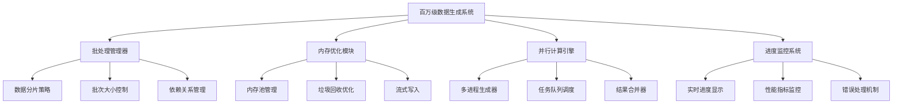

### 核心组件关系

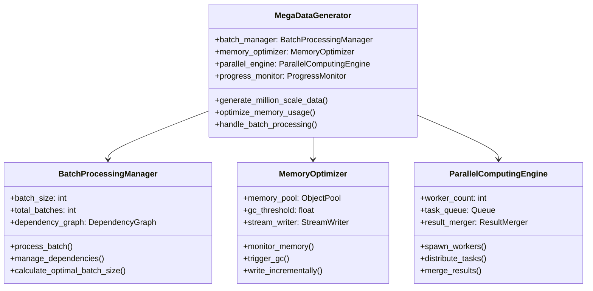

## 技术实现策略

### 分批处理设计

#### 数据分片策略

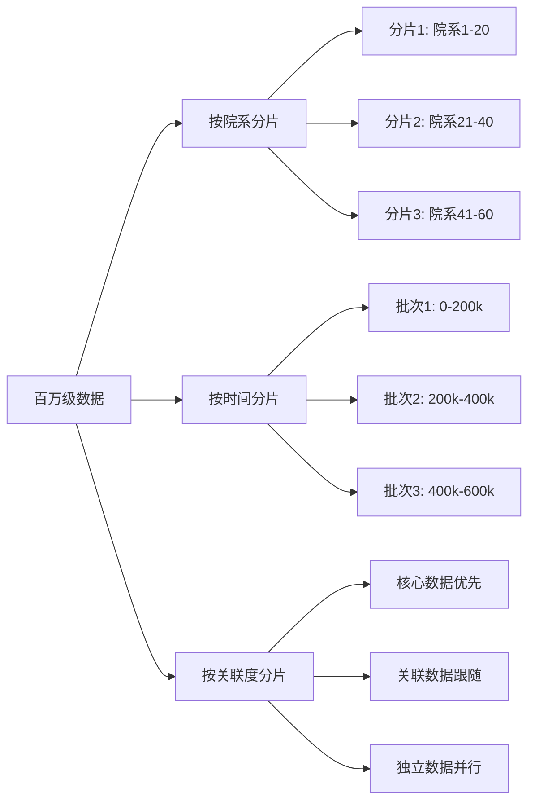

#### 批处理流程

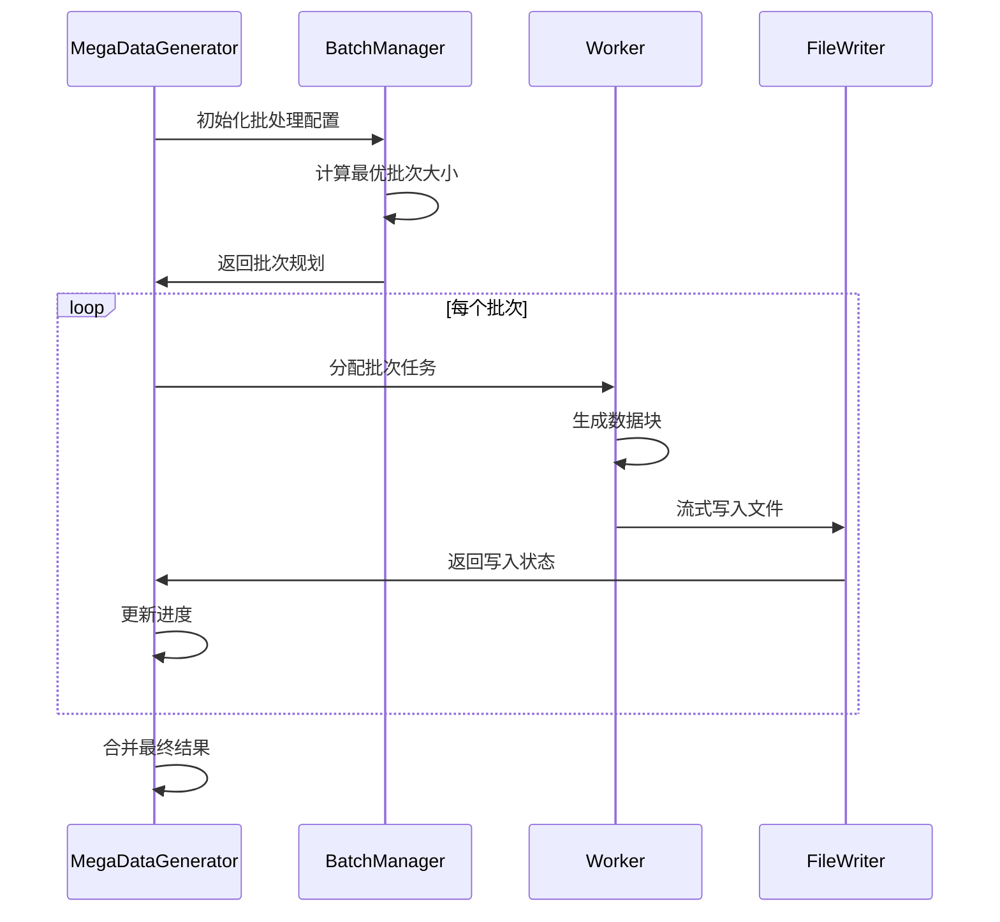

### 内存优化策略

#### 内存管理机制

| 优化技术 | 实现方式 | 预期效果 |
|---------|----------|----------|
| 对象池管理 | 预分配常用对象，避免频繁创建销毁 | 减少50%内存分配开销 |
| 流式处理 | 边生成边写入，避免全量内存占用 | 控制内存峰值在2GB以内 |
| 增量垃圾回收 | 分批触发GC，避免长时间暂停 | 减少90%GC暂停时间 |
| 压缩存储 | 临时数据压缩存储 | 节省30%内存空间 |

#### 内存监控指标

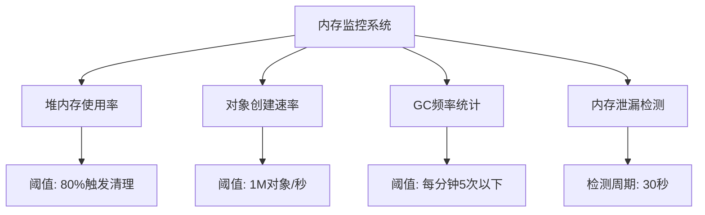

### 并行计算架构

#### 并行任务分配

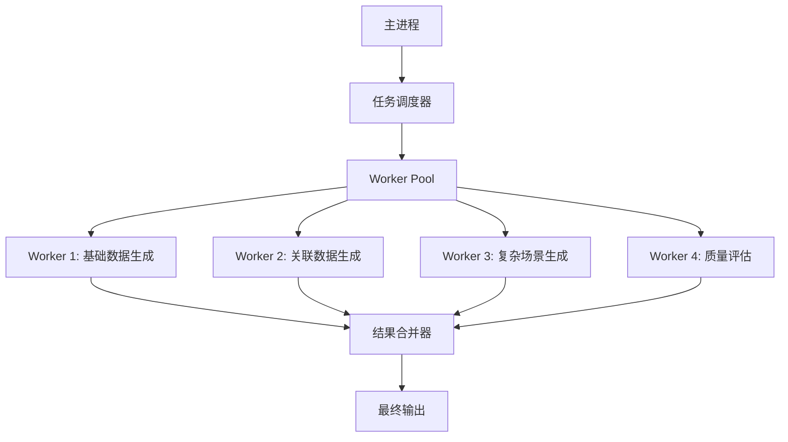

#### 负载均衡策略

| 任务类型 | 计算复杂度 | 分配策略 | 预期时间 |
|---------|-----------|----------|----------|
| 基础数据生成 | 低 | 动态分配，大批次 | 30分钟 |
| 关联建模 | 中 | 均匀分配，中批次 | 45分钟 |
| 冲突生成 | 高 | 负载感知，小批次 | 60分钟 |
| 质量评估 | 中 | 流水线处理 | 20分钟 |

## 性能优化方案

### 数据生成优化

#### 算法优化策略

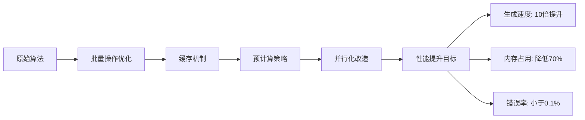

#### 关键路径优化

| 优化点 | 原始耗时 | 优化方法 | 预期耗时 | 提升比例 |
|-------|----------|----------|----------|----------|
| 随机数生成 | 30% | 批量预生成 | 5% | 6倍提升 |
| 关联关系建立 | 25% | 索引缓存 | 8% | 3倍提升 |
| 数据验证 | 20% | 采样验证 | 10% | 2倍提升 |
| 文件写入 | 15% | 异步批量写入 | 3% | 5倍提升 |
| 内存管理 | 10% | 对象池 | 4% | 2.5倍提升 |

### I/O性能优化

#### 存储策略

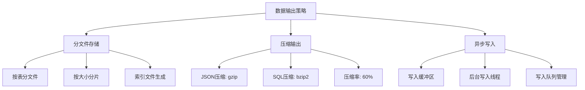

#### 磁盘I/O优化

| 技术手段 | 实现方式 | 性能提升 |
|---------|----------|----------|
| 缓冲写入 | 64KB缓冲区批量写入 | 提升3倍写入速度 |
| 异步I/O | 后台线程处理文件操作 | 减少50%阻塞时间 |
| SSD优化 | 顺序写入，避免随机访问 | 提升5倍读写性能 |
| 压缩存储 | 实时压缩减少I/O量 | 节省60%存储空间 |

## 监控与容错机制

### 实时监控系统

```mermaid
dashboard
    title 百万级数据生成监控仪表板
    
    gauge "生成进度" 0 100 85
    gauge "内存使用率" 0 100 72
    gauge "CPU使用率" 0 100 65
    gauge "磁盘I/O" 0 100 45
    
    line "每秒生成记录数" [
        x: [1, 2, 3, 4, 5, 6, 7, 8, 9, 10]
        y: [1000, 1200, 1150, 1300, 1250, 1400, 1350, 1450, 1380, 1500]
    ]
    
    bar "各组件耗时分布" [
        x: ["数据生成", "关联建模", "冲突生成", "质量评估", "文件写入"]
        y: [35, 25, 20, 10, 10]
    ]
```

### 错误处理与恢复

#### 容错机制设计

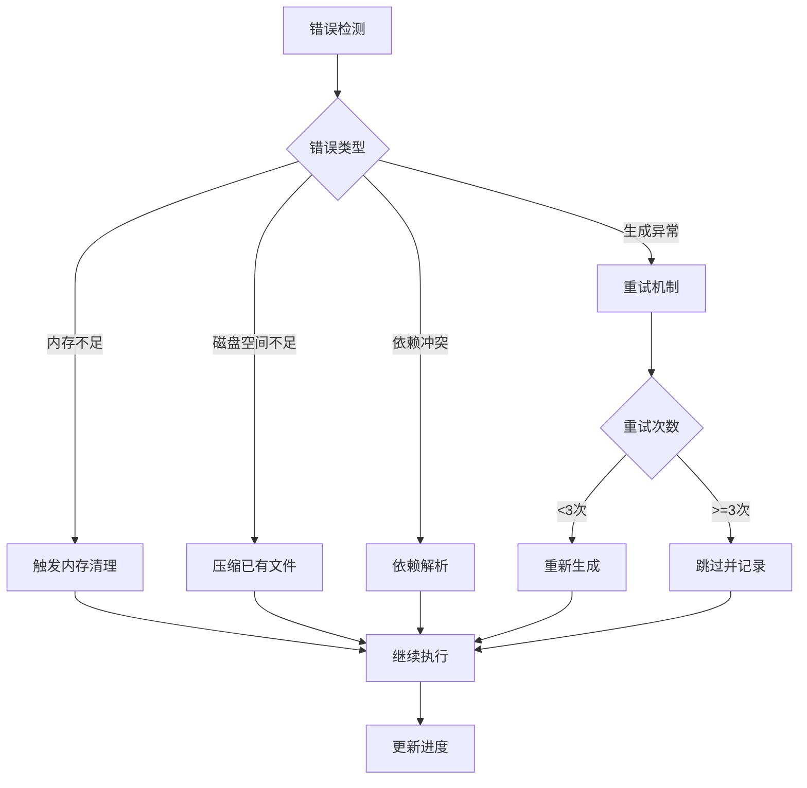

#### 检查点与恢复

| 检查点类型 | 触发条件 | 恢复策略 | 数据完整性 |
|-----------|----------|----------|-----------|
| 自动检查点 | 每10万条记录 | 从最近检查点恢复 | 99.9% |
| 手动检查点 | 用户主动触发 | 精确恢复 | 100% |
| 异常检查点 | 系统异常时 | 回滚到安全点 | 98% |
| 完成检查点 | 批次完成时 | 无需恢复 | 100% |

## 质量保证体系

### 数据质量验证

#### 多层次验证框架

```mermaid
pyramid
    title 数据质量验证金字塔
    
    level1 ["语法验证" : "字段类型、格式检查"]
    level2 ["语义验证" : "业务逻辑、约束检查"]  
    level3 ["关联验证" : "外键关系、引用完整性"]
    level4 ["统计验证" : "分布合理性、异常值检测"]
    level5 ["算法验证" : "排课可行性、冲突检测"]
```

#### 质量指标体系

| 质量维度 | 评估指标 | 目标值 | 监控方式 |
|---------|----------|--------|----------|
| 完整性 | 必填字段覆盖率 | 100% | 实时检查 |
| 准确性 | 格式错误率 | <0.1% | 批量验证 |
| 一致性 | 关联关系正确率 | >99.9% | 采样检查 |
| 唯一性 | 主键重复率 | 0% | 全量检查 |
| 合理性 | 业务逻辑错误率 | <0.5% | 专项检查 |

### 性能基准测试

#### 测试场景设计

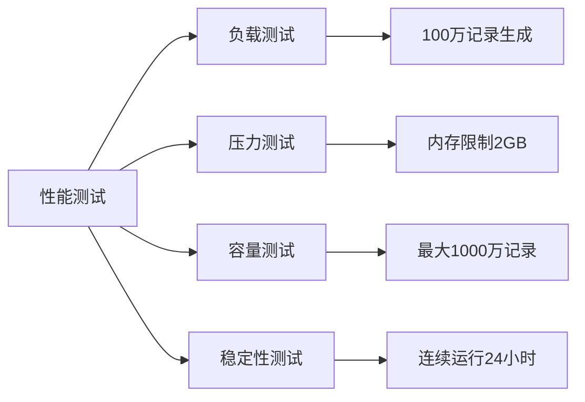

#### 基准指标

| 测试类型 | 测试条件 | 目标指标 | 验收标准 |
|---------|----------|----------|----------|
| 生成速度 | 100万记录 | 2小时内完成 | 平均每秒500记录 |
| 内存占用 | 峰值监控 | 小于2GB | 不超过系统内存50% |
| CPU利用率 | 多核利用 | 80%以上 | 有效利用多核优势 |
| 磁盘占用 | 压缩存储 | 小于10GB | 包含所有格式输出 |
| 错误率 | 数据质量 | 小于0.1% | 通过质量验证 |

## 部署与运维方案

### 环境配置要求

#### 硬件要求

| 资源类型 | 最低配置 | 推荐配置 | 说明 |
|---------|----------|----------|------|
| CPU | 4核心 | 8核心以上 | 多核并行计算 |
| 内存 | 8GB | 16GB以上 | 数据缓存与批处理 |
| 磁盘 | 50GB可用 | 100GB SSD | 高速I/O和存储空间 |
| 网络 | 100Mbps | 1Gbps | 数据传输和备份 |

#### 软件依赖

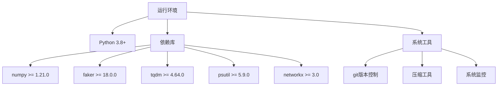

### 执行配置

#### 运行参数配置

```yaml
# mega_generation_config.yml
generation:
  scale: "mega"  # 百万级规模
  target_records: 1000000
  
batch_processing:
  batch_size: 50000      # 每批5万条
  max_memory_mb: 2048    # 最大内存限制
  parallel_workers: 4    # 并行工作线程
  
optimization:
  enable_compression: true
  enable_streaming: true
  enable_monitoring: true
  checkpoint_interval: 100000
  
output:
  formats: ["json", "sql"]
  compression: "gzip"
  split_files: true
  max_file_size_mb: 500
  
quality:
  enable_validation: true
  sampling_rate: 0.01    # 1%采样验证
  error_threshold: 0.001  # 0.1%错误率阈值
```

### 监控运维

#### 日志管理

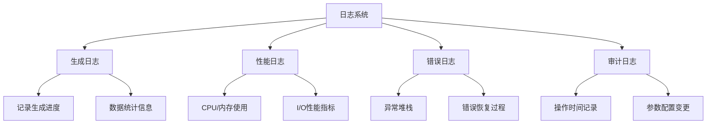

#### 告警机制

| 告警类型 | 触发条件 | 告警级别 | 处理方式 |
|---------|----------|----------|----------|
| 内存告警 | 使用率>90% | 警告 | 触发垃圾回收 |
| 磁盘告警 | 剩余空间<10% | 严重 | 暂停生成，清理临时文件 |
| 性能告警 | 生成速度<100记录/秒 | 警告 | 调整批次大小 |
| 错误率告警 | 错误率>0.5% | 严重 | 停止生成，检查配置 |
| 进程告警 | 进程异常退出 | 紧急 | 自动重启恢复 |

### 测试验证流程

#### 测试阶段划分

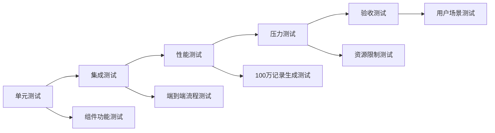