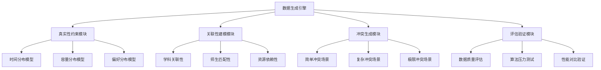
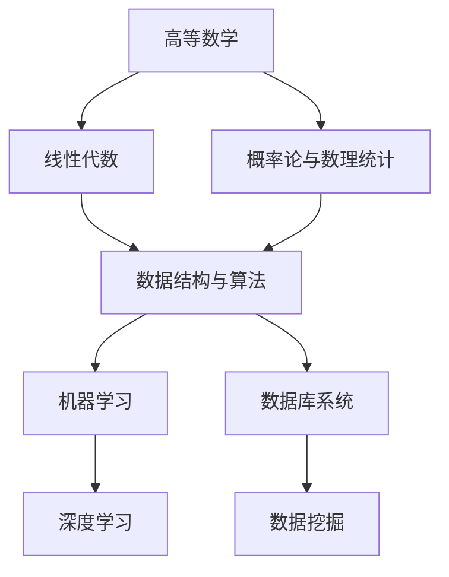

# 数据生成脚本优化设计文档

## 概述

本文档分析当前项目数据生成脚本的不合理性，并提出优化方案以提升模拟数据的真实性，从而更好地体现排课算法的优越性。

## 现有数据生成脚本问题分析

### 核心问题识别

#### 1. 数据分布不真实
- **随机性过强**：所有数据都采用均匀分布或简单权重分布，缺乏真实场景的复杂分布特征
- **缺乏关联性**：各类数据之间缺乏真实的业务关联和约束关系
- **时间模式单一**：未考虑真实大学的作息时间、季节性课程安排等

#### 2. 约束条件设计不当
- **硬约束不够严格**：教师时间冲突、教室容量限制等硬约束检查不充分
- **软约束缺失**：缺乏教师偏好时间、连续课程安排、跨校区通勤时间等软约束
- **优先级未体现**：未考虑课程重要性、教师级别、学生年级等因素的优先级

#### 3. 冲突场景不充分
- **冲突密度低**：生成的冲突场景数量和复杂度不足以充分测试算法
- **冲突类型单一**：主要是时间冲突，缺乏资源竞争、容量限制等复杂冲突
- **解决难度梯度不明显**：缺乏从简单到复杂的冲突场景梯度

#### 4. 业务逻辑不贴合实际
- **选课模式简化**：未考虑先修课程、学期限制、专业要求等
- **教师分配不合理**：未考虑教师专业背景、职称、教学能力等
- **教室分配随意**：未考虑课程类型与教室设施的匹配

## 优化方案设计

### 架构设计



### 数据生成策略优化

#### 1. 真实性分布建模

**时间偏好分布**
- 基于高斯分布模拟教师时间偏好：上午(8-12点)权重0.4，下午(2-6点)权重0.45，晚上权重0.15
- 考虑年龄因素：年长教师更偏好上午，年轻教师接受晚上时间
- 引入"连堂偏好"：67%教师偏好连续2-3节课，减少准备时间

**课程学时分布**
- 理论课：主要集中在2-4学时，采用正态分布N(3, 0.8)
- 实验课：主要集中在3-6学时，采用正态分布N(4, 1.2)
- 实习课：6-8学时，权重分布[0.3, 0.4, 0.2, 0.1]

**选课行为建模**
- 热门课程遵循帕累托分布：20%课程吸引80%学生关注
- 专业相关性权重：本专业课程选择概率0.8，相关专业0.15，其他0.05
- 学期负载约束：学生每学期选课12-25学分，平均18学分

#### 2. 关联性约束强化

**学科知识图谱**


**师生匹配约束**
- 教师专业背景匹配：计算机专业教师不教化学课程
- 职称与课程难度匹配：教授/副教授承担核心专业课，讲师承担基础课
- 教学能力评级：引入教师评分(1-5星)，高难度课程需要高评分教师

**资源依赖建模**
- 实验课程需要专门实验室：机房、化学实验室、物理实验室
- 大班课程需要阶梯教室：>100人课程需要容量>120的教室
- 设备依赖：多媒体课程需要投影设备，编程课需要计算机

#### 3. 冲突场景分级生成

**Level 1: 基础冲突 (占30%)**
- 教师时间冲突：同一教师在同一时间安排多门课程
- 教室时间冲突：同一教室在同一时间安排多门课程
- 学生课表冲突：学生必修课时间冲突

**Level 2: 复杂冲突 (占50%)**
- 资源竞争冲突：热门教师、热门教室、热门时间段的竞争
- 容量限制冲突：教室容量不足、选课人数超限
- 跨校区冲突：教师在不同校区的课程间隔时间不足

**Level 3: 极限冲突 (占20%)**
- 多维度约束冲突：同时涉及时间、空间、人员、设备的复合冲突
- 连锁反应冲突：一个课程调整引发的多个相关课程冲突
- 优化目标冲突：满足硬约束但严重违反软约束的情况

### 实现方案

#### 1. 核心优化模块

**RealisticDataGenerator 类**
- 负责基于真实分布的数据生成
- 集成概率分布、约束检查、关联性验证
- 支持可配置的真实性参数调节

**ConflictScenarioEngine 类**
- 负责分级冲突场景的系统性生成
- 支持冲突复杂度可控调节
- 提供冲突解决难度评估

**DataQualityAssessment 类**
- 评估生成数据的真实性指标
- 对比不同数据集下算法性能差异
- 生成数据质量报告和算法性能报告

#### 2. 算法性能验证体系

**多维度性能对比**
- 解决方案质量：硬约束满足率、软约束满足率、总体满意度
- 算法效率：计算时间、内存使用、收敛速度
- 鲁棒性：在不同数据分布下的稳定性

**基准测试场景**
- 小规模完美场景：验证算法正确性
- 中规模现实场景：验证算法实用性  
- 大规模极限场景：验证算法扩展性

#### 3. 可视化分析工具

**数据分布可视化**
- 时间偏好热力图
- 课程选择分布图
- 资源利用率统计图

**冲突分析可视化**
- 冲突类型分布饼图
- 冲突解决效果对比图
- 算法性能雷达图

## 技术实现要点

### 1. 数据生成优化

**概率分布引擎**
```python
# 时间偏好建模
time_preference = {
    '8-10': np.random.normal(0.8, 0.1),  # 上午黄金时间
    '10-12': np.random.normal(0.7, 0.15),
    '14-16': np.random.normal(0.75, 0.12),
    '16-18': np.random.normal(0.6, 0.18),
    '19-21': np.random.normal(0.3, 0.2)   # 晚上时间
}

# 课程热度建模 - 帕累托分布
course_popularity = np.random.pareto(1.16, size=course_count) * 10
```

**约束传播算法**
```python
def propagate_constraints(assignments):
    """
    约束传播算法，确保数据一致性
    """
    for assignment in assignments:
        # 检查硬约束
        validate_hard_constraints(assignment)
        # 传播软约束影响
        propagate_soft_constraints(assignment)
        # 更新关联数据
        update_related_data(assignment)
```

### 2. 冲突生成策略

**分层冲突注入**
```python
def inject_conflicts_by_level(level, intensity):
    """
    按级别注入冲突
    level: 1(基础), 2(复杂), 3(极限)
    intensity: 0.1-0.9 冲突密度
    """
    if level == 1:
        return basic_conflicts(intensity)
    elif level == 2:
        return complex_conflicts(intensity)
    else:
        return extreme_conflicts(intensity)
```

**自适应冲突密度**
```python
def adaptive_conflict_density(algorithm_performance):
    """
    根据算法表现自适应调整冲突密度
    """
    if algorithm_performance.success_rate > 0.9:
        return increase_difficulty()
    elif algorithm_performance.success_rate < 0.3:
        return decrease_difficulty()
    else:
        return maintain_difficulty()
```

### 3. 评估验证框架

**多指标评估体系**
```python
class PerformanceMetrics:
    def __init__(self):
        self.hard_constraint_satisfaction = 0.0
        self.soft_constraint_satisfaction = 0.0
        self.resource_utilization = 0.0
        self.user_satisfaction = 0.0
        self.computational_efficiency = 0.0
        self.solution_stability = 0.0
```

**A/B测试框架**
```python
def algorithm_comparison(algorithm_a, algorithm_b, test_datasets):
    """
    算法性能对比测试
    """
    results_a = run_algorithm_tests(algorithm_a, test_datasets)
    results_b = run_algorithm_tests(algorithm_b, test_datasets)
    
    return generate_comparison_report(results_a, results_b)
```

## 预期效果

### 1. 数据真实性提升
- 时间分布贴近真实大学作息规律
- 师生选择行为符合实际偏好模式
- 资源约束反映真实校园限制条件

### 2. 算法测试充分性
- 涵盖从简单到复杂的全场景测试
- 能够充分暴露算法在极限条件下的表现
- 提供客观的算法性能对比基准

### 3. 算法优越性体现
- 通过真实数据证明智能算法相比传统方法的优势
- 在复杂冲突场景下展现算法的鲁棒性
- 通过多维度指标全面评估算法价值

### 4. 实际应用指导
- 为真实环境部署提供参考数据
- 帮助识别算法在实际应用中的潜在问题
- 为算法参数调优提供科学依据