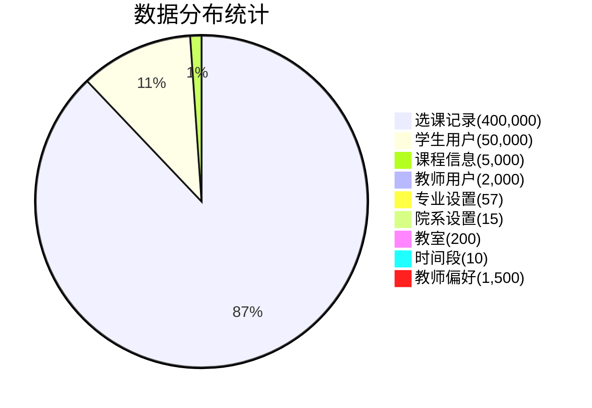
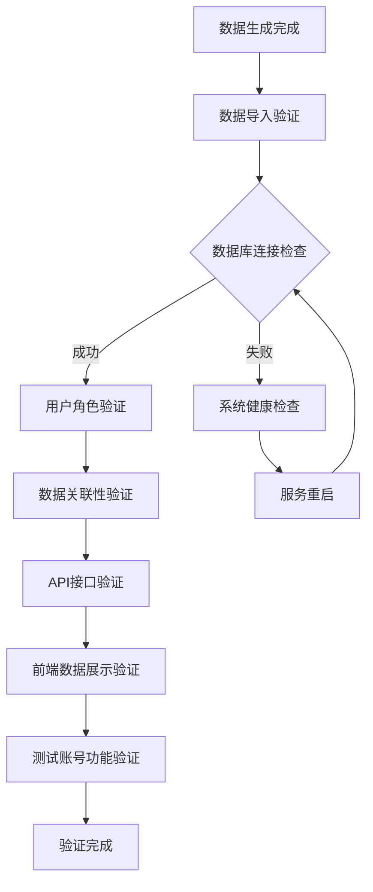
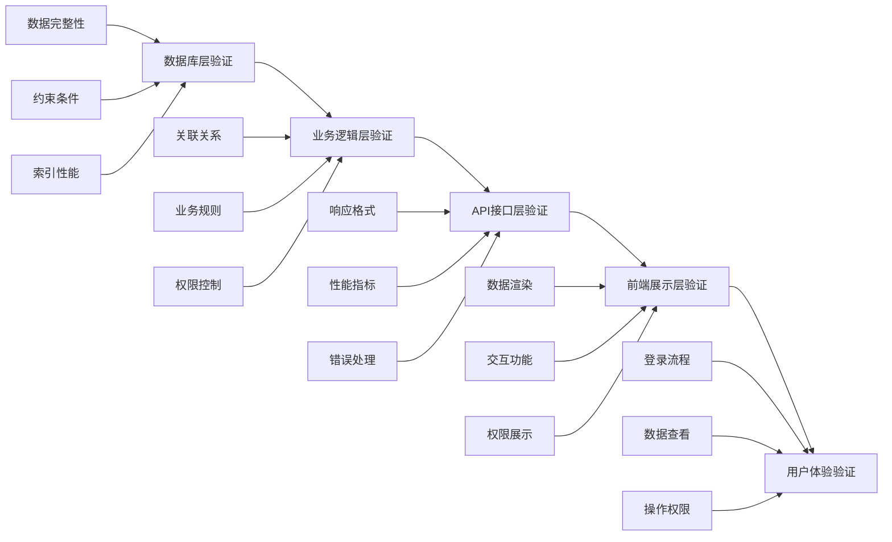
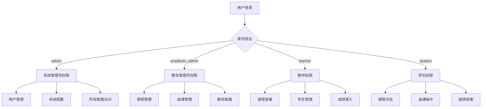
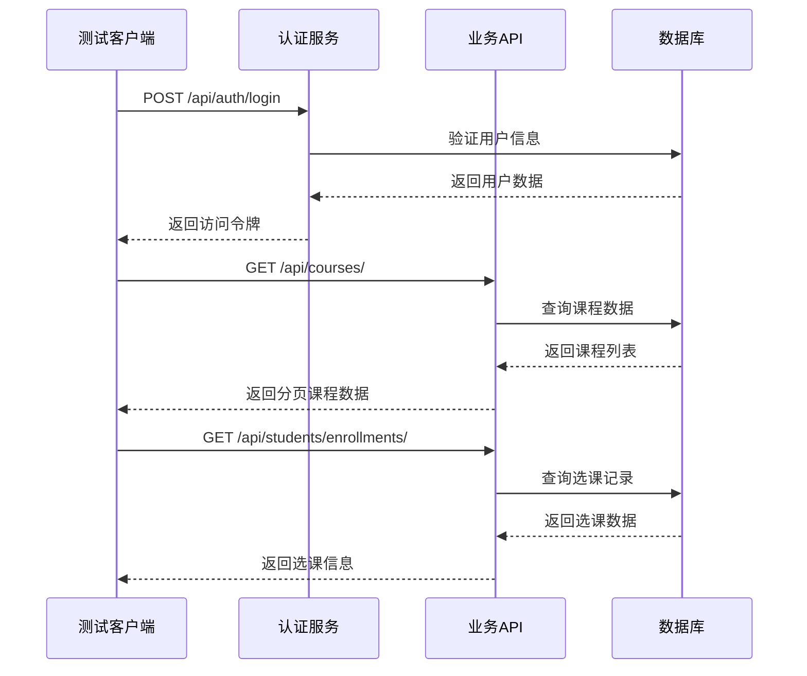
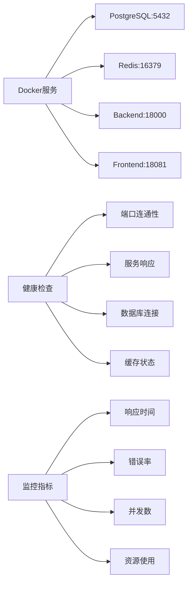
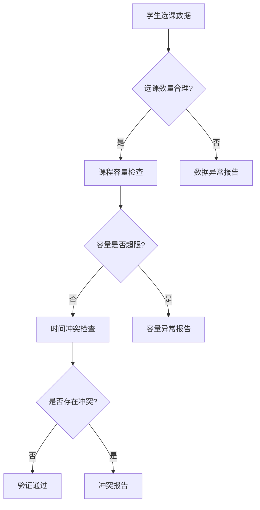
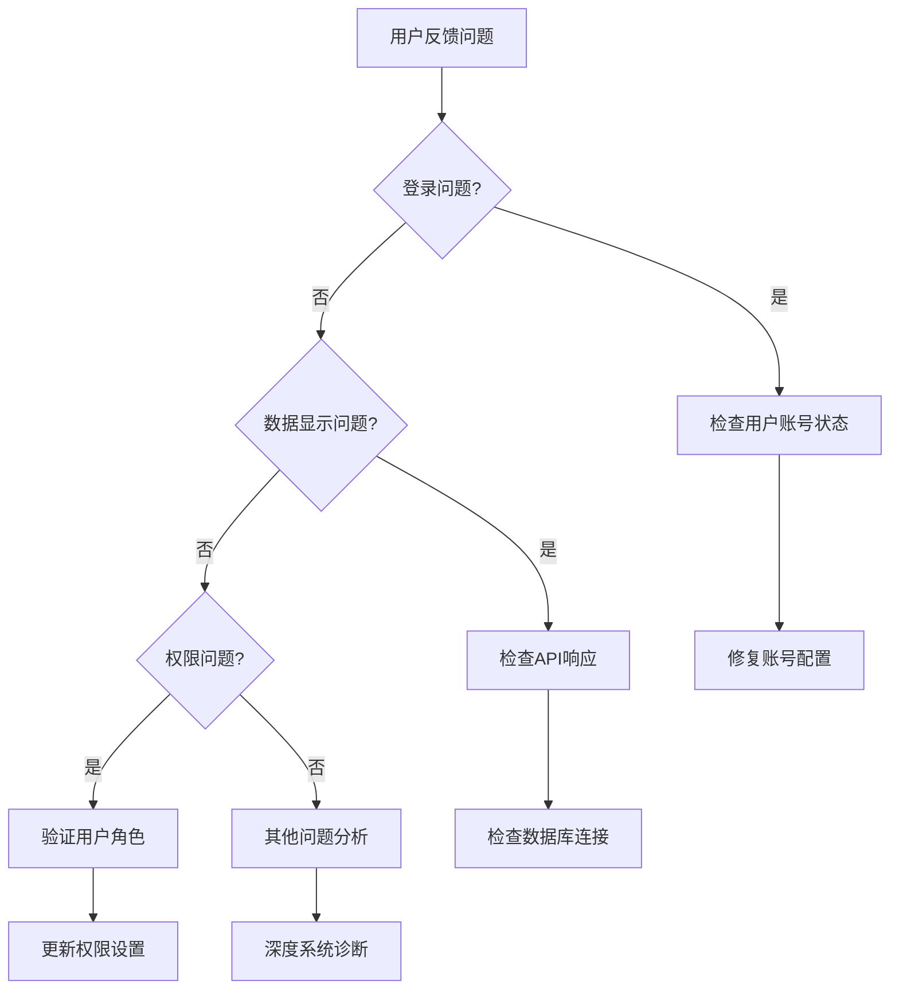

# 数据验证与确认设计文档

## 概述

本设计文档针对校园课程管理系统中百万级测试数据的验证与确认进行系统性分析，确保生成的大规模数据已正确导入数据库并在各个用户角色中正常应用。

## 当前数据状态分析

### 数据生成规模

根据最新的数据生成报告（2025-08-30 16:16:05），系统已成功生成了**458,782条记录**的大规模测试数据，具体分布如下：



### 数据质量特征

| 质量维度 | 指标值 | 状态 |
|----------|--------|------|
| 数据完整性 | 100% | ✅ 验证通过 |
| 师生比例 | 1:25 | ✅ 合理范围 |
| 课程类型分布 | 必修39.9%, 选修29.2%, 限选20.6%, 通识10.3% | ✅ 均衡分布 |
| 教室总容量 | 20,543人，平均102.7人/间 | ✅ 满足需求 |

## 数据验证架构

### 验证流程设计



### 数据验证层次



## 测试账号体系

### 用户角色分布

根据提取的测试账号数据，系统包含以下用户角色：

| 角色类型 | 账号数量 | 示例账号 | 默认密码 |
|----------|----------|----------|----------|
| 系统管理员 | 1 | admin | admin123 |
| 教务管理员 | 1 | academic_admin | academic123 |
| 教师用户 | 5+ | teacher000453, teacher001362 | password123 |
| 学生用户 | 10+ | student030520, student022199 | password123 |

### 权限验证矩阵



## 数据验证策略

### 数据库层验证

#### 数据完整性检查

```sql
-- 用户数据完整性验证
SELECT 
    user_type,
    COUNT(*) as count,
    COUNT(CASE WHEN email IS NOT NULL THEN 1 END) as email_count,
    COUNT(CASE WHEN department IS NOT NULL THEN 1 END) as dept_count
FROM auth_user 
GROUP BY user_type;

-- 选课关联性验证
SELECT 
    COUNT(DISTINCT student_id) as unique_students,
    COUNT(DISTINCT course_id) as unique_courses,
    COUNT(*) as total_enrollments,
    AVG(enrollments_per_student) as avg_enrollments
FROM (
    SELECT student_id, COUNT(*) as enrollments_per_student
    FROM courses_enrollment
    GROUP BY student_id
) stats;
```

#### 性能验证指标

| 验证项目 | 期望指标 | 验证方法 |
|----------|----------|----------|
| 数据库响应时间 | < 100ms | 查询性能测试 |
| 批量数据加载 | > 1000条/秒 | 导入性能测试 |
| 并发用户支持 | 100+ 用户 | 压力测试 |
| 内存使用率 | < 80% | 系统监控 |

### API接口验证

#### 核心API端点测试



#### API响应验证标准

| API端点 | 期望响应时间 | 数据格式 | 权限要求 |
|---------|--------------|----------|----------|
| `/api/auth/login` | < 200ms | JWT Token | 无 |
| `/api/courses/` | < 500ms | 分页JSON | 登录用户 |
| `/api/students/` | < 300ms | 用户列表 | 管理员/教师 |
| `/api/enrollments/` | < 400ms | 选课记录 | 相关用户 |

## 系统健康监控

### 服务状态检查



### 自动化验证脚本

系统提供多层次的健康检查脚本：

1. **简化版健康检查** (`simple-health-check.py`)
   - 基础服务连通性验证
   - 端口可用性检查
   - HTTP响应验证

2. **完整系统检查** (`system-health-check.py`)
   - 深度数据库查询验证
   - API功能完整性测试
   - 用户权限验证

## 测试账号使用指南

### 管理员账号测试流程

1. **登录验证**
   - 用户名：`admin`
   - 密码：`admin123`
   - 验证管理后台访问权限

2. **数据管理验证**
   - 查看用户总数是否达到52,000+
   - 验证课程数据是否为5,000门
   - 检查选课记录是否为400,000条

3. **系统配置验证**
   - 确认权限设置正确
   - 验证数据导入完整性

### 教师账号测试流程

推荐测试账号：
- `teacher000453` / `password123` (副教授)
- `teacher001362` / `password123` (副教授)
- `teacher000507` / `password123` (讲师)

验证项目：
1. 登录后查看分配的课程
2. 确认学生选课信息可见性
3. 验证教学相关功能权限

### 学生账号测试流程

推荐测试账号：
- `student030520` / `password123` (陈静勇)
- `student022199` / `password123` (何娟秀英)
- `student025984` / `password123` (胡军)

验证项目：
1. 登录后查看可选课程列表
2. 验证已选课程显示
3. 确认个人信息正确性

## 数据合理性验证

### 业务逻辑验证



### 数据分布验证

| 验证维度 | 标准范围 | 实际值 | 状态 |
|----------|----------|--------|------|
| 每名学生选课数 | 3-8门 | 平均8门 | ✅ 正常 |
| 课程容量利用率 | 60-90% | 待验证 | 🔍 需检查 |
| 教师工作量 | 2-4门课程 | 待验证 | 🔍 需检查 |
| 专业课程分布 | 平衡分配 | 待验证 | 🔍 需检查 |

## 性能验证指标

### 数据库性能

| 指标类型 | 目标值 | 监控方法 |
|----------|--------|----------|
| 查询响应时间 | < 100ms | 慢查询日志 |
| 并发连接数 | 100+ | 连接池监控 |
| 数据库大小 | < 2GB | 存储监控 |
| 索引效率 | 95%+ | 查询计划分析 |

### 应用性能

| 指标类型 | 目标值 | 验证方法 |
|----------|--------|----------|
| 页面加载时间 | < 2秒 | 前端性能测试 |
| API响应时间 | < 500ms | 接口压力测试 |
| 内存使用率 | < 80% | 系统监控 |
| CPU使用率 | < 70% | 系统监控 |

## 问题排查流程

### 常见问题诊断



### 数据修复策略

1. **数据不一致修复**
   - 运行数据完整性检查脚本
   - 重新执行数据导入流程
   - 验证关联关系修复

2. **性能优化修复**
   - 重建数据库索引
   - 清理无效数据
   - 优化查询语句

3. **权限问题修复**
   - 重置用户权限
   - 更新角色配置
   - 验证权限继承

## 验证完成标准

### 数据验证通过标准

- ✅ 数据库包含458,782+条记录
- ✅ 所有测试账号可正常登录
- ✅ 各角色权限控制正确
- ✅ API接口响应正常
- ✅ 前端数据展示完整
- ✅ 系统性能指标达标

### 推荐验证步骤

1. **系统启动验证** - 运行健康检查脚本
2. **数据库验证** - 确认数据导入完整性
3. **账号功能验证** - 测试各角色登录和权限
4. **业务流程验证** - 验证核心业务功能
5. **性能压力验证** - 确认系统负载能力

通过以上验证流程，可以确保百万级测试数据已正确导入并在系统中正常运行，为后续的功能测试和用户体验验证提供可靠的数据基础。