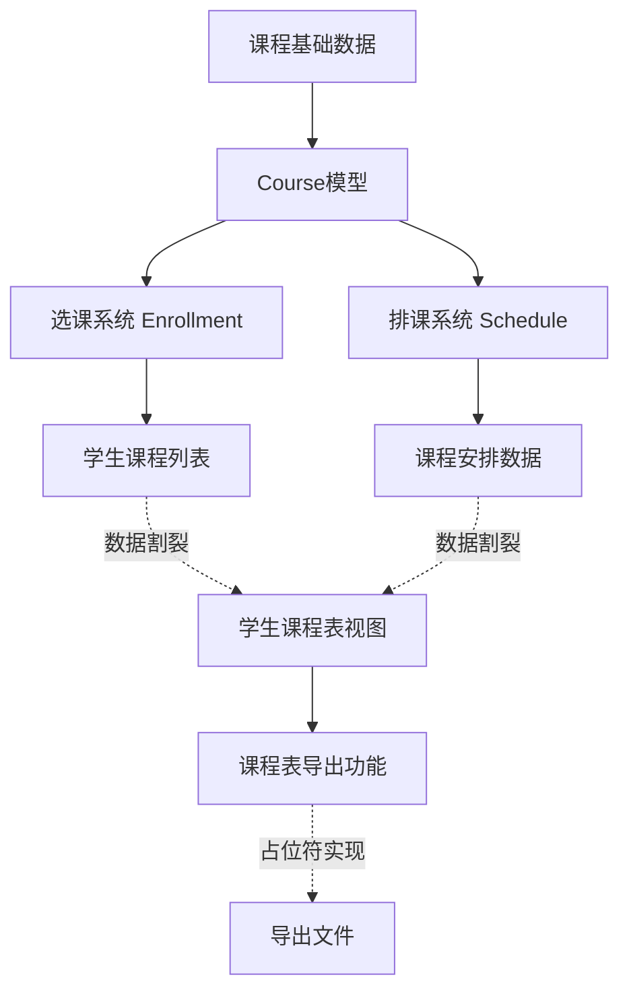
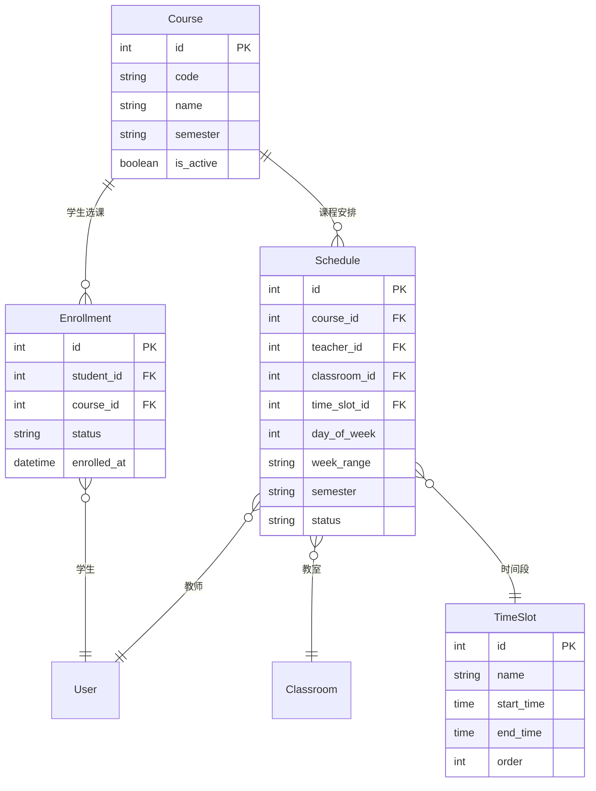
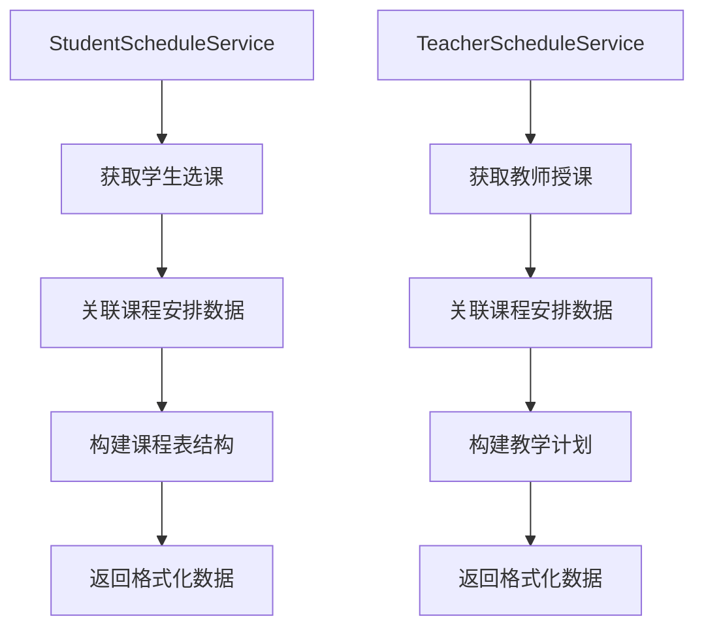
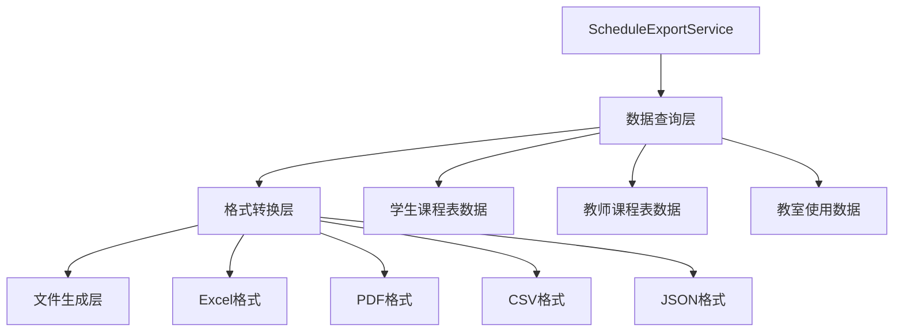

# 数据库连接问题设计文档

## 1. 概述

基于当前系统分析，发现数据库已成功导入数据，但课程表与课程列表之间缺乏有效的业务逻辑对接，同时课程表导出功能仍为占位符实现。本文档将设计完整的解决方案来修复这些关键业务功能缺失问题。

## 2. 问题分析

### 2.1 核心问题识别

#### 课程表与课程列表对接问题
- 学生选课系统与课程安排系统存在数据割裂
- `StudentService.get_course_schedule()` 返回占位符数据，未与 `Schedule` 模型对接
- 前端课程表组件无法正确显示实际的排课数据

#### 课程表导出功能问题
- 导出API存在但返回空数据或错误数据
- 前端导出功能调用后端API但无法获取有效内容
- 缺乏完整的数据格式转换和文件生成逻辑

### 2.2 数据流分析



### 2.3 技术债务识别

- **StudentService**: `get_course_schedule()` 未实现真实数据查询
- **Schedule模型**: 与Enrollment模型缺乏关联查询
- **导出服务**: `ScheduleImportExportService` 部分方法实现不完整
- **前端组件**: 硬编码时间段，未动态获取TimeSlot数据

## 3. 架构设计

### 3.1 数据模型关系重构



### 3.2 业务逻辑层设计

#### 3.2.1 课程表数据服务层



#### 3.2.2 数据导出服务层



## 4. 实现方案

### 4.1 后端API层改造

#### 4.1.1 学生课程表API增强

**现有问题**:
```python
# 当前StudentService.get_course_schedule()返回占位符数据
schedule_data.append({
    'classroom': '待安排',  # 占位符
    'time_slot': '待安排',  # 占位符
})
```

**改进方案**:
```python
def get_course_schedule(self, semester=None, week=None):
    """获取学生真实课程表"""
    # 1. 获取学生选课记录
    enrollments = Enrollment.objects.filter(
        student=self.user,
        status='enrolled'
    ).select_related('course')
    
    # 2. 关联课程安排数据
    schedule_query = Schedule.objects.filter(
        course__in=[e.course for e in enrollments],
        status='active'
    ).select_related(
        'course', 'teacher', 'classroom', 'time_slot'
    )
    
    if semester:
        schedule_query = schedule_query.filter(semester=semester)
        
    # 3. 构建课程表数据
    return self._build_schedule_data(schedule_query, week)
```

#### 4.1.2 导出服务完善

**Excel导出增强**:
```python
@staticmethod
def export_student_schedule_to_excel(user, semester=None):
    """导出学生个人课程表为Excel"""
    # 1. 获取学生课程安排
    service = StudentService(user)
    schedule_data = service.get_course_schedule(semester)
    
    # 2. 创建课程表格式
    wb = openpyxl.Workbook()
    ws = wb.active
    ws.title = f"个人课程表-{user.username}"
    
    # 3. 构建时间表格
    time_slots = TimeSlot.objects.filter(is_active=True).order_by('order')
    days = ['时间', '周一', '周二', '周三', '周四', '周五', '周六', '周日']
    
    # 4. 填充课程数据到网格
    return _generate_schedule_grid(schedule_data, time_slots, days)
```

### 4.2 前端组件改造

#### 4.2.1 动态时间段获取

**当前问题**:
```typescript
// 硬编码时间段
const timeSlots = [
  '08:00-09:40',
  '10:00-11:40', 
  '14:00-15:40'
];
```

**改进方案**:
```typescript
interface TimeSlot {
  id: number;
  name: string;
  start_time: string;
  end_time: string;
  order: number;
}

const CourseSchedule: React.FC = () => {
  const [timeSlots, setTimeSlots] = useState<TimeSlot[]>([]);
  
  useEffect(() => {
    // 动态获取时间段配置
    const fetchTimeSlots = async () => {
      const response = await scheduleAPI.getTimeSlots();
      setTimeSlots(response.data);
    };
    fetchTimeSlots();
  }, []);
};
```

#### 4.2.2 课程表网格动态生成

```typescript
const buildScheduleGrid = useMemo(() => {
  const grid: ScheduleGrid = {};
  
  // 初始化网格结构
  timeSlots.forEach(slot => {
    grid[slot.id] = {};
    weekDays.forEach((_, dayIndex) => {
      grid[slot.id][dayIndex + 1] = null;
    });
  });
  
  // 填充真实课程数据
  schedule.forEach(item => {
    if (grid[item.time_slot_id] && !grid[item.time_slot_id][item.day_of_week]) {
      grid[item.time_slot_id][item.day_of_week] = item;
    }
  });
  
  return grid;
}, [schedule, timeSlots]);
```

### 4.3 数据服务层设计

#### 4.3.1 统一的课程表服务

```python
class UnifiedScheduleService:
    """统一的课程表服务"""
    
    @staticmethod
    def get_user_schedule(user, semester=None, week=None, user_type=None):
        """根据用户类型获取相应的课程表"""
        if user_type == 'student':
            return StudentScheduleService.get_student_schedule(user, semester, week)
        elif user_type == 'teacher':
            return TeacherScheduleService.get_teacher_schedule(user, semester, week)
        else:
            return []
    
    @staticmethod
    def export_user_schedule(user, format='excel', semester=None, user_type=None):
        """导出用户课程表"""
        schedule_data = UnifiedScheduleService.get_user_schedule(
            user, semester, user_type=user_type
        )
        
        if format == 'excel':
            return ScheduleExportService.to_excel(schedule_data, user)
        elif format == 'pdf':
            return ScheduleExportService.to_pdf(schedule_data, user)
        elif format == 'csv':
            return ScheduleExportService.to_csv(schedule_data, user)
```

#### 4.3.2 课程表数据标准化

```python
class ScheduleDataSerializer:
    """课程表数据序列化标准"""
    
    @staticmethod
    def serialize_schedule_item(schedule):
        """标准化课程表项目数据"""
        return {
            'course_id': schedule.course.id,
            'course_code': schedule.course.code,
            'course_name': schedule.course.name,
            'teacher_id': schedule.teacher.id,
            'teacher_name': schedule.teacher.get_full_name(),
            'classroom_id': schedule.classroom.id,
            'classroom_name': str(schedule.classroom),
            'time_slot_id': schedule.time_slot.id,
            'time_slot_name': schedule.time_slot.name,
            'start_time': schedule.time_slot.start_time.strftime('%H:%M'),
            'end_time': schedule.time_slot.end_time.strftime('%H:%M'),
            'day_of_week': schedule.day_of_week,
            'week_range': schedule.week_range,
            'semester': schedule.semester,
            'status': schedule.status
        }
```

## 5. API接口重构

### 5.1 学生课程表API

```python
@api_view(['GET'])
@permission_classes([permissions.IsAuthenticated, IsStudent])
def student_schedule(request):
    """学生课程表API - 重构版本"""
    
    semester = request.GET.get('semester')
    week = request.GET.get('week')
    format_type = request.GET.get('format', 'json')
    
    service = StudentService(request.user)
    
    if format_type == 'json':
        schedule_data = service.get_course_schedule(semester, week)
        serializer = CourseScheduleSerializer(schedule_data, many=True)
        return Response(serializer.data)
    
    elif format_type in ['excel', 'pdf', 'csv']:
        file_content = UnifiedScheduleService.export_user_schedule(
            request.user, format_type, semester, 'student'
        )
        return _create_download_response(file_content, format_type, 'schedule')
```

### 5.2 时间段配置API

```python
@api_view(['GET'])
@permission_classes([permissions.IsAuthenticated])
def time_slots(request):
    """获取时间段配置"""
    
    time_slots = TimeSlot.objects.filter(is_active=True).order_by('order')
    data = [{
        'id': slot.id,
        'name': slot.name,
        'start_time': slot.start_time.strftime('%H:%M'),
        'end_time': slot.end_time.strftime('%H:%M'),
        'order': slot.order
    } for slot in time_slots]
    
    return Response(data)
```

## 6. 测试策略

### 6.1 单元测试覆盖

```python
class StudentScheduleServiceTest(TestCase):
    def test_get_course_schedule_with_real_data(self):
        """测试获取真实课程表数据"""
        # 创建测试数据
        course = Course.objects.create(name='测试课程', code='TEST101')
        enrollment = Enrollment.objects.create(student=self.student, course=course)
        schedule = Schedule.objects.create(
            course=course,
            teacher=self.teacher,
            classroom=self.classroom,
            time_slot=self.time_slot,
            day_of_week=1,
            semester='2024-2025-1'
        )
        
        # 测试服务
        service = StudentService(self.student)
        result = service.get_course_schedule('2024-2025-1')
        
        self.assertEqual(len(result), 1)
        self.assertEqual(result[0]['course_name'], '测试课程')
        self.assertNotEqual(result[0]['classroom'], '待安排')

    def test_export_schedule_excel(self):
        """测试课程表Excel导出"""
        file_content = UnifiedScheduleService.export_user_schedule(
            self.student, 'excel', '2024-2025-1', 'student'
        )
        self.assertTrue(len(file_content) > 0)
```

### 6.2 集成测试

```python
class ScheduleIntegrationTest(APITestCase):
    def test_student_schedule_api_integration(self):
        """测试学生课程表API集成"""
        self.client.force_authenticate(user=self.student)
        
        response = self.client.get('/api/v1/students/schedule/', {
            'semester': '2024-2025-1'
        })
        
        self.assertEqual(response.status_code, 200)
        self.assertTrue('course_name' in response.data[0])
        self.assertNotEqual(response.data[0]['classroom'], '待安排')
    
    def test_export_functionality(self):
        """测试导出功能"""
        self.client.force_authenticate(user=self.student)
        
        response = self.client.get('/api/v1/students/schedule/export/', {
            'semester': '2024-2025-1',
            'format': 'excel'
        })
        
        self.assertEqual(response.status_code, 200)
        self.assertEqual(response['Content-Type'], 
                        'application/vnd.openxmlformats-officedocument.spreadsheetml.sheet')
```

## 7. 部署和迁移

### 7.1 数据库迁移

```python
# migrations/0001_enhance_schedule_integration.py
from django.db import migrations

def populate_missing_schedules(apps, schema_editor):
    """为现有选课记录创建默认课程安排"""
    Enrollment = apps.get_model('courses', 'Enrollment')
    Schedule = apps.get_model('schedules', 'Schedule')
    TimeSlot = apps.get_model('schedules', 'TimeSlot')
    
    # 为没有对应Schedule的Enrollment创建默认安排
    enrollments_without_schedule = Enrollment.objects.filter(
        course__schedules__isnull=True
    ).select_related('course')
    
    for enrollment in enrollments_without_schedule:
        # 创建默认时间安排逻辑
        pass

class Migration(migrations.Migration):
    dependencies = [
        ('schedules', '0001_initial'),
        ('courses', '0001_initial'),
    ]

    operations = [
        migrations.RunPython(populate_missing_schedules),
    ]
```

### 7.2 配置更新

```python
# settings/production.py 更新
INSTALLED_APPS = [
    # ...
    'apps.schedules',
    'apps.courses',
    'apps.students',
]

# API配置
REST_FRAMEWORK = {
    'DEFAULT_PAGINATION_CLASS': 'rest_framework.pagination.PageNumberPagination',
    'PAGE_SIZE': 20,
    # 添加课程表相关的过滤器
    'DEFAULT_FILTER_BACKENDS': [
        'django_filters.rest_framework.DjangoFilterBackend',
    ],
}
```

## 8. 性能优化

### 8.1 数据库查询优化

```python
class OptimizedScheduleService:
    @staticmethod
    def get_student_schedule_optimized(user, semester=None):
        """优化的学生课程表查询"""
        return Schedule.objects.filter(
            course__enrollments__student=user,
            course__enrollments__status='enrolled',
            status='active'
        ).select_related(
            'course', 'teacher', 'classroom', 'time_slot'
        ).prefetch_related(
            'course__teachers'
        ).filter(
            semester=semester if semester else models.F('semester')
        ).order_by('day_of_week', 'time_slot__order')
```

### 8.2 缓存策略

```python
from django.core.cache import cache

class CachedScheduleService:
    @staticmethod
    def get_cached_student_schedule(user, semester):
        """带缓存的学生课程表"""
        cache_key = f"student_schedule_{user.id}_{semester}"
        cached_data = cache.get(cache_key)
        
        if cached_data is None:
            cached_data = StudentService(user).get_course_schedule(semester)
            cache.set(cache_key, cached_data, timeout=3600)  # 1小时缓存
            
        return cached_data
```

## 9. 监控和维护

### 9.1 错误监控

```python
import logging

logger = logging.getLogger('schedule_service')

class MonitoredScheduleService:
    def get_course_schedule(self, semester=None, week=None):
        try:
            result = self._get_schedule_data(semester, week)
            logger.info(f"成功获取用户 {self.user.id} 的课程表，共 {len(result)} 条记录")
            return result
        except Exception as e:
            logger.error(f"获取用户 {self.user.id} 课程表失败: {str(e)}")
            raise
```

### 9.2 数据质量检查

```python
class ScheduleDataValidator:
    @staticmethod
    def validate_schedule_integrity():
        """检查课程表数据完整性"""
        # 检查是否存在没有对应Schedule的Enrollment
        orphaned_enrollments = Enrollment.objects.filter(
            status='enrolled',
            course__schedules__isnull=True
        ).count()
        
        if orphaned_enrollments > 0:
            logger.warning(f"发现 {orphaned_enrollments} 条选课记录没有对应的课程安排")
            
        return {
            'orphaned_enrollments': orphaned_enrollments,
            'total_schedules': Schedule.objects.filter(status='active').count(),
            'total_enrollments': Enrollment.objects.filter(status='enrolled').count()
        }
```