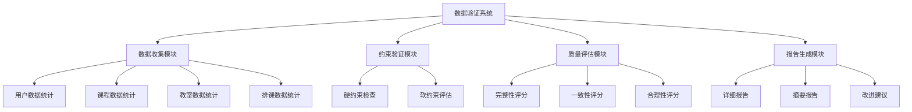
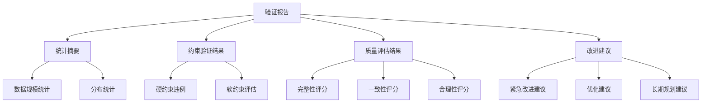

# 数据库数据合理性验证设计文档

## 1. 概述

### 1.1 目标
设计并实现一个全面的数据库数据合理性验证系统，用于检查课程管理系统中各类数据的完整性、一致性和合理性，确保系统在大规模数据场景下的稳定运行。

### 1.2 验证范围
- 用户数据（学生、教师、管理员）
- 课程数据
- 教室数据
- 排课数据
- 选课数据
- 时间段数据

### 1.3 验证维度
- 数据完整性（完整性检查）
- 约束遵守性（硬约束和软约束）
- 数据质量（合理性、一致性）
- 性能指标（数据分布、利用率）

## 2. 系统架构

### 2.1 整体架构


### 2.2 核心组件

#### 2.2.1 数据收集模块
负责从数据库中收集各类数据的统计信息，包括数量、分布、关联关系等。

#### 2.2.2 约束验证模块
检查数据是否满足业务约束，分为硬约束（必须满足）和软约束（建议满足）。

#### 2.2.3 质量评估模块
对数据质量进行量化评估，生成各项质量评分。

#### 2.2.4 报告生成模块
生成详细的验证报告，包括统计数据、约束违例、质量评分和改进建议。

## 3. 数据模型验证

### 3.1 用户数据验证
| 验证项 | 描述 | 硬约束/软约束 | 验证方法 |
|--------|------|---------------|----------|
| 用户总数 | 检查用户数据是否存在 | 硬约束 | 统计User表记录数 |
| 角色分布 | 检查学生、教师、管理员比例是否合理 | 软约束 | 按user_type分组统计 |
| 数据完整性 | 检查必填字段是否为空 | 硬约束 | 检查NULL值 |

### 3.2 课程数据验证
| 验证项 | 描述 | 硬约束/软约束 | 验证方法 |
|--------|------|---------------|----------|
| 课程数量 | 检查课程数据是否存在 | 硬约束 | 统计Course表记录数 |
| 学分范围 | 检查学分是否在合理范围内(1-10) | 硬约束 | 检查credits字段范围 |
| 课程类型 | 检查课程类型是否符合规范 | 硬约束 | 检查course_type字段值 |
| 授课教师 | 检查每门课程是否有授课教师 | 硬约束 | 检查teachers关联关系 |

### 3.3 教室数据验证
| 验证项 | 描述 | 硬约束/软约束 | 验证方法 |
|--------|------|---------------|----------|
| 教室数量 | 检查教室数据是否存在 | 硬约束 | 统计Classroom表记录数 |
| 容量范围 | 检查教室容量是否在合理范围内(1-1000) | 硬约束 | 检查capacity字段范围 |
| 教室类型 | 检查教室类型是否符合规范 | 硬约束 | 检查room_type字段值 |
| 可用状态 | 检查教室是否标记为可用 | 软约束 | 检查is_available字段 |

### 3.4 排课数据验证
| 验证项 | 描述 | 硬约束/软约束 | 验证方法 |
|--------|------|---------------|----------|
| 排课数量 | 检查排课数据是否存在 | 硬约束 | 统计Schedule表记录数 |
| 教师冲突 | 检查同一教师在同一时间是否有多个排课 | 硬约束 | 检查teacher+day_of_week+time_slot唯一性 |
| 教室冲突 | 检查同一教室在同一时间是否有多个排课 | 硬约束 | 检查classroom+day_of_week+time_slot唯一性 |
| 容量冲突 | 检查选课人数是否超过教室容量 | 硬约束 | 比较enrollment_count与classroom.capacity |

### 3.5 选课数据验证
| 验证项 | 描述 | 硬约束/软约束 | 验证方法 |
|--------|------|---------------|----------|
| 选课数量 | 检查选课数据是否存在 | 硬约束 | 统计Enrollment表记录数 |
| 状态有效性 | 检查选课状态是否符合规范 | 硬约束 | 检查status字段值 |
| 课程关联 | 检查选课记录是否关联有效课程 | 硬约束 | 检查course外键 |
| 学生关联 | 检查选课记录是否关联有效学生 | 硬约束 | 检查student外键 |

### 3.6 时间段数据验证
| 验证项 | 描述 | 硬约束/软约束 | 验证方法 |
|--------|------|---------------|----------|
| 时间段数量 | 检查时间段数据是否存在 | 硬约束 | 统计TimeSlot表记录数 |
| 时间顺序 | 检查开始时间是否早于结束时间 | 硬约束 | 比较start_time与end_time |
| 排序唯一 | 检查排序字段是否唯一 | 硬约束 | 检查order字段唯一性 |

## 4. 约束验证设计

### 4.1 硬约束验证
硬约束是业务规则中必须满足的条件，违反硬约束会导致系统功能异常。

#### 4.1.1 数据完整性约束
```
检查点:
1. 所有数据表记录数应大于0（核心数据表）
2. 必填字段不应为空
3. 外键关联应有效
4. 唯一性约束应满足
```

#### 4.1.2 业务逻辑约束
```
检查点:
1. 教师时间冲突检查
2. 教室时间冲突检查
3. 教室容量约束检查
4. 课程教师关联检查
5. 选课状态有效性检查
```

### 4.2 软约束验证
软约束是业务规则中建议满足的条件，违反软约束不会导致系统功能异常，但可能影响用户体验或资源利用率。

#### 4.2.1 资源利用率约束
```
检查点:
1. 教室利用率应在合理范围内(30%-95%)
2. 教师工作量应在合理范围内
3. 课程选课率应在合理范围内
```

#### 4.2.2 数据分布约束
```
检查点:
1. 学生选课数量应在合理范围内(3-12门)
2. 教师授课数量应在合理范围内
3. 时间段分布应相对均匀
```

## 5. 质量评估模型

### 5.1 评估指标体系

#### 5.1.1 完整性评分 (权重: 30%)
```
评分标准:
- 核心数据表存在性检查 (40%)
- 必填字段完整性检查 (30%)
- 关联关系完整性检查 (30%)
```

#### 5.1.2 一致性评分 (权重: 40%)
```
评分标准:
- 硬约束违例数量 (60%)
- 数据格式一致性检查 (20%)
- 业务逻辑一致性检查 (20%)
```

#### 5.1.3 合理性评分 (权重: 30%)
```
评分标准:
- 资源利用率合理性 (40%)
- 数据分布合理性 (30%)
- 业务参数合理性 (30%)
```

### 5.2 评分计算方法
```
总体质量评分 = 完整性评分×30% + 一致性评分×40% + 合理性评分×30%

各单项评分 = (1 - 违例数量/总检查项数) × 100
```

## 6. 报告生成设计

### 6.1 报告结构


### 6.2 报告内容

#### 6.2.1 统计摘要
- 各类数据的数量统计
- 关键指标的分布情况
- 数据规模概览

#### 6.2.2 约束验证结果
- 硬约束违例详情
- 软约束评估结果
- 约束遵守率统计

#### 6.2.3 质量评估结果
- 各维度质量评分
- 总体质量评级
- 质量趋势分析

#### 6.2.4 改进建议
- 紧急修复建议（高优先级）
- 优化改进建议（中优先级）
- 长期规划建议（低优先级）

## 7. 实施计划

### 7.1 阶段一：核心验证功能实现
- 实现数据收集模块
- 实现硬约束验证模块
- 实现基础报告生成模块

### 7.2 阶段二：质量评估完善
- 实现软约束评估模块
- 实现质量评分模型
- 完善报告内容

### 7.3 阶段三：系统优化
- 性能优化
- 用户体验优化
- 自动化验证机制

## 8. 测试策略

### 8.1 单元测试
- 各验证函数的独立测试
- 评分算法的准确性测试
- 报告生成的完整性测试

### 8.2 集成测试
- 与数据库的连接测试
- 完整验证流程测试
- 报告输出格式测试

### 8.3 性能测试
- 大数据量下的验证性能测试
- 内存占用测试
- 并发处理能力测试