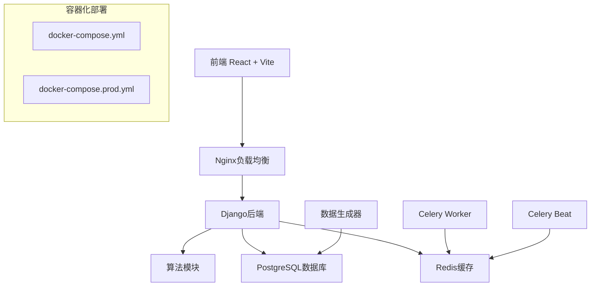
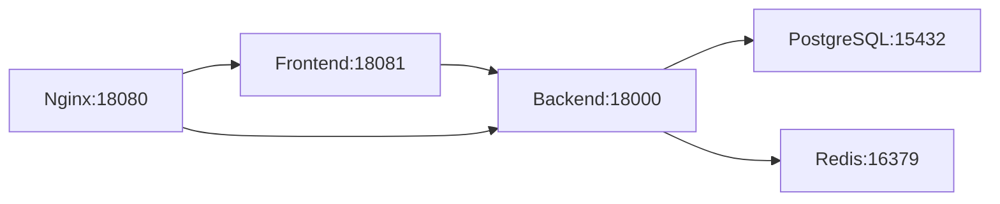
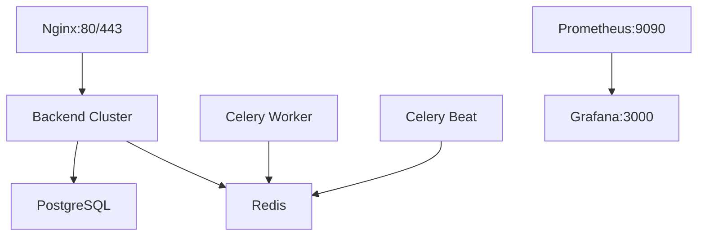
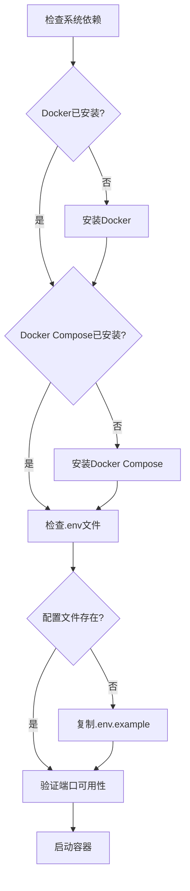
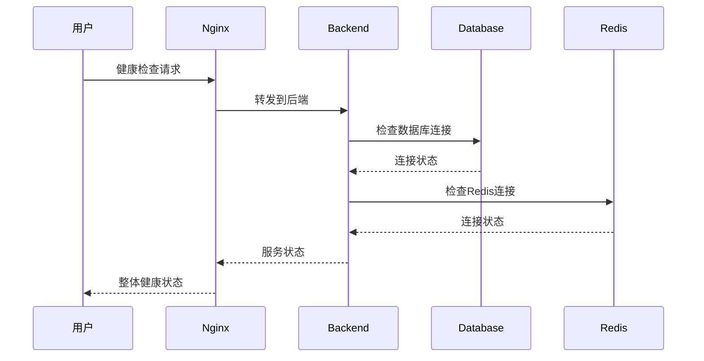
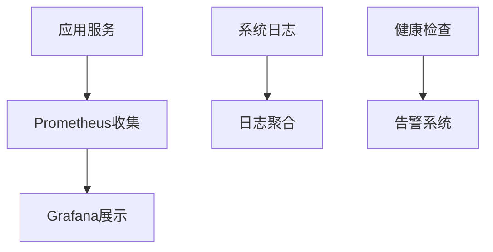
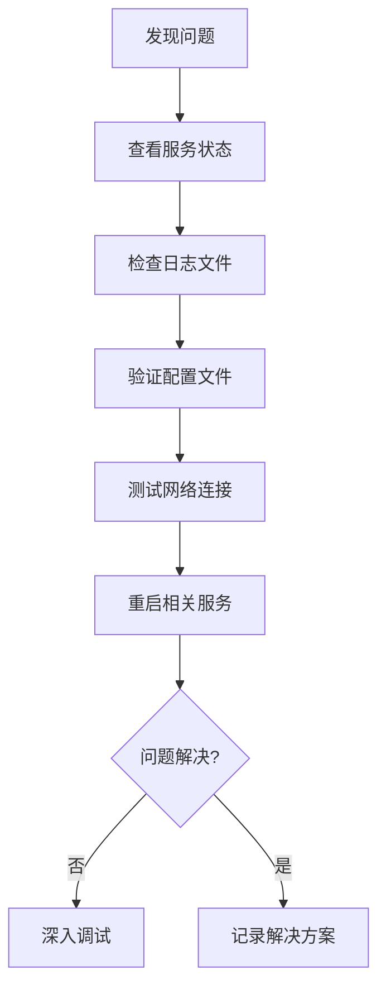
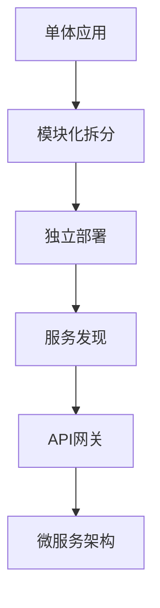
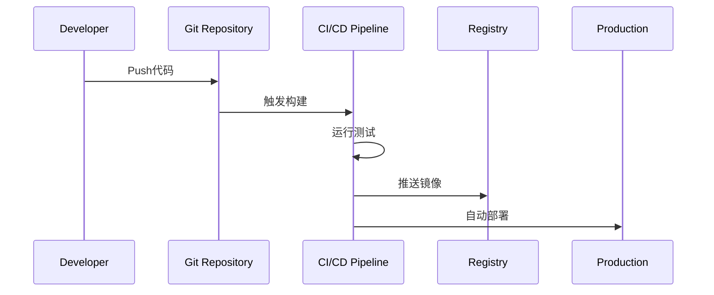

# 课程管理系统依赖检查与Docker启动设计

## 概述

本设计文档详细分析课程管理系统的项目依赖结构，并提供完整的Docker容器化部署方案。该系统采用前后端分离架构，包含Django后端、React前端、智能排课算法模块和数据生成器组件。

## 项目架构概览



## 依赖分析

### 后端依赖 (Django)

| 类别 | 组件 | 版本 | 作用 |
|------|------|------|------|
| 核心框架 | Django | 4.2.7 | Web框架 |
| API框架 | djangorestframework | 3.14.0 | REST API |
| 数据库 | psycopg2-binary | 2.9.10 | PostgreSQL驱动 |
| 缓存 | redis, django-redis | 5.0.1, 5.4.0 | 缓存系统 |
| 异步任务 | celery | 5.3.4 | 后台任务队列 |
| 认证 | djangorestframework-simplejwt | 5.3.0 | JWT认证 |
| CORS | django-cors-headers | 4.3.1 | 跨域支持 |
| 文档 | drf-spectacular | 0.26.5 | API文档 |
| 部署 | gunicorn | 21.2.0 | WSGI服务器 |
| 科学计算 | numpy | >=1.21.0 | 算法支持 |

### 前端依赖 (React)

| 类别 | 组件 | 版本 | 作用 |
|------|------|------|------|
| 核心框架 | React | 18.2.0 | UI框架 |
| 构建工具 | Vite | 4.5.0 | 开发和构建 |
| UI库 | Antd | 5.12.8 | 组件库 |
| 状态管理 | @reduxjs/toolkit | 1.9.7 | 状态管理 |
| 路由 | react-router-dom | 6.18.0 | 路由管理 |
| HTTP客户端 | axios | 1.6.2 | API请求 |
| 图表 | echarts, recharts | 5.4.3, 3.1.2 | 数据可视化 |
| 样式 | styled-components | 6.1.1 | CSS-in-JS |
| 工具库 | lodash, dayjs | 4.17.21, 1.11.13 | 工具函数 |

### 算法模块依赖

| 组件 | 版本 | 作用 |
|------|------|------|
| numpy | >=1.21.0 | 数值计算 |
| openpyxl | >=3.0.9 | Excel导出 |
| reportlab | >=3.6.0 | PDF生成 |
| multiprocessing-logging | >=0.3.4 | 并行计算日志 |

### 数据生成器依赖

| 组件 | 版本 | 作用 |
|------|------|------|
| faker | 19.6.2 | 假数据生成 |
| pandas | >=2.1.1 | 数据处理 |
| numpy | >=1.26.0 | 数值计算 |
| psycopg2-binary | 2.9.7 | 数据库连接 |
| sqlalchemy | 2.0.21 | ORM框架 |
| tqdm | 4.66.1 | 进度条显示 |

## Docker容器化架构

### 开发环境配置 (docker-compose.yml)



**服务组件:**
- **Frontend**: React应用，基于nginx:alpine
- **Backend**: Django应用，基于python:3.9-slim
- **Database**: PostgreSQL 13-alpine
- **Cache**: Redis 6-alpine
- **Load Balancer**: Nginx (可选)

**端口映射:**
- Frontend: 18081:80
- Backend: 18000:8000
- PostgreSQL: 15432:5432
- Redis: 16379:6379
- Nginx: 18080:80

### 生产环境配置 (docker-compose.prod.yml)



**增强特性:**
- 多副本后端服务 (replicas: 2)
- Celery异步任务处理
- SSL/TLS支持
- 资源限制和健康检查
- 监控服务 (Prometheus + Grafana)

### Docker镜像构建策略

#### 后端镜像特点
- 基础镜像: python:3.9-slim
- 系统依赖: postgresql-client, build-essential
- 用户安全: 非root用户运行
- 健康检查: API endpoint检测
- 启动脚本: docker-entrypoint.sh

#### 前端镜像特点
- 多阶段构建: node:18-alpine → nginx:alpine
- 构建优化: 跳过Cypress安装
- 静态文件服务: nginx配置
- 体积优化: 仅包含构建产物

## 环境变量配置

### 核心配置项

| 变量名 | 用途 | 示例值 |
|--------|------|--------|
| DB_PASSWORD | 数据库密码 | your_db_password_here |
| REDIS_PASSWORD | Redis密码 | your_redis_password_here |
| SECRET_KEY | Django密钥 | your-secret-key-change-in-production |
| ALLOWED_HOSTS | 允许的主机 | localhost,127.0.0.1,your_domain |
| CORS_ALLOWED_ORIGINS | CORS域名 | http://localhost:8081 |

### 算法模块配置

| 变量名 | 用途 | 默认值 |
|--------|------|--------|
| ALGORITHM_TIMEOUT | 算法超时时间 | 300秒 |
| GENETIC_ALGORITHM_POPULATION_SIZE | 遗传算法种群大小 | 100 |
| GENETIC_ALGORITHM_GENERATIONS | 遗传算法代数 | 50 |

## 启动流程设计

### 启动前检查



### 快速启动步骤

1. **环境准备**
   ```bash
   # 复制环境配置
   cp .env.example .env
   
   # 检查Docker服务
   docker --version
   docker-compose --version
   ```

2. **开发环境启动**
   ```bash
   # 构建并启动所有服务
   docker-compose up -d
   
   # 查看服务状态
   docker-compose ps
   
   # 查看日志
   docker-compose logs -f
   ```

3. **生产环境启动**
   ```bash
   # 使用生产配置启动
   docker-compose -f docker-compose.prod.yml up -d
   
   # 启动监控服务
   docker-compose -f docker-compose.prod.yml --profile monitoring up -d
   ```

### 服务健康检查



## 数据初始化策略

### 数据库初始化流程


### 测试数据生成

| 脚本 | 用途 | 数据量级 |
|------|------|----------|
| create_basic_test_data.py | 基础测试数据 | 小规模 |
| generate_large_test_data.py | 大规模测试 | 万级 |
| import_mega_data.py | 压力测试数据 | 百万级 |

## 性能优化配置

### 资源限制设置

```yaml
# 生产环境资源配置
deploy:
  resources:
    limits:
      cpus: '2.0'
      memory: 2G
    reservations:
      cpus: '1.0'  
      memory: 1G
```

### 缓存策略

| 组件 | 缓存类型 | 配置 |
|------|----------|------|
| Redis | 内存缓存 | maxmemory 512mb |
| PostgreSQL | 连接池 | max_connections |
| Nginx | 静态文件 | 缓存策略 |

## 监控与日志

### 监控架构



### 日志管理

| 日志类型 | 存储位置 | 轮转策略 |
|----------|----------|----------|
| 应用日志 | /app/logs | 按大小轮转 |
| 数据库日志 | PostgreSQL容器 | 按时间轮转 |
| Web访问日志 | Nginx容器 | 每日轮转 |

## 故障排除指南

### 常见问题解决

| 问题 | 症状 | 解决方案 |
|------|------|----------|
| 端口冲突 | 启动失败 | 修改docker-compose.yml端口映射 |
| 数据库连接失败 | 后端无法启动 | 检查数据库服务状态和连接配置 |
| 前端无法访问后端 | API调用失败 | 验证CORS配置和网络连通性 |
| 内存不足 | 容器重启 | 调整资源限制或增加系统内存 |
| 算法模块错误 | 排课功能异常 | 检查numpy等科学计算库安装 |

### 调试流程



## 安全配置

### 生产环境安全

| 安全措施 | 配置项 | 说明 |
|----------|--------|------|
| SSL/TLS | SECURE_SSL_REDIRECT | 强制HTTPS |
| HSTS | SECURE_HSTS_SECONDS | HTTP严格传输安全 |
| 密码管理 | 环境变量 | 敏感信息外部化 |
| 网络隔离 | Docker网络 | 容器间通信控制 |
| 权限控制 | 非root用户 | 最小权限原则 |

### 数据保护


## 扩展性设计

### 水平扩展支持

| 组件 | 扩展方式 | 配置 |
|------|----------|------|
| 后端服务 | 增加副本数 | replicas: N |
| 数据库 | 读写分离 | 主从配置 |
| 缓存 | Redis集群 | 集群模式 |
| 负载均衡 | Nginx配置 | upstream配置 |

### 微服务化路径



## 开发工作流程

### 本地开发环境

```bash
# 开发模式启动
docker-compose up -d

# 代码热重载
docker-compose exec backend python manage.py runserver 0.0.0.0:8000

# 前端开发服务器
cd frontend && npm run dev
```

### CI/CD集成



## 测试策略

### 测试环境配置

| 测试类型 | 工具 | 配置文件 |
|----------|------|----------|
| 后端单元测试 | pytest | pytest.ini |
| 前端单元测试 | Jest | jest.config.js |
| 集成测试 | Docker Compose | docker-compose.test.yml |
| 端到端测试 | Cypress | cypress.config.js |
| 性能测试 | 自定义脚本 | performance-test.js |

### 自动化测试流程

```bash
# 运行完整测试套件
npm run test:all

# 后端测试
docker-compose exec backend python -m pytest

# 前端测试  
docker-compose exec frontend npm test

# 集成测试
docker-compose -f docker-compose.test.yml up --abort-on-container-exit
```