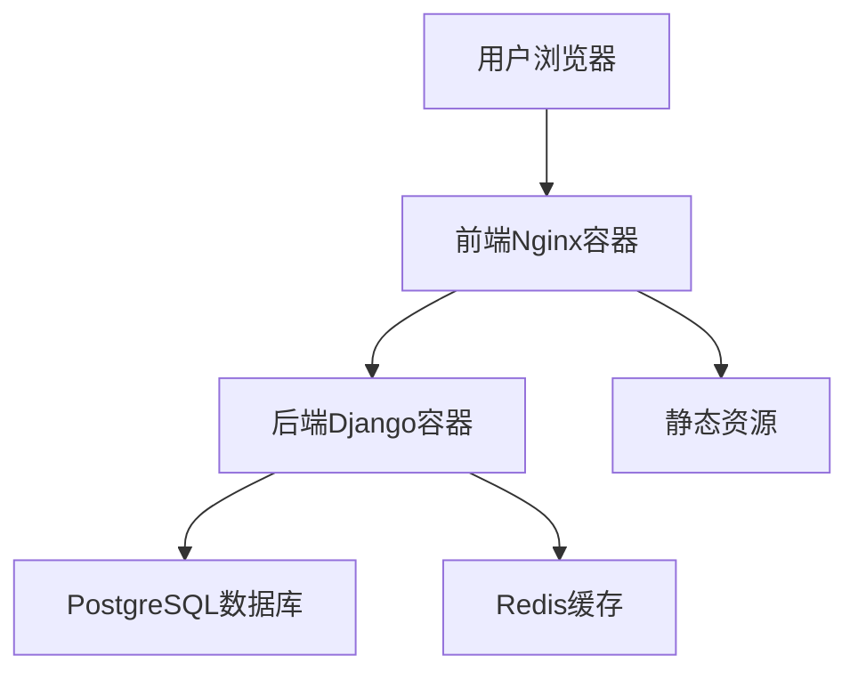

# 前端启动问题检测与修复方案

## 1. 概述

本设计文档旨在分析课程管理系统前端未能正常启动的问题，并提供详细的检测和修复方案。通过系统性分析前端配置、构建流程、容器化部署以及相关依赖，识别导致前端服务无法正常启动的根本原因，并提供相应的解决方案。

## 2. 问题分析

### 2.1 架构问题识别

通过代码库分析，发现以下关键问题：

1. **缺少前端服务定义**：在 `docker-compose.yml` 和 `docker-compose.prod.yml` 文件中均未定义前端服务，导致前端容器无法启动。

2. **构建与部署不一致**：前端具有独立的 Dockerfile，但未在主 docker-compose 配置中引用，造成部署时前端服务缺失。

3. **环境配置不完整**：缺少前端服务所需的环境变量配置。

### 2.2 技术栈分析

- **前端框架**：React + TypeScript + Vite
- **状态管理**：Redux Toolkit
- **UI组件库**：Ant Design
- **路由管理**：React Router v6
- **构建工具**：Vite
- **容器化**：Docker (基于 nginx:alpine)
- **部署编排**：Docker Compose

### 2.3 依赖关系分析



## 3. 根本原因分析

### 3.1 主要原因

1. **docker-compose 配置缺失**：未在 docker-compose 配置文件中定义前端服务，导致前端容器无法启动。

2. **服务依赖关系不明确**：前端与后端服务之间缺少明确的依赖关系定义。

### 3.2 次要原因

1. **开发环境与生产环境配置不一致**：缺少统一的环境变量管理机制。

2. **健康检查机制不完善**：缺少前端服务的健康检查配置。

## 4. 解决方案设计

### 4.1 修复docker-compose配置

需要在 `docker-compose.yml` 中添加前端服务定义：

```yaml
# 前端服务
frontend:
  build:
    context: ./frontend
    dockerfile: Dockerfile
  container_name: course_management_frontend
  restart: unless-stopped
  ports:
    - "80:80"
  depends_on:
    - backend
  networks:
    - course_management_network
  healthcheck:
    test: ["CMD", "curl", "-f", "http://localhost/health"]
    interval: 30s
    timeout: 10s
    retries: 3
    start_period: 40s
```

### 4.2 优化前端Dockerfile

当前前端 Dockerfile 已基本正确，但可以添加一些优化：

1. 添加构建参数支持
2. 优化构建缓存
3. 改进健康检查机制

### 4.3 环境变量配置

在 `.env.example` 文件中添加前端相关配置：

```env
# 前端配置
FRONTEND_PORT=3000
VITE_API_BASE_URL=http://localhost:18000/api
```

同时需要在前端项目中创建开发环境的 `.env` 文件：

```env
# 开发环境配置
VITE_API_BASE_URL=http://localhost:18000/api/v1
VITE_APP_TITLE=校园课程表管理系统(开发环境)
VITE_APP_VERSION=1.0.0-dev
```

## 5. 实施步骤

### 5.1 第一阶段：配置修复

1. 修改 `docker-compose.yml`，添加前端服务定义
   - 在 services 部分添加 frontend 服务配置
   - 配置正确的构建上下文和 Dockerfile 路径
   - 设置端口映射、网络和依赖关系

2. 更新 `.env.example`，添加前端环境变量
   - 添加前端服务所需的环境变量
   - 确保环境变量命名规范一致

3. 验证前端 Dockerfile 配置
   - 检查构建阶段是否正确复制源代码
   - 验证生产阶段是否正确复制构建产物
   - 确认 nginx 配置文件路径正确

4. 创建前端开发环境变量文件
   - 在 `frontend/` 目录下创建 `.env` 文件
   - 配置开发环境所需的环境变量

### 5.2 第二阶段：构建测试

1. 执行 `docker-compose build frontend` 构建前端服务
   - 检查依赖安装是否成功
   - 验证构建过程无 TypeScript 编译错误
   - 确认构建产物生成位置正确

2. 运行 `docker-compose up frontend` 测试单独启动
   - 检查容器是否成功启动
   - 验证 nginx 服务是否正常运行
   - 确认健康检查端点可访问

3. 检查构建日志，修复可能的构建错误
   - 分析构建失败的具体原因
   - 修复依赖版本冲突问题
   - 解决 TypeScript 类型检查错误

### 5.3 第三阶段：集成测试

1. 启动完整服务栈：`docker-compose up -d`
   - 验证所有服务容器正常启动
   - 检查服务间网络连接正常
   - 确认各服务健康检查通过

2. 验证前端服务是否正常运行
   - 访问前端页面检查是否正常加载
   - 验证静态资源（CSS、JS、图片）可访问
   - 检查页面路由是否正常工作

3. 检查前后端通信是否正常
   - 测试 API 接口调用是否成功
   - 验证登录认证流程
   - 检查跨域资源共享(CORS)配置

4. 验证健康检查端点
   - 检查前端 `/health` 端点返回正常
   - 验证后端健康检查接口
   - 确认监控系统能正确获取服务状态

## 6. 验证方案

### 6.1 前端服务验证

1. **端口检查**：
   ```bash
   curl -f http://localhost/health
   ```

2. **页面访问测试**：
   - 访问 `http://localhost` 应显示登录页面
   - 检查静态资源是否正常加载

3. **API连通性测试**：
   - 前端应能成功调用后端API
   - 检查浏览器控制台无跨域错误

### 6.2 容器状态验证

1. **容器运行状态**：
   ```bash
   docker-compose ps
   ```

2. **服务日志检查**：
   ```bash
   docker-compose logs frontend
   ```

3. **网络连通性**：
   ```bash
   docker-compose exec frontend ping backend
   ```

## 7. 风险与缓解措施

### 7.1 潜在风险

1. **构建失败**：前端构建过程中可能出现依赖问题
2. **端口冲突**：前端服务端口可能与其他服务冲突
3. **跨域问题**：前后端通信可能存在CORS问题
4. **网络连接问题**：前端无法连接到后端服务
5. **静态资源加载失败**：CSS、JS等静态资源无法正确加载

### 7.2 缓解措施

1. **构建问题**：
   - 使用 `--no-cache` 参数重新构建
   - 检查 package.json 依赖版本
   - 清理 node_modules 并重新安装依赖

2. **端口冲突**：
   - 修改 docker-compose.yml 中的端口映射
   - 检查主机端口占用情况
   - 使用不同的端口进行测试

3. **跨域问题**：
   - 配置 nginx 反向代理
   - 更新后端 CORS 设置
   - 检查前端 API 请求地址配置

4. **网络连接问题**：
   - 验证 Docker 网络配置
   - 检查服务间依赖关系
   - 使用 docker-compose exec 测试网络连通性

5. **静态资源加载失败**：
   - 检查 nginx 配置文件
   - 验证构建产物路径
   - 确认文件权限设置

## 8. 回滚方案

如果修复方案导致系统不稳定，可采用以下回滚措施：

1. 恢复原始 docker-compose.yml 文件
2. 停止新增的前端服务容器
3. 重新启动原有服务栈

## 9. 后续优化建议

### 9.1 开发环境优化

1. 添加开发模式下的热重载支持
2. 配置本地开发代理避免跨域问题
3. 提供独立的前端开发启动脚本
4. 添加开发环境下的 Mock 数据支持
5. 配置本地 HTTPS 支持

### 9.2 生产环境优化

1. 在生产环境配置中添加前端服务
2. 配置CDN加速静态资源加载
3. 添加前端性能监控
4. 实施资源压缩和缓存策略
5. 配置负载均衡和高可用部署

### 9.3 监控告警

1. 添加前端服务健康检查告警
2. 配置前端错误日志收集
3. 建立前端性能监控体系
4. 实施用户行为监控
5. 添加前端异常捕获和上报机制

## 10. 具体修复操作指南

### 10.1 修改 docker-compose.yml 文件

在 `services` 部分添加以下配置：

```yaml
  # 前端服务
  frontend:
    build:
      context: ./frontend
      dockerfile: Dockerfile
    container_name: course_management_frontend
    restart: unless-stopped
    ports:
      - "80:80"
    depends_on:
      backend:
        condition: service_healthy
    networks:
      - course_management_network
    healthcheck:
      test: ["CMD", "curl", "-f", "http://localhost/health"]
      interval: 30s
      timeout: 10s
      retries: 3
      start_period: 40s
```

### 10.2 验证修改后的配置

1. 运行以下命令验证配置文件语法：
   ```bash
   docker-compose config
   ```

2. 构建并启动前端服务：
   ```bash
   docker-compose build frontend
   docker-compose up frontend
   ```

3. 检查服务状态：
   ```bash
   docker-compose ps
   ```

### 10.3 完整服务栈测试

1. 启动所有服务：
   ```bash
   docker-compose up -d
   ```

2. 验证所有服务正常运行后，访问前端页面：
   ```bash
   curl -f http://localhost
   ```

3. 检查日志确认无错误：
   ```bash
   docker-compose logs frontend
   ```