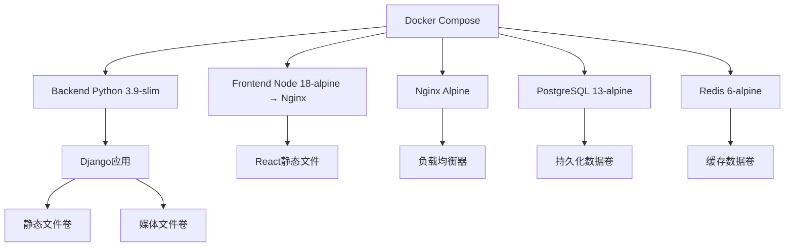

# 项目依赖重新安装设计文档

## 概述

本文档为从其他电脑复制粘贴过来的校园课程表管理系统项目，提供完整的依赖重新安装和环境配置方案。该项目是一个基于Docker的全栈应用，包含Python Django后端、React前端、智能排课算法模块和数据生成器。

## 项目架构分析

### 技术栈识别
- **后端**: Python 3.9 + Django 4.2.7 + PostgreSQL 13 + Redis 6
- **前端**: React 18 + TypeScript + Vite + Ant Design
- **算法模块**: Python + NumPy (遗传算法、启发式算法)
- **数据生成器**: Python + Faker + Pandas
- **部署方案**: Docker + Docker Compose
- **数据库**: PostgreSQL 13
- **缓存**: Redis 6
- **Web服务器**: Nginx (生产环境)

### 项目结构
```
course-management-system/
├── backend/                 # Django后端应用
├── frontend/               # React前端应用
├── algorithms/             # 智能排课算法模块
├── data-generator/         # 测试数据生成器
├── deployment/docker/      # Docker部署配置
├── docker-compose.yml      # 开发环境配置
└── docker-compose.prod.yml # 生产环境配置
```

## 依赖重新安装方案

### 阶段一: 基础环境安装

#### 1.1 软件依赖检查与安装

**必需软件列表:**
- Docker Desktop (最新版本)
- Git (用于版本控制)
- Node.js 18+ (前端开发)
- Python 3.9+ (算法模块开发)

**Chocolatey安装脚本:**
```powershell
# 安装Chocolatey包管理器
Set-ExecutionPolicy Bypass -Scope Process -Force
[System.Net.ServicePointManager]::SecurityProtocol = [System.Net.ServicePointManager]::SecurityProtocol -bor 3072
iex ((New-Object System.Net.WebClient).DownloadString('https://chocolatey.org/install.ps1'))

# 安装Docker Desktop
choco install docker-desktop

# 安装Node.js 18
choco install nodejs --version=18.17.0

# 安装Python 3.9
choco install python --version=3.9.13

# 安装Git
choco install git

# 安装其他工具
choco install vscode          # 可选：代码编辑器
choco install postman        # 可选：API测试工具
```

#### 1.2 Docker环境配置

**Docker Desktop配置要求:**
- 内存分配: ≥ 4GB
- CPU核心: ≥ 2核
- 磁盘空间: ≥ 20GB
- WSL2后端启用 (Windows)

**验证命令:**
```bash
docker --version
docker compose --version
docker run hello-world
```

### 阶段二: 项目环境配置

#### 2.1 环境变量配置

**创建.env文件:**
```bash
# 复制环境变量模板
cp .env.example .env
```

**关键环境变量:**
```env
# 数据库配置
DB_PASSWORD=postgres123
DB_HOST=db
DB_PORT=5432
DB_NAME=course_management

# Redis配置
REDIS_PASSWORD=redis123
REDIS_HOST=redis
REDIS_PORT=6379

# Django配置
SECRET_KEY=your-secret-key-change-in-production
DEBUG=False
ALLOWED_HOSTS=localhost,127.0.0.1
```

#### 2.2 依赖文件分析

**后端依赖 (backend/requirements.txt):**
- Django 4.2.7 + DRF 3.14.0
- PostgreSQL驱动: psycopg2-binary 2.9.10
- Redis支持: redis 5.0.1, django-redis 5.4.0
- 异步任务: celery 5.3.4
- API文档: drf-spectacular 0.26.5
- 认证: djangorestframework-simplejwt 5.3.0

**前端依赖 (frontend/package.json):**
- React 18.2.0 + TypeScript
- UI框架: Ant Design 5.12.8
- 状态管理: Redux Toolkit 1.9.7
- 路由: React Router 6.18.0
- HTTP客户端: Axios 1.6.2
- 图表库: ECharts 5.4.3, Recharts 3.1.2

**算法模块依赖 (algorithms/requirements.txt):**
- 核心计算: numpy ≥1.21.0
- 数据导出: openpyxl ≥3.0.9, reportlab ≥3.6.0
- 测试框架: pytest ≥6.2.0

**数据生成器依赖 (data-generator/requirements.txt):**
- 假数据生成: faker 19.6.2
- 数据处理: pandas ≥2.1.1, numpy ≥1.26.0
- 数据库支持: sqlalchemy 2.0.21

### 阶段三: Docker部署执行

#### 3.1 Docker镜像构建策略

**多阶段构建配置:**



**容器网络架构:**
- 网络类型: bridge
- 子网: 172.20.0.0/16
- 服务发现: Docker内部DNS
- 端口映射:
  - PostgreSQL: 5432:5432
  - Redis: 6379:6379
  - Django: 8000:8000
  - React: 8081:80
  - Nginx: 8080:80

#### 3.2 数据卷配置

**持久化数据卷:**
- postgres_data: 数据库数据持久化
- redis_data: 缓存数据持久化
- static_volume: Django静态文件
- media_volume: 用户上传文件
- logs_volume: 应用日志文件

#### 3.3 健康检查机制

**服务健康检查配置:**

| 服务 | 检查命令 | 间隔 | 超时 | 重试次数 |
|------|----------|------|------|----------|
| PostgreSQL | pg_isready -U postgres | 10s | 5s | 5 |
| Redis | redis-cli ping | 10s | 3s | 5 |
| Django | HTTP请求 /api/health/ | 30s | 10s | 3 |
| Frontend | curl -f http://localhost/health | 30s | 10s | 3 |

### 阶段四: 部署执行流程

#### 4.1 预部署检查清单

**环境检查脚本:**
```powershell
# 检查Docker状态
docker --version
docker compose --version
docker system info

# 检查端口占用
netstat -an | findstr "5432 6379 8000 8081 8080"

# 检查磁盘空间
docker system df
```

#### 4.2 部署命令序列

**开发环境部署:**
```bash
# 1. 清理旧容器和镜像
docker compose down --volumes --remove-orphans
docker system prune -f

# 2. 构建并启动服务
docker compose build --no-cache
docker compose up -d

# 3. 查看服务状态
docker compose ps
docker compose logs -f

# 4. 数据库初始化
docker compose exec backend python manage.py migrate
docker compose exec backend python manage.py collectstatic --noinput

# 5. 创建超级用户
docker compose exec backend python manage.py createsuperuser
```

**生产环境部署:**
```bash
# 使用生产配置文件
docker compose -f docker-compose.prod.yml up -d
```

#### 4.3 验证测试流程

**服务可用性测试:**
```bash
# 检查所有服务状态
docker compose ps

# 测试数据库连接
docker compose exec backend python manage.py check --database default

# 测试Redis连接
docker compose exec backend python manage.py shell -c "
from django.core.cache import cache
cache.set('test', 'success')
print(cache.get('test'))
"

# 测试API端点
curl http://localhost:8000/api/health/
curl http://localhost:8081/health
```

**功能测试:**
1. 访问前端应用: http://localhost:8081
2. 访问后端API: http://localhost:8000/api/
3. 访问管理界面: http://localhost:8000/admin/
4. 测试用户登录注册功能
5. 测试课程管理功能

#### 4.4 故障排查指南

**常见问题及解决方案:**

| 问题类型 | 症状 | 解决方案 |
|----------|------|----------|
| 端口冲突 | 容器启动失败 | 修改docker-compose.yml端口映射 |
| 磁盘空间不足 | 构建失败 | docker system prune清理空间 |
| 网络连接问题 | 服务间通信失败 | 重启Docker Desktop |
| 数据库连接失败 | Django无法启动 | 检查环境变量和数据库状态 |
| 前端构建失败 | npm install错误 | 删除node_modules重新安装 |

**日志检查命令:**
```bash
# 查看所有服务日志
docker compose logs

# 查看特定服务日志
docker compose logs backend
docker compose logs frontend
docker compose logs db

# 实时跟踪日志
docker compose logs -f --tail=100
```

### 阶段五: 性能优化与监控

#### 5.1 资源优化配置

**Docker资源限制:**
```yaml
services:
  backend:
    deploy:
      resources:
        limits:
          memory: 1G
          cpus: '0.5'
        reservations:
          memory: 512M
          cpus: '0.25'
```

#### 5.2 监控指标

**关键监控指标:**
- 容器CPU使用率
- 内存使用情况
- 磁盘IO性能
- 网络延迟
- 数据库连接池状态
- Redis缓存命中率

**监控命令:**
```bash
# 资源使用情况
docker stats

# 容器健康状态
docker compose ps --services --filter "health=healthy"

# 系统资源监控
docker system df
docker system events
```

## 测试策略

### 单元测试执行
```bash
# 后端测试
docker compose exec backend python -m pytest

# 前端测试
docker compose exec frontend npm test

# 算法模块测试
docker compose exec backend python -m pytest algorithms/tests/
```

### 集成测试
```bash
# API集成测试
docker compose exec backend python manage.py test

# 端到端测试
docker compose exec frontend npm run test:e2e
```

### 性能测试
```bash
# 数据库压力测试
docker compose exec backend python manage.py shell -c "
from django.test import TestCase
from django.test.utils import override_settings
# 执行性能测试代码
"

# 并发请求测试
docker compose exec backend python manage.py test_load
```
