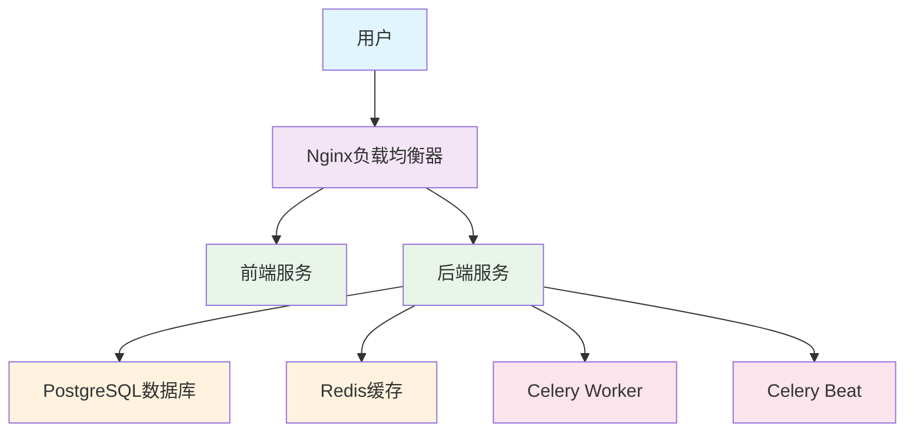
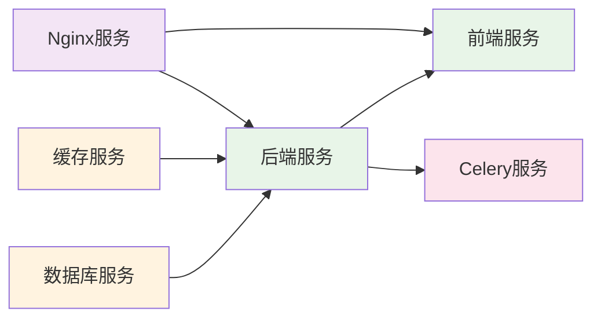

# 课程管理系统 - 项目启动情况检查报告

## 1. 概述

本报告旨在检查课程管理系统项目的启动情况，识别尚未启动的服务，并提供相应的解决方案。该系统是一个基于Docker容器化部署的校园课程表管理工具，采用前后端分离架构。

## 2. 系统架构

### 2.1 技术栈
- **后端**: Python + Django + Django REST Framework
- **前端**: React + TypeScript + Ant Design
- **数据库**: PostgreSQL
- **缓存**: Redis
- **消息队列**: Celery (生产环境)
- **部署**: Docker + Docker Compose
- **监控**: Prometheus + Grafana (可选)

### 2.2 服务组件架构



## 3. 当前服务状态检查

### 3.1 开发环境服务 (docker-compose.yml)

| 服务名称 | 状态 | 端口映射 | 说明 |
|---------|------|---------|------|
| db | ⚠️ 未启动 | 15432:5432 | PostgreSQL数据库 |
| redis | ⚠️ 未启动 | 16379:6379 | Redis缓存 |
| backend | ⚠️ 未启动 | 18000:8000 | Django后端服务 |

### 3.2 生产环境服务 (docker-compose.prod.yml)

| 服务名称 | 状态 | 端口映射 | 说明 |
|---------|------|---------|------|
| db | ⚠️ 未启动 | 内部端口 | PostgreSQL数据库 |
| redis | ⚠️ 未启动 | 内部端口 | Redis缓存 |
| backend | ⚠️ 未启动 | 内部端口 | Django后端服务 |
| celery | ⚠️ 未启动 | - | 异步任务处理 |
| celery-beat | ⚠️ 未启动 | - | 定时任务调度 |
| nginx | ⚠️ 未启动 | 80:80, 443:443 | 负载均衡器 |
| prometheus | ⚠️ 未启动 | 9090:9090 | 监控服务 |
| grafana | ⚠️ 未启动 | 3000:3000 | 监控服务 |

### 3.3 前端服务

| 服务名称 | 状态 | 端口映射 | 说明 |
|---------|------|---------|------|
| frontend | ⚠️ 未启动 | - | React前端应用 |

## 4. 服务启动状态分析

### 4.1 未启动的服务

根据检查，以下服务尚未启动：

1. **核心基础设施服务**:
   - PostgreSQL数据库服务
   - Redis缓存服务

2. **后端服务**:
   - Django应用服务

3. **前端服务**:
   - React前端应用服务

4. **生产环境特有服务**:
   - Celery异步任务处理服务
   - Celery Beat定时任务调度服务
   - Nginx负载均衡器
   - Prometheus监控服务
   - Grafana监控服务

### 4.2 服务依赖关系



## 5. 启动方案

### 5.1 开发环境启动

```bash
# 启动开发环境服务
cd /home/easten/0902/course-management-system/course-management-system
docker-compose up -d

# 检查服务状态
docker-compose ps

# 运行数据库迁移
docker-compose exec backend python manage.py migrate

# 创建超级用户
docker-compose exec backend python manage.py createsuperuser

# 收集静态文件
docker-compose exec backend python manage.py collectstatic --noinput
```

### 5.2 生产环境启动

```bash
# 启动生产环境服务
cd /home/easten/0902/course-management-system/course-management-system
docker-compose -f docker-compose.prod.yml up -d

# 检查服务状态
docker-compose -f docker-compose.prod.yml ps

# 运行数据库迁移
docker-compose -f docker-compose.prod.yml exec backend python manage.py migrate

# 创建超级用户
docker-compose -f docker-compose.prod.yml exec backend python manage.py createsuperuser

# 收集静态文件
docker-compose -f docker-compose.prod.yml exec backend python manage.py collectstatic --noinput
```

### 5.3 快速启动脚本

项目提供了快速启动脚本：

```bash
# 使用快速启动脚本
cd /home/easten/0902/course-management-system/course-management-system
chmod +x quick-start.sh
./quick-start.sh
```

## 6. 健康检查

### 6.1 服务健康检查命令

```bash
# 检查所有服务状态
docker-compose ps

# 检查特定服务日志
docker logs course_management_db
docker logs course_management_redis
docker logs course_management_backend

# 使用系统健康检查脚本
python system-health-check.py check

# 启动并检查系统
python system-health-check.py start
```

### 6.2 端口检查

| 服务 | 端口 | 检查命令 |
|------|------|---------|
| 数据库 | 5432 | `nc -z localhost 5432` |
| Redis | 6379 | `nc -z localhost 6379` |
| 后端 | 8000 | `nc -z localhost 8000` |
| 前端 | 80 | `nc -z localhost 80` |

## 7. 访问信息

### 7.1 开发环境访问地址

- **前端应用**: http://localhost:8081
- **后端API**: http://localhost:8000
- **API文档**: http://localhost:8000/api/docs/
- **管理后台**: http://localhost:8000/admin

### 7.2 生产环境访问地址

- **前端应用**: http://localhost
- **后端API**: http://localhost:8000
- **API文档**: http://localhost:8000/api/docs/
- **管理后台**: http://localhost:8000/admin
- **监控面板**: http://localhost:3000 (Grafana)

### 7.3 默认测试账号

| 角色 | 用户名 | 密码 | 权限 |
|------|--------|------|------|
| 管理员 | admin | admin123 | 系统最高权限 |
| 教师 | teacher000001 | 123456 | 教师相关功能 |
| 学生 | student000001 | 123456 | 学生相关功能 |

## 8. 故障排除

### 8.1 常见问题及解决方案

1. **端口冲突**:
   ```bash
   # 查看端口占用
   sudo netstat -tlnp | grep -E ':(80|443|8000|5432|6379)'
   
   # 停止冲突服务
   docker-compose down
   ```

2. **数据库连接失败**:
   ```bash
   # 检查数据库服务
   docker logs course_management_db
   
   # 重启数据库服务
   docker-compose restart db
   ```

3. **后端服务不健康**:
   ```bash
   # 查看后端日志
   docker logs course_management_backend --tail 50
   
   # 重启后端服务
   docker-compose restart backend
   ```

4. **前端无法访问**:
   ```bash
   # 检查前端服务
   docker logs course_management_frontend
   
   # 重启前端服务
   docker-compose restart frontend
   ```

### 8.2 服务管理命令

```bash
# 查看所有运行中的容器
docker ps

# 查看特定服务日志
docker-compose logs -f [service_name]

# 重启特定服务
docker-compose restart [service_name]

# 停止所有服务
docker-compose down

# 停止并删除数据卷（谨慎使用）
docker-compose down -v

# 重新构建并启动服务
docker-compose up -d --build
```