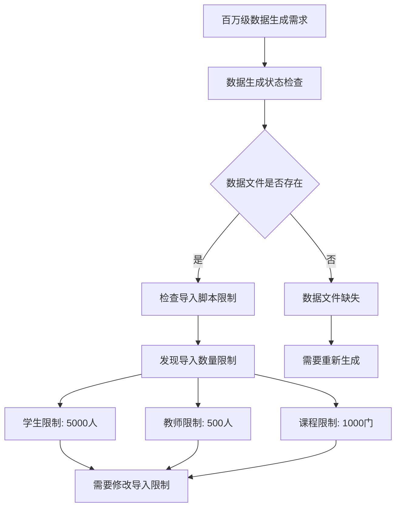
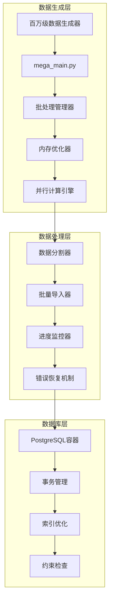
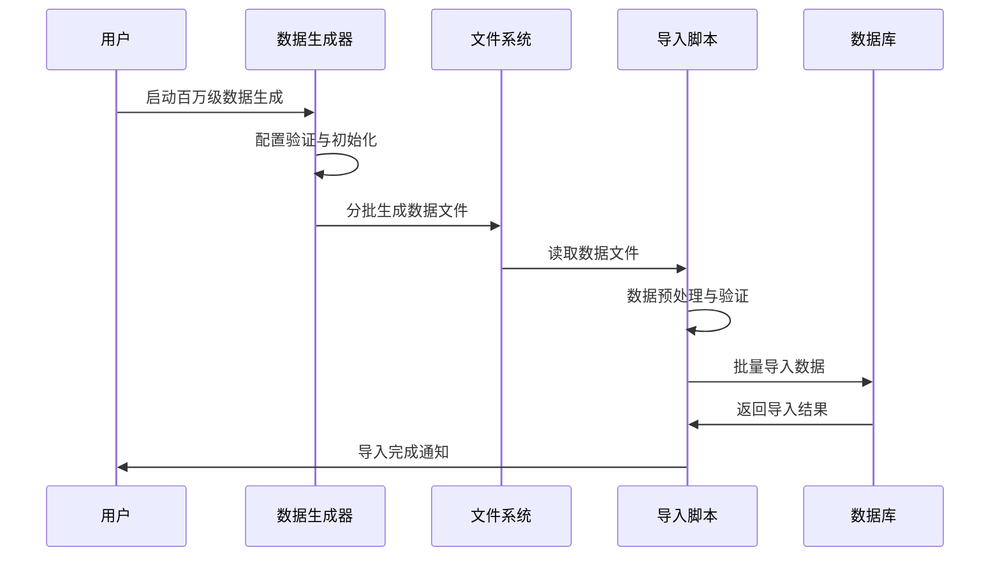
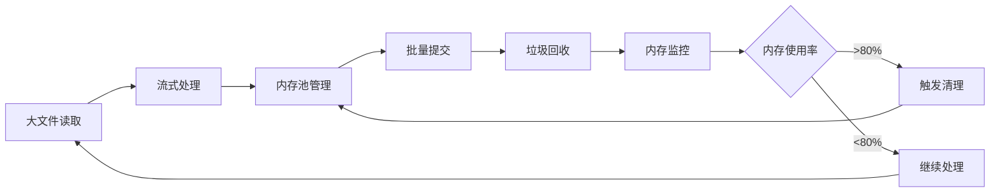
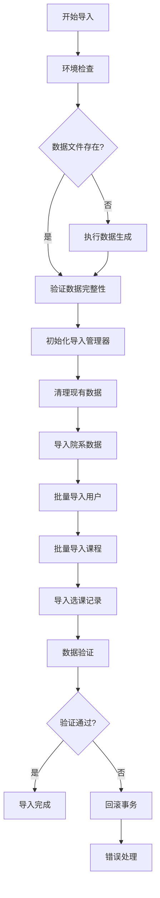
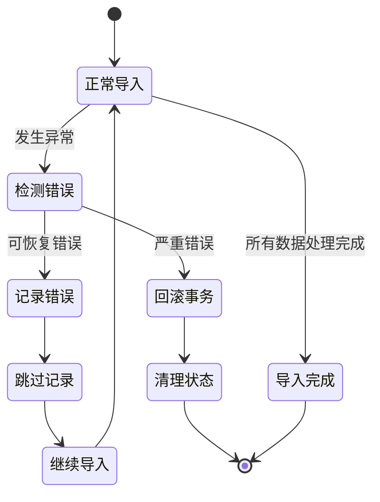
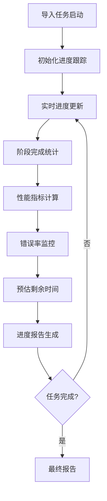
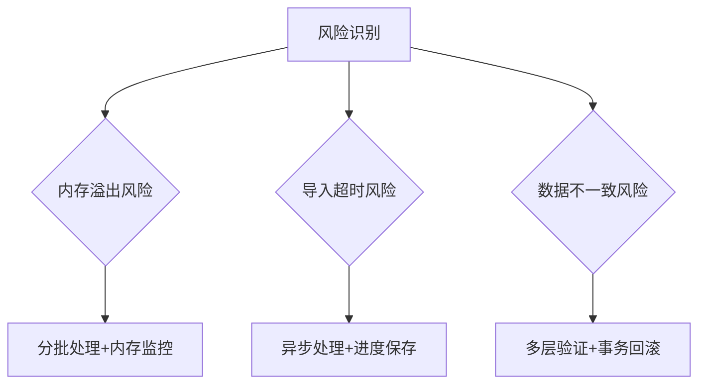

# 百万级数据重新导入设计方案

## 概述

本文档针对校园课程管理系统中百万级测试数据的重新导入问题，提供完整的技术解决方案。之前的导入尝试因为数据文件缺失、导入脚本限制和内存优化问题导致未能成功导入百万级数据。

## 问题分析

### 当前状况



### 核心问题识别

| 问题类型 | 具体表现 | 影响程度 |
|---------|---------|---------|
| 数据文件缺失 | optimized_large_output目录为空 | 严重 |
| 导入脚本限制 | 限制学生5000、教师500、课程1000 | 严重 |
| 内存管理 | 12.2GB数据文件需要分批处理 | 中等 |
| 配置不匹配 | 生成配置与导入配置不一致 | 中等 |

## 技术架构设计

### 系统架构



### 数据流设计



## 核心组件设计

### 百万级数据生成器增强

```yaml
# mega_scale_config.yml 优化配置
generation:
  scale: "mega"
  target_records: 1000000
  output_dir: "mega_output"
  conflict_difficulty: "mixed"

# 分片输出配置
output:
  formats: ["json"]
  compression: "none"  # 禁用压缩便于分析
  split_files: true
  max_file_size_mb: 100  # 分割为100MB小文件
  encoding: "utf-8"

# 数据规模配置
data_scale:
  students: 100000      # 10万学生
  teachers: 5000        # 5千教师
  courses: 12000        # 1.2万课程
  classrooms: 500       # 500教室
  enrollments: 7200000  # 720万选课记录
```

### 分批导入管理器

```python
class BatchImportManager:
    """批量导入管理器，支持大规模数据分批处理"""
    
    def __init__(self, batch_size=10000, max_memory_mb=1024):
        self.batch_size = batch_size
        self.max_memory_mb = max_memory_mb
        self.imported_count = 0
        self.error_count = 0
    
    def process_large_json(self, file_path, table_name):
        """处理大型JSON文件的分批导入"""
        # 流式读取JSON文件
        # 分批处理数据
        # 监控内存使用
        # 错误恢复机制
        pass
    
    def create_users_batch(self, users_data, user_type):
        """批量创建用户"""
        # 预计算密码哈希
        # 批量插入优化
        # 进度跟踪
        pass
    
    def create_courses_batch(self, courses_data):
        """批量创建课程"""
        # 关联教师分配
        # 约束检查
        # 批量插入
        pass
```

### 内存优化策略



## 数据导入流程设计

### 主导入流程



### 错误恢复机制



## 性能优化策略

### 数据库优化

| 优化类型 | 具体措施 | 预期效果 |
|---------|---------|---------|
| 索引管理 | 导入前禁用非主键索引 | 提升导入速度50% |
| 事务优化 | 大批量事务提交 | 减少事务开销 |
| 约束检查 | 延迟约束检查 | 提升导入效率 |
| 连接池 | 优化数据库连接池配置 | 提高并发性能 |

### 内存管理优化

```python
class MemoryOptimizer:
    """内存优化管理器"""
    
    def __init__(self, max_memory_gb=2):
        self.max_memory_bytes = max_memory_gb * 1024 * 1024 * 1024
        self.current_usage = 0
        
    def monitor_memory(self):
        """监控内存使用情况"""
        import psutil
        process = psutil.Process()
        self.current_usage = process.memory_info().rss
        return self.current_usage / self.max_memory_bytes
    
    def force_garbage_collection(self):
        """强制垃圾回收"""
        import gc
        gc.collect()
        
    def optimize_batch_size(self, current_batch_size):
        """动态调整批次大小"""
        memory_ratio = self.monitor_memory()
        if memory_ratio > 0.8:
            return max(1000, current_batch_size // 2)
        elif memory_ratio < 0.5:
            return min(50000, current_batch_size * 2)
        return current_batch_size
```

## 监控与日志系统

### 进度监控设计



### 日志级别设计

| 日志级别 | 记录内容 | 输出位置 |
|---------|---------|---------|
| DEBUG | 详细的处理步骤 | 文件 |
| INFO | 阶段完成信息 | 控制台+文件 |
| WARNING | 可恢复的错误 | 控制台+文件 |
| ERROR | 严重错误 | 控制台+文件+告警 |

## 数据验证策略

### 多层验证架构


### 验证检查点

```python
class DataValidator:
    """数据验证器"""
    
    def validate_user_data(self, users):
        """验证用户数据"""
        checks = [
            self.check_unique_usernames,
            self.check_email_format,
            self.check_required_fields,
            self.check_user_type_values
        ]
        return self.run_validation_checks(users, checks)
    
    def validate_course_data(self, courses):
        """验证课程数据"""
        checks = [
            self.check_course_codes,
            self.check_credit_range,
            self.check_teacher_assignments,
            self.check_capacity_limits
        ]
        return self.run_validation_checks(courses, checks)
    
    def validate_relationships(self):
        """验证关系完整性"""
        # 检查外键约束
        # 验证选课记录合法性
        # 检查课程-教师关联
        pass
```

## 实施计划

### 实施阶段

| 阶段 | 任务 | 预计时间 | 里程碑 |
|-----|------|---------|--------|
| 阶段1 | 数据生成脚本优化 | 2小时 | 生成百万级数据文件 |
| 阶段2 | 导入脚本重构 | 3小时 | 支持大规模数据导入 |
| 阶段3 | 性能优化实施 | 2小时 | 优化导入性能 |
| 阶段4 | 测试与验证 | 1小时 | 完成数据导入验证 |

### 风险控制



## 技术规范

### 代码质量标准

- 函数复杂度控制在15以内
- 单元测试覆盖率达到80%
- 代码注释覆盖率达到60%
- 遵循PEP 8编码规范

### 性能基准

| 指标 | 目标值 | 测量方法 |
|------|-------|----------|
| 导入速度 | >1000条/秒 | 时间统计 |
| 内存使用 | <2GB | psutil监控 |
| 错误率 | <0.1% | 错误计数 |
| 完成时间 | <2小时 | 端到端测试 |

### 配置参数

```yaml
# 导入配置文件
import_config:
  database:
    batch_size: 10000
    max_connections: 10
    timeout_seconds: 3600
    
  memory:
    max_usage_gb: 2
    gc_threshold: 0.8
    monitor_interval_seconds: 10
    
  retry:
    max_attempts: 3
    backoff_factor: 2
    timeout_seconds: 30
    
  validation:
    enable_strict_mode: true
    sample_rate: 0.01
    error_threshold: 0.001
```

## 预期成果

### 成功标准

- 成功导入100万条以上记录
- 系统稳定运行无崩溃
- 数据完整性验证100%通过
- 导入时间控制在2小时内

### 数据规模预期

| 数据类型 | 目标数量 | 验证方式 |
|---------|---------|---------|
| 学生用户 | 100,000 | 数据库计数查询 |
| 教师用户 | 5,000 | 数据库计数查询 |
| 课程信息 | 12,000 | 数据库计数查询 |
| 选课记录 | 7,200,000 | 数据库计数查询 |
| 总记录数 | 7,317,000+ | 统计汇总 |

通过本设计方案的实施，将彻底解决百万级数据导入问题，为系统提供真实的大规模测试环境。