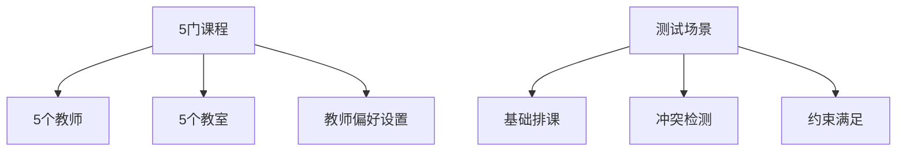
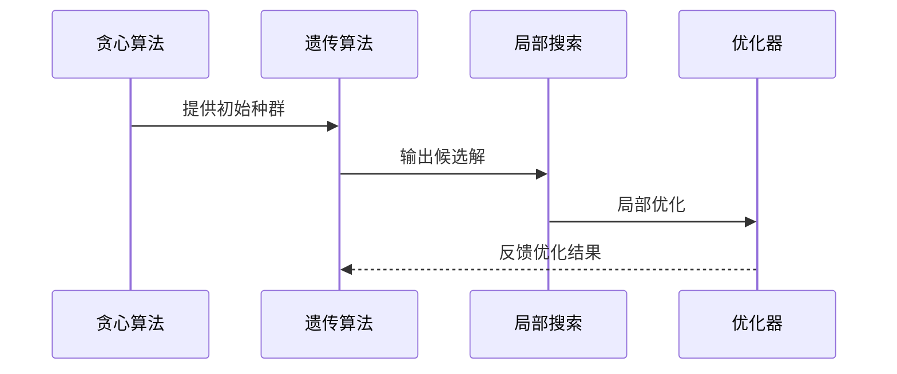

# 排课算法验证与开发设计文档

## 项目概述

### 背景
课程管理系统需要实现智能排课功能，当前项目已包含完整的排课算法模块，包括遗传算法、贪心算法、混合优化算法等。需要验证现有算法的可行性，并根据验证结果优化或重新开发排课算法。

### 目标
1. 验证现有排课算法的实际效果和性能
2. 分析算法在实际数据下的表现
3. 根据验证结果优化算法或开发新算法
4. 确保排课结果能正确显示在课程表中

## 技术架构分析

### 现有算法架构

#### 核心引擎组件
- **SchedulingEngine**: 统一排课引擎，支持多种算法
- **ConstraintManager**: 约束管理器，处理硬约束和软约束
- **ConflictDetector**: 冲突检测器
- **ConflictResolver**: 冲突解决器

#### 算法类型
```
AlgorithmType:
├── GREEDY - 贪心算法
├── GENETIC - 遗传算法  
├── PARALLEL_GENETIC - 并行遗传算法
├── HYBRID - 混合优化算法
└── OPTIMIZER - 后优化器
```

#### 算法模块结构
```
algorithms/
├── engine.py - 核心排课引擎
├── models.py - 数据模型定义
├── genetic/ - 遗传算法实现
│   ├── genetic_algorithm.py
│   ├── individual.py
│   └── operators.py
├── heuristic/ - 启发式算法
│   ├── greedy_scheduler.py
│   ├── local_search.py
│   └── priority_rules.py
├── constraints/ - 约束管理
│   ├── manager.py
│   ├── hard_constraints.py
│   └── soft_constraints.py
├── conflict/ - 冲突处理
│   ├── detector.py
│   ├── resolver.py
│   └── analyzer.py
└── optimizer/ - 优化器
    ├── hybrid_optimizer.py
    ├── parallel_ga.py
    └── schedule_optimizer.py
```

## 算法验证方案

### 验证维度

#### 1. 功能完整性验证
- **基础功能测试**: 验证各算法能正常运行
- **数据兼容性测试**: 验证与现有数据库模型的兼容性
- **接口集成测试**: 验证后端API的正确调用

#### 2. 算法性能验证
- **计算效率**: 不同规模数据下的生成时间
- **解质量**: 适应度评分和冲突数量
- **资源利用率**: 教师、教室、时间段的利用效率

#### 3. 约束满足验证
- **硬约束检查**: 时间冲突、教师冲突、教室容量等
- **软约束优化**: 教师偏好、连续课程安排等
- **业务规则验证**: 学期、学年、课程类型等业务约束

### 验证测试用例设计

#### 小规模测试数据


#### 中规模测试数据
- 50门课程，20个教师，15个教室
- 多种课程类型和时间需求
- 复杂约束条件

#### 大规模测试数据
- 200+门课程，100+教师，50+教室
- 性能压力测试
- 算法收敛性验证

## 算法优化策略

### 当前算法评估

#### 遗传算法优势
- 全局搜索能力强
- 适合复杂约束优化
- 可调参数丰富

#### 遗传算法劣势
- 计算时间长
- 参数调优复杂
- 收敛性不稳定

#### 贪心算法优势
- 计算速度快
- 实现简单
- 适合初解生成

#### 贪心算法劣势
- 容易陷入局部最优
- 对约束敏感
- 解质量不稳定

### 算法改进方向

#### 混合算法策略


#### 自适应参数调整
- 基于数据规模动态调整种群大小
- 根据收敛情况调整变异率
- 实时监控算法性能指标

#### 并行计算优化
- 岛屿模型并行遗传算法
- 多线程冲突检测
- 分布式约束评估

## 性能指标体系

### 算法质量指标

#### 适应度评分系统
```
总适应度 = W1×硬约束满足度 + W2×软约束满足度 + W3×资源利用率
```

#### 约束满足率
- 硬约束满足率: 100%为目标
- 软约束满足率: 80%+为良好
- 冲突解决率: 90%+为优秀

#### 资源利用效率
- 教师工作负荷均衡度
- 教室利用率分布
- 时间段利用率统计

### 性能效率指标

#### 计算时间复杂度
- 小规模数据(≤50课程): < 30秒
- 中规模数据(≤200课程): < 5分钟  
- 大规模数据(≤500课程): < 30分钟

#### 内存使用效率
- 种群内存占用监控
- 约束评估内存优化
- 冲突检测内存管理

## 数据流集成方案

### 算法与数据库集成

#### 数据获取接口
```python
def get_scheduling_data(semester, academic_year):
    courses = Course.objects.filter(
        semester=semester,
        academic_year=academic_year,
        is_active=True
    ).values()
    
    teachers = User.objects.filter(
        user_type='teacher',
        is_active=True
    ).values()
    
    classrooms = Classroom.objects.filter(
        is_available=True
    ).values()
    
    return courses, teachers, classrooms
```

#### 结果保存流程


### API接口设计

#### 排课生成接口
```
POST /api/v1/algorithms/generate/
{
  "algorithm": "hybrid",
  "semester": "2024-2025-1", 
  "academic_year": "2024-2025",
  "algorithm_params": {
    "population_size": 100,
    "max_generations": 200
  }
}
```

#### 排课分析接口
```
POST /api/v1/algorithms/analyze/
{
  "schedule_id": 123
}
```

## 验证实施计划

### 阶段一：基础功能验证
1. **算法模块导入测试**
   - 验证所有算法类正常加载
   - 检查依赖关系完整性
   
2. **示例数据测试**
   - 运行demo.py验证基础功能
   - 分析各算法输出结果
   
3. **API集成测试**  
   - 测试后端算法调用接口
   - 验证数据格式兼容性

### 阶段二：算法性能评估
1. **小规模数据测试**
   - 5-10门课程的排课测试
   - 各算法性能对比分析
   
2. **中规模数据测试**
   - 50-100门课程的排课测试
   - 算法收敛性分析
   
3. **约束满足度测试**
   - 硬约束违反检测
   - 软约束优化效果评估

### 阶段三：实际数据验证
1. **生产数据测试**
   - 使用真实课程数据测试
   - 验证排课结果合理性
   
2. **课程表显示验证**
   - 确保算法结果正确显示
   - 验证学生教师课程表一致性
   
3. **用户体验测试**
   - 排课生成时间测试
   - 结果质量用户评估

### 阶段四：算法优化开发
1. **性能瓶颈分析**
   - 识别算法性能瓶颈
   - 制定优化改进方案
   
2. **算法参数调优**
   - 基于测试结果调优参数
   - 建立最佳实践配置
   
3. **新算法开发**（如需要）
   - 设计改进算法架构
   - 实现新的优化策略

## 风险评估与缓解

### 技术风险

#### 算法性能不足
- **风险**: 现有算法无法满足实际需求
- **缓解**: 准备算法重构方案，采用更高效的启发式方法

#### 约束处理复杂
- **风险**: 复杂约束导致算法失效
- **缓解**: 设计约束分层处理机制，优先满足核心约束

#### 数据兼容性问题  
- **风险**: 算法模型与数据库模型不匹配
- **缓解**: 设计数据适配层，确保格式转换正确

### 业务风险

#### 排课结果不合理
- **风险**: 算法生成的排课不符合实际教学需求
- **缓解**: 加强业务规则验证，提供手动调整功能

#### 生成时间过长
- **风险**: 排课生成时间影响用户体验
- **缓解**: 实现异步处理和进度反馈机制

## 验证成功标准

### 功能完整性标准
- [ ] 所有算法模块正常运行
- [ ] API接口调用成功
- [ ] 数据格式转换正确
- [ ] 课程表正确显示排课结果

### 性能效率标准
- [ ] 小规模数据(≤50课程)生成时间 < 30秒
- [ ] 中规模数据(≤200课程)生成时间 < 5分钟
- [ ] 硬约束满足率 = 100%
- [ ] 软约束满足率 > 80%

### 结果质量标准
- [ ] 无时间冲突和教师冲突
- [ ] 教室容量满足要求
- [ ] 教师工作负荷合理分布
- [ ] 课程时间安排符合教学规律

### 用户体验标准
- [ ] 算法选择界面友好
- [ ] 生成过程有进度提示
- [ ] 结果分析清晰易懂
- [ ] 支持结果导出和分享

## 后续开发建议

### 短期改进
1. **参数配置界面**: 开发算法参数可视化配置
2. **结果对比分析**: 实现多种算法结果对比功能
3. **约束管理工具**: 提供约束条件可视化管理

### 长期规划
1. **机器学习集成**: 基于历史数据训练优化模型
2. **智能推荐系统**: 根据历史偏好推荐最优算法
3. **分布式计算**: 支持大规模数据的分布式排课处理

通过这个系统性的验证和开发方案，我们将能够充分评估现有排课算法的可行性，并基于实际需求进行相应的优化改进。