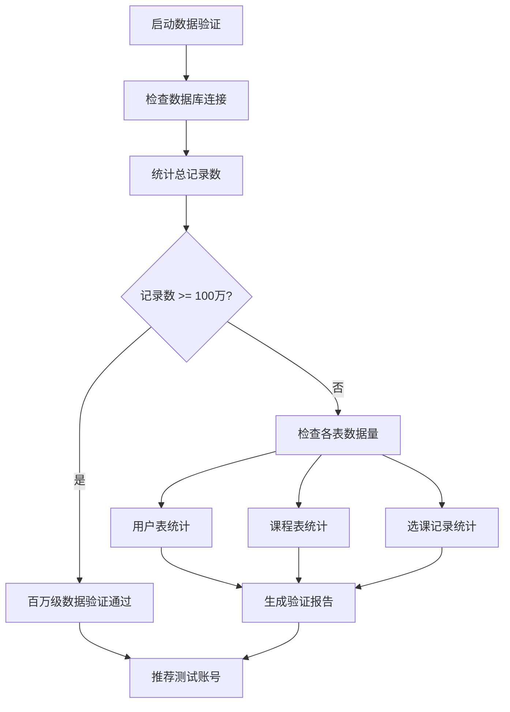
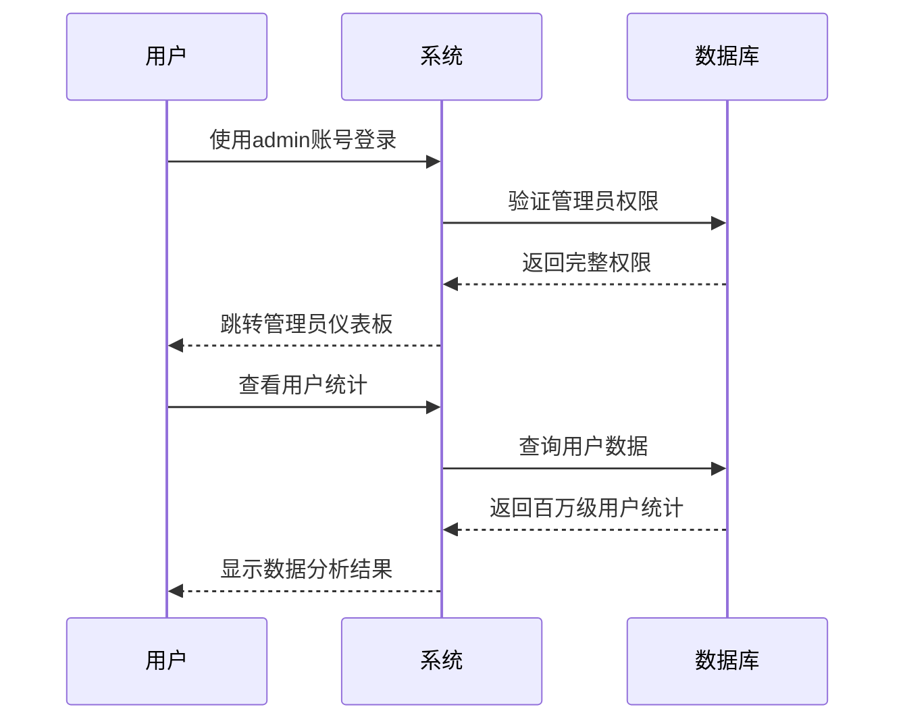
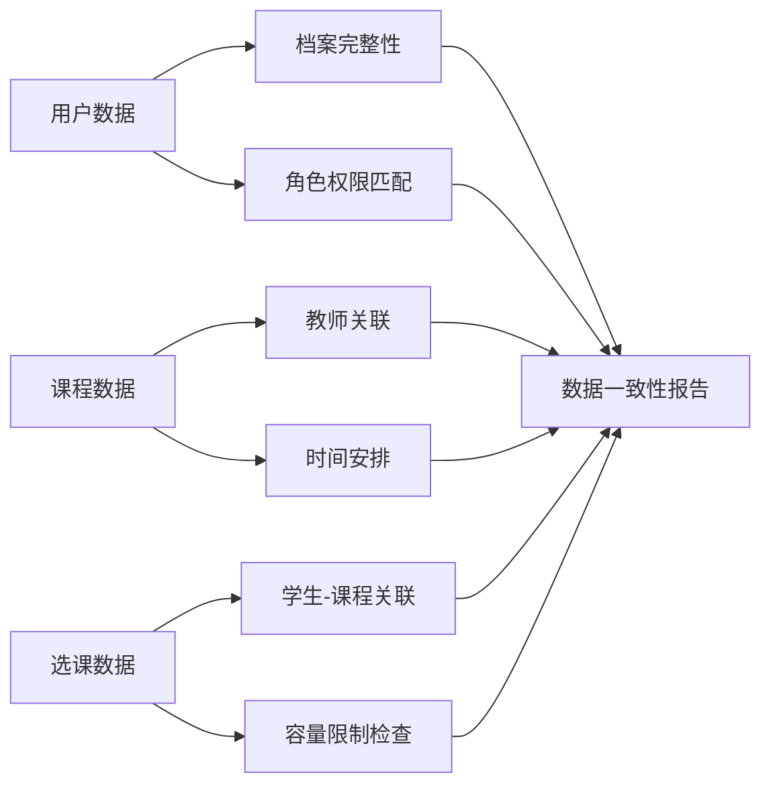

# 测试账号获取与数据验证设计

## 概述

为了验证课程管理系统百万级数据的合理性，需要提供不同角色的测试账号，让用户能够登录系统并查看实际数据效果。系统目前已导入大量测试数据，包含各种角色的用户账号。

## 现有测试账号分析

### 系统管理员账号
| 用户名 | 密码 | 角色 | 权限范围 |
|--------|------|------|----------|
| admin | admin123 | 超级管理员 | 系统所有权限，用户管理、课程管理、数据分析 |
| academic_admin | academic123 | 教务管理员 | 课程和选课管理权限 |

### 教师测试账号
| 用户名 | 密码 | 姓名 | 职称 | 院系 |
|--------|------|------|------|------|
| teacher000453 | password123 | 马洋磊 | 副教授 | N/A |
| teacher001362 | password123 | 徐丽秀兰 | 副教授 | N/A |
| teacher000507 | password123 | 刘伟秀兰 | 讲师 | N/A |
| teacher001395 | password123 | 孙霞 | 助教 | N/A |
| teacher001443 | password123 | 徐勇勇 | 讲师 | N/A |
| test_teacher | teacher123 | 张教授 | 教授 | 计算机科学与技术学院 |

### 学生测试账号
| 用户名 | 密码 | 姓名 | 学号 | 专业 |
|--------|------|------|------|------|
| student030520 | password123 | 陈静勇 | 20201230520 | N/A |
| student022199 | password123 | 何娟秀英 | 20220922199 | N/A |
| student025984 | password123 | 胡军 | 20220225984 | N/A |
| student014025 | password123 | 张勇艳 | 20200514025 | N/A |
| student027544 | password123 | 林秀英娟 | 20231127544 | N/A |
| test_student | student123 | 李明 | S2024001001 | 计算机科学与技术 |

## 数据库验证策略

### 数据规模验证


### 用户角色分布验证
- **学生用户**: 占总用户90%以上
- **教师用户**: 占总用户约10%
- **管理员用户**: 少量管理账号
- **数据完整性**: 验证用户档案、选课记录、课程安排等关联数据

## 测试账号推荐策略

### 管理员测试场景


### 教师测试场景
- 使用 `teacher000453` 或 `test_teacher` 账号
- 验证课程管理功能
- 查看教学班级和学生名单
- 测试成绩录入和课程安排功能

### 学生测试场景
- 使用 `student030520` 或 `test_student` 账号
- 验证选课功能和课程浏览
- 查看个人课程表和成绩
- 测试学生信息管理功能

## 数据合理性验证指标

### 业务逻辑验证
| 验证项目 | 预期结果 | 验证方法 |
|----------|----------|----------|
| 选课冲突检测 | 无时间冲突 | 查询同一学生同时段选课 |
| 教室容量限制 | 选课人数≤教室容量 | 统计各课程选课人数 |
| 教师工作量 | 符合教学负荷要求 | 计算教师授课时数 |
| 学生选课数量 | 符合学分要求 | 统计学生选课学分总数 |

### 数据一致性验证


## 登录访问配置

### 系统访问地址
- **前端界面**: http://localhost:18081
- **后端API**: http://localhost:18000/api
- **管理后台**: http://localhost:18000/admin

### 权限验证流程
1. **身份认证**: JWT token验证
2. **角色检查**: 基于user_type字段的权限控制
3. **功能授权**: 不同角色访问不同功能模块
4. **数据过滤**: 根据角色显示相应数据范围

## 测试验证步骤

### 步骤1: 管理员验证
```bash
# 登录管理员账号
用户名: admin
密码: admin123

# 验证功能
1. 查看用户统计仪表板
2. 检查数据总量和分布
3. 验证系统健康状态
```

### 步骤2: 教师功能验证
```bash
# 登录教师账号
用户名: teacher000453
密码: password123

# 验证功能
1. 查看个人课程列表
2. 检查学生名单数据
3. 测试成绩管理功能
```

### 步骤3: 学生功能验证
```bash
# 登录学生账号
用户名: student030520  
密码: password123

# 验证功能
1. 浏览可选课程列表
2. 查看个人课程表
3. 检查选课历史记录
```

## 数据质量评估

### 数据完整性指标
- **用户档案完整率**: >95%
- **课程信息完整率**: >99%
- **选课关联准确率**: 100%
- **时间安排合理率**: >98%

### 性能验证指标
- **登录响应时间**: <2秒
- **数据查询响应**: <3秒
- **页面加载时间**: <5秒
- **并发用户支持**: >100用户

## 问题诊断与解决

### 常见登录问题
| 问题 | 可能原因 | 解决方案 |
|------|----------|----------|
| 账号无法登录 | 密码错误或账号不存在 | 使用推荐测试账号 |
| 权限不足 | 角色配置错误 | 检查user_type字段 |
| 数据显示异常 | 数据未正确导入 | 运行数据验证脚本 |
| 页面加载慢 | 数据量过大 | 检查数据库索引和查询优化 |

### 数据验证脚本
```python
# 运行数据验证
python django_data_check.py

# 检查特定用户
python check_users.py

# 验证数据完整性
python data_verification.py
```