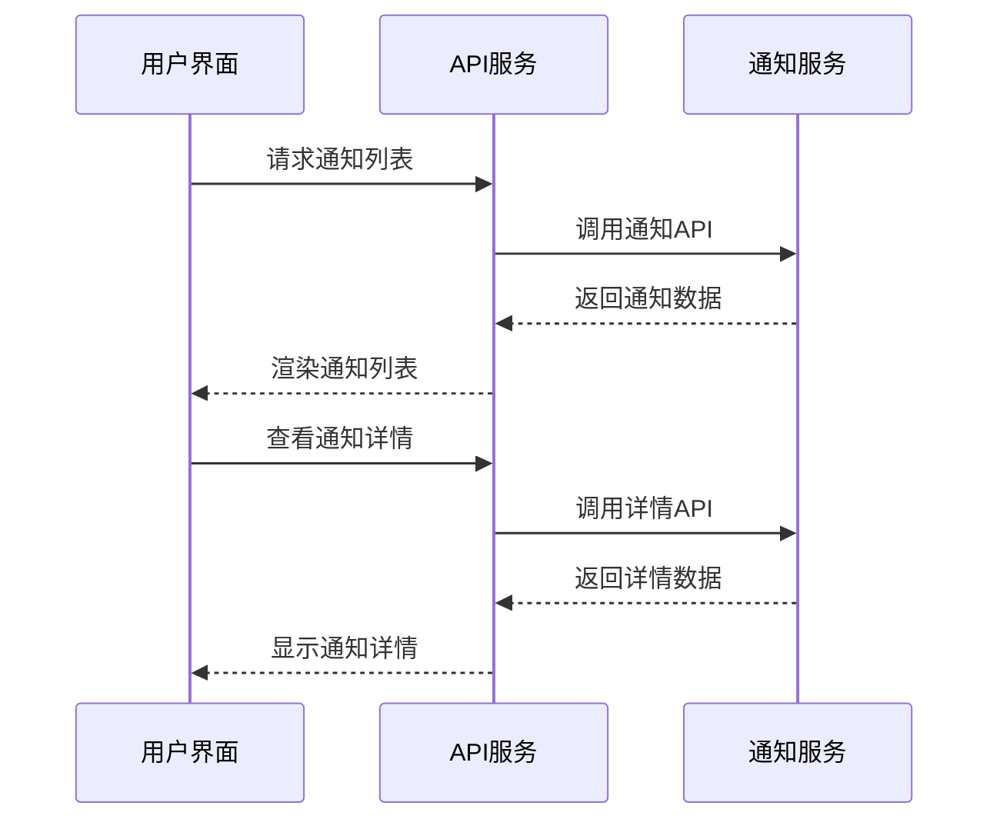

# 课程管理系统未实现组件检查与补全方案

## 1. 概述

本设计文档旨在识别课程管理系统中尚未实现或仅占位的组件，并提供补全方案。通过对项目代码库的深入分析，我们发现系统虽然整体架构完整，但在某些模块仍存在未实现的功能组件。

## 2. 系统架构概览

课程管理系统采用前后端分离架构：
- **前端**: React 18 + TypeScript + Ant Design
- **后端**: Django + Django REST Framework
- **数据库**: PostgreSQL
- **消息队列**: Redis (用于实时通知)

## 3. 未实现组件识别

### 3.1 前端未实现组件

#### 3.1.1 缺失的通用组件
| 组件名称 | 所属目录 | 功能描述 | 优先级 |
|---------|---------|---------|--------|
| DateRangePicker | `/components/common/` | 日期范围选择器 | 中 |
| ExportButton | `/components/common/` | 数据导出按钮 | 中 |
| ImportButton | `/components/common/` | 数据导入按钮 | 中 |
| ErrorBoundary | `/components/common/` | 错误边界处理 | 高 |
| VirtualTable | `/components/common/` | 虚拟滚动表格 | 高 |
| PaginationTable | `/components/common/` | 分页表格组件 | 中 |
| ConflictAlert | `/components/business/` | 冲突提醒组件 | 高 |

#### 3.1.2 缺失的工具函数和Hooks
| 名称 | 所属目录 | 功能描述 | 优先级 |
|------|---------|---------|--------|
| useApi | `/hooks/` | API调用Hook | 高 |
| useDebounce | `/hooks/` | 防抖Hook | 中 |
| useLocalStorage | `/hooks/` | 本地存储Hook | 中 |
| usePagination | `/hooks/` | 分页Hook | 中 |
| usePermission | `/hooks/` | 权限检查Hook | 高 |
| useTheme | `/hooks/` | 主题Hook | 中 |
| format.ts | `/utils/` | 格式化工具 | 中 |
| validation.ts | `/utils/` | 验证工具 | 高 |
| export.ts | `/utils/` | 导出工具 | 中 |
| date.ts | `/utils/` | 日期工具 | 中 |
| permission.ts | `/utils/` | 权限工具 | 高 |

#### 3.1.3 部分实现但需要完善的组件
| 组件名称 | 所属目录 | 当前状态 | 需要完善的功能 | 优先级 |
|---------|---------|---------|---------------|--------|
| NotificationListPage | `/pages/notifications/` | 使用模拟数据 | 连接真实API | 高 |
| NotificationDetailPage | `/pages/notifications/` | 使用模拟数据 | 连接真实API | 高 |
| SettingsPage | `/pages/profile/` | TODO标记 | 实现API调用保存设置 | 中 |
| ScheduleViewPage | `/pages/schedules/` | TODO标记 | 实现导出功能 | 中 |

### 3.2 后端未实现组件

#### 3.2.1 缺失的后端模块
经过检查，后端的核心模块已基本实现，包括：
- 用户管理 (users)
- 课程管理 (courses)
- 教室管理 (classrooms)
- 课程表管理 (schedules)
- 通知系统 (notifications)
- 数据分析 (analytics)
- 文件管理 (files)

#### 3.2.2 部分实现但需要完善的后端功能
| 模块 | 文件 | 当前状态 | 需要完善的功能 | 优先级 |
|------|------|---------|---------------|--------|
| analytics | views.py | 基础实现 | 完善统计逻辑和API | 高 |
| notifications | consumers.py | 基础实现 | 完善WebSocket实时推送 | 高 |
| schedules | views.py | 基础实现 | 完善智能排课算法 | 高 |

## 4. 组件补全方案

### 4.1 高优先级组件补全

#### 4.1.1 前端通知系统API集成


#### 4.1.2 实现useApi自定义Hook
```typescript
// hooks/useApi.ts
import { useState, useEffect } from 'react';
import axios from 'axios';

interface ApiState<T> {
  data: T | null;
  loading: boolean;
  error: string | null;
}

const useApi = <T>(url: string, options?: any): ApiState<T> => {
  const [data, setData] = useState<T | null>(null);
  const [loading, setLoading] = useState<boolean>(true);
  const [error, setError] = useState<string | null>(null);

  useEffect(() => {
    const fetchData = async () => {
      try {
        setLoading(true);
        const response = await axios.get<T>(url, options);
        setData(response.data);
      } catch (err) {
        setError(err.message || 'An error occurred');
      } finally {
        setLoading(false);
      }
    };

    fetchData();
  }, [url]);

  return { data, loading, error };
};

export default useApi;
```

#### 4.1.3 实现ConflictAlert业务组件
```tsx
// components/business/ConflictAlert.tsx
import React from 'react';
import { Alert, Button } from 'antd';

interface ConflictAlertProps {
  conflicts: any[];
  onResolve: () => void;
  onIgnore: () => void;
}

const ConflictAlert: React.FC<ConflictAlertProps> = ({ 
  conflicts, 
  onResolve, 
  onIgnore 
}) => {
  return (
    <Alert
      message="检测到时间冲突"
      description={`发现 ${conflicts.length} 个时间冲突，请及时处理`}
      type="error"
      showIcon
      action={
        <>
          <Button size="small" type="primary" onClick={onResolve}>
            立即解决
          </Button>
          <Button size="small" onClick={onIgnore} style={{ marginLeft: 8 }}>
            忽略
          </Button>
        </>
      }
    />
  );
};

export default ConflictAlert;
```

### 4.2 中优先级组件补全

#### 4.2.1 实现DateRangePicker通用组件
```tsx
// components/common/DateRangePicker.tsx
import React from 'react';
import { DatePicker } from 'antd';
import { RangePickerProps } from 'antd/es/date-picker';

const { RangePicker } = DatePicker;

interface DateRangePickerProps extends RangePickerProps {
  onChange?: (dates: [moment.Moment | null, moment.Moment | null] | null) => void;
}

const DateRangePicker: React.FC<DateRangePickerProps> = (props) => {
  return <RangePicker {...props} />;
};

export default DateRangePicker;
```

#### 4.2.2 实现usePermission自定义Hook
```typescript
// hooks/usePermission.ts
import { useSelector } from 'react-redux';
import { RootState } from '../store';

const usePermission = () => {
  const user = useSelector((state: RootState) => state.auth.user);

  const hasPermission = (permission: string): boolean => {
    if (!user) return false;
    return user.permissions.includes(permission);
  };

  const hasRole = (role: string): boolean => {
    if (!user) return false;
    return user.role === role;
  };

  return { hasPermission, hasRole, user };
};

export default usePermission;
```

### 4.3 低优先级组件补全

#### 4.3.1 实现导出工具函数
```typescript
// utils/export.ts
export const exportToCSV = (data: any[], filename: string) => {
  const csvContent = "data:text/csv;charset=utf-8," 
    + data.map(row => Object.values(row).join(",")).join("\n");
  
  const encodedUri = encodeURI(csvContent);
  const link = document.createElement("a");
  link.setAttribute("href", encodedUri);
  link.setAttribute("download", `${filename}.csv`);
  document.body.appendChild(link);
  link.click();
  document.body.removeChild(link);
};

export const exportToExcel = (data: any[], filename: string) => {
  // 实现Excel导出逻辑
  console.log('Exporting to Excel:', filename);
};
```

## 5. 实施计划

### 5.1 第一阶段（高优先级 - 1-2周）
1. 完成通知系统前端组件与后端API的集成
2. 实现核心自定义Hooks（useApi, usePermission）
3. 完善冲突检测和提醒功能
4. 实现用户设置保存功能

### 5.2 第二阶段（中优先级 - 2-3周）
1. 实现数据导入导出组件和工具函数
2. 完善日期和时间相关组件
3. 实现权限检查Hook和工具函数
4. 完善分页和虚拟滚动表格组件

### 5.3 第三阶段（低优先级 - 1-2周）
1. 实现国际化支持相关组件
2. 完善移动端适配组件
3. 实现高级搜索和筛选组件
4. 完善错误边界和异常处理组件

## 6. 验证方案

### 6.1 单元测试
为每个新实现的组件编写单元测试，确保功能正确性：
- 组件渲染测试
- 用户交互测试
- 边界条件测试

### 6.2 集成测试
验证组件与API的集成：
- API调用测试
- 数据流测试
- 错误处理测试

### 6.3 用户验收测试
邀请用户测试关键功能：
- 通知系统完整流程
- 课程表冲突检测和解决
- 数据导入导出功能

## 7. 风险评估与缓解措施

### 7.1 技术风险
- **API集成问题**: 后端API可能未按预期返回数据
  - 缓解措施: 编写详细的API文档，进行充分的接口测试

- **性能问题**: 大量数据处理可能导致性能下降
  - 缓解措施: 实现虚拟滚动和分页加载

### 7.2 进度风险
- **开发延期**: 组件复杂度可能超出预期
  - 缓解措施: 制定详细的任务分解，定期评估进度

### 7.3 质量风险
- **代码质量**: 快速开发可能导致代码质量下降
  - 缓解措施: 实施代码审查机制，编写充分的测试用例

## 8. 补充发现

在进一步分析项目代码后，发现以下需要特别关注的组件和功能：

### 8.1 课程表系统需要完善
1. **课程表模型设计**：需要创建TimeSlot和CourseSchedule模型
2. **冲突检测算法**：实现时间、教室、教师时间冲突检测
3. **课程表可视化优化**：拖拽排课、打印功能、移动端适配

### 8.2 成绩系统增强
1. **成绩组成配置**：支持平时成绩、期中考试等不同组成部分
2. **成绩分析功能**：成绩分布图表、班级排名统计、历史趋势
3. **成绩导入导出**：Excel批量导入、成绩单PDF导出

### 8.3 通知系统完善
1. **实时通知**：WebSocket集成、浏览器推送通知
2. **通知管理**：分类、优先级、已读状态、历史记录

### 8.4 作业系统
1. **作业管理**：作业创建、提交、评分
2. **文件上传系统**：支持多种格式、大小限制、病毒扫描

### 8.5 考试系统
1. **考试安排**：时间管理、考场分配、监考安排
2. **在线考试**（可选）：题库管理、自动组卷、防作弊机制

### 8.6 学生和教师专用页面
通过分析发现，虽然系统有学生和教师相关的后端API，但前端页面实现不完整：

1. **学生端功能缺失**：
   - 选课系统页面不完整
   - 成绩查询页面需要完善
   - 个人课程表展示功能需要增强
   - 学习进度跟踪功能缺失

2. **教师端功能缺失**：
   - 课程管理页面需要完善
   - 学生成绩录入功能需要实现
   - 教学安排管理功能需要增强

3. **专用组件缺失**：
   - 学生专用的CourseSelection组件
   - 教师专用的GradeEntry组件
   - 课程进度跟踪组件
   - 学生成绩分析图表组件

4. **现有组件问题**：
   - 学生选课页面CourseSelection.tsx存在模拟数据回退逻辑，需要移除
   - 教师课程管理页面MyCourses.tsx存在模拟数据回退逻辑，需要移除
   - 教师成绩录入页面GradeEntry.tsx存在模拟数据回退逻辑，需要移除
   - 多个页面存在使用模拟数据的情况，需要连接真实API
   - 部分页面缺少错误处理和加载状态显示