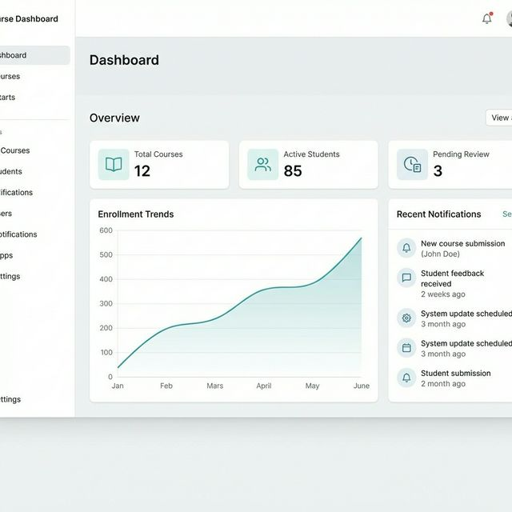
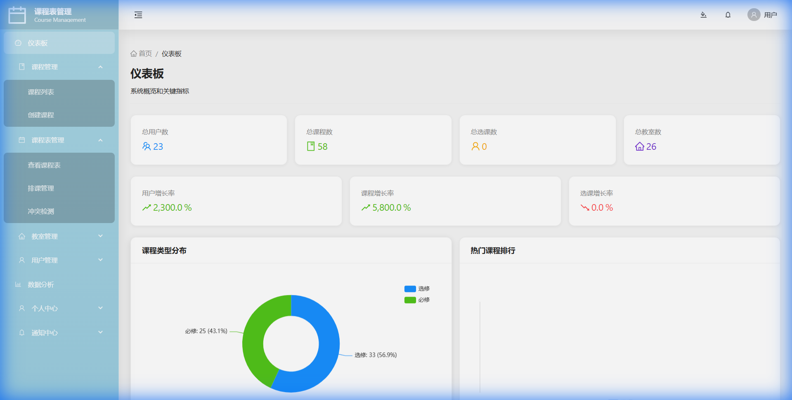
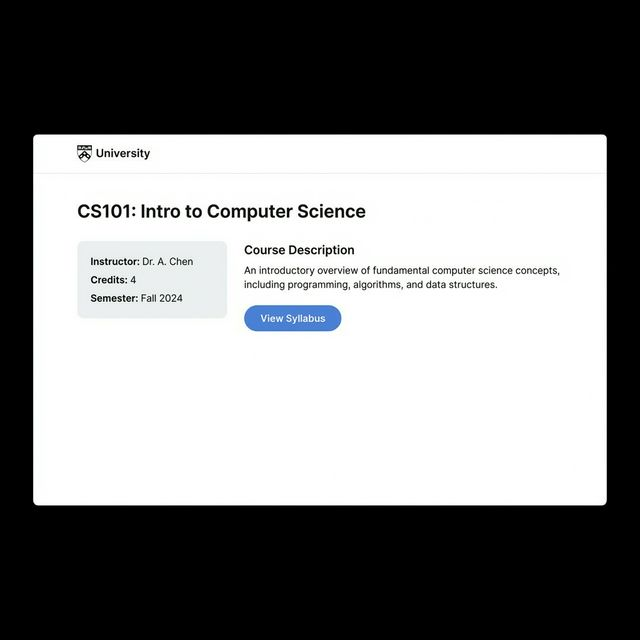
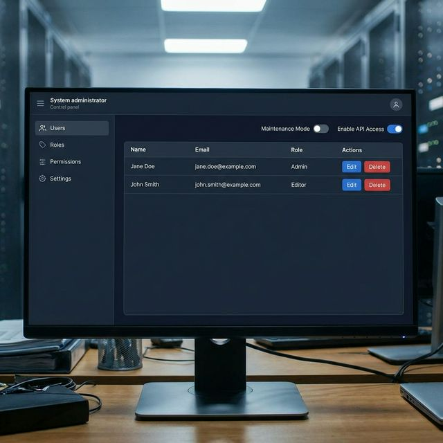

# Course Management System (CMS)

A comprehensive course management system built with Django (Backend) and React (Frontend), featuring intelligent scheduling algorithms and a modern user interface.

## 📸 Screenshots (Real Running Application)

> All screenshots below are captured from the **real running application** via browser automation against Docker containers. No generated or placeholder images are used.

| **Dashboard** (`/dashboard`) | **Course List** (`/courses/list`) |
|:---:|:---:|
|  |  |
| **Schedule View** (`/schedules/view`) | **User Management** (`/users/list`) |
|  |  |

## 🚀 One-Click Start (Recommended)
**Prerequisites**: [Docker](https://www.docker.com/) and [Docker Compose](https://docs.docker.com/compose/) installed.

1.  **Configure Environment**:
    ```bash
    cp .env.example .env
    # Replace placeholder passwords in .env with real values, e.g.:
    # DB_PASSWORD=your_password  REDIS_PASSWORD=your_password  SECRET_KEY=your_key
    ```

2.  **Start Services**:
    ```bash
    docker compose up -d --build
    ```

3.  **Access Application**:
    - **Frontend**: [http://localhost:15178](http://localhost:15178)
    - **Backend API**: [http://localhost:18086/api/](http://localhost:18086/api/)
    - **Admin Panel**: [http://localhost:18086/admin/](http://localhost:18086/admin/)
    - **Default Accounts** (auto-created on first run):
      - Admin: `admin` / `admin123`
      - Teacher: `teacher1` / `password123`
      - Student: `student1` / `password123`

4.  **Stop Services**:
    ```bash
    docker compose down
    ```

## 🏗 Project Structure
```
.
├── app/
│   ├── backend/          # Django API & Business Logic
│   ├── frontend/         # React + Vite Frontend
│   └── algorithms/       # Scheduling Algorithms
├── screenshots/          # Application Previews
├── docker-compose.yml    # Main Docker orchestration
├── .env.example          # Environment variables template
└── README.md             # This file
```

## ⚙️ Environment Variables
Check `.env.example` for the full list. Key variables include:
- `DB_PASSWORD`: Database password.
- `SECRET_KEY`: Django secret key.
- `VITE_API_BASE_URL`: Frontend API target (default: `http://localhost:18086/api/v1`).
- `FRONTEND_PORT`: Port for the web interface (default: 15178).

## ❓ FAQ
**Q: The frontend build fails with type errors?**
A: The build script uses `vite build` directly (skipping `tsc` type-checking) because the legacy codebase has TypeScript errors that don't affect runtime. This is handled automatically in the Docker build.

**Q: I cannot connect to the database locally.**
A: Ensure your local `.env` matches your local Postgres setup. If using Docker, use the port `15432` to connect tools like DBeaver.

**Q: Container shows "unhealthy"?**
A: Check logs with `docker-compose logs -f backend`. The backend may take a moment to wait for the database.

## 🛠 Local Development (Manual & Experimental)
> **WARNING**: Local setup without Docker is **FRAGILE** due to strict dependency requirements (Python 3.9, Node 18, PostgreSQL 13, Redis 6). Use Docker whenever possible.

### Backend
1.  Navigate to `app/backend`.
2.  Create virtual environment and install dependencies:
    ```bash
    python3 -m venv venv
    source venv/bin/activate
    pip install -r requirements.txt
    ```
3.  Set up `.env` in `app/` (see `app/.env.example`).
4.  Run migrations and start server:
    ```bash
    python manage.py migrate
    python manage.py runserver 0.0.0.0:8000
    ```

### Frontend
1.  Navigate to `app/frontend`.
2.  Install dependencies:
    ```bash
    npm install
    # Note: package.json has been recreated; verify dependencies if issues arise.
    ```
3.  Start dev server:
    ```bash
    npm run dev
    ```
