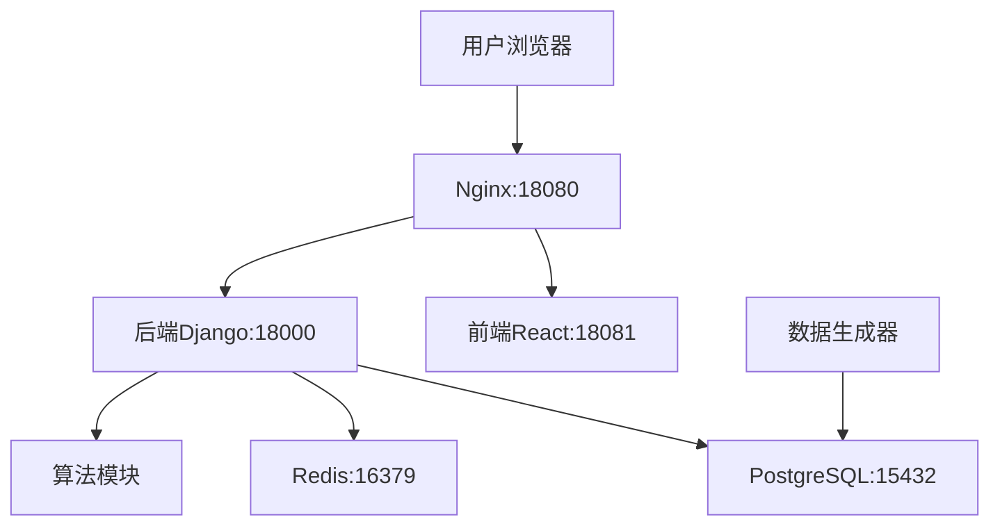

# 课程管理系统 - 新环境部署完整技术文档

## 📋 文档概述

本文档提供课程管理系统在新环境中完整部署的详细指南，包含依赖检查、环境配置、Docker部署、系统初始化和验证测试的完整流程。

---

## 🏗️ 系统架构

### 技术栈概览
```
前端层: React 18.2.0 + Vite 4.5.0 + Antd 5.12.8
API层: Django 4.2.7 + DRF 3.14.0 + JWT认证
数据层: PostgreSQL 13 + Redis 6
算法层: Python + NumPy + 遗传算法
部署层: Docker + Docker Compose + Nginx
```

### 服务架构图


---

## 🔧 环境要求

### 系统要求
- **操作系统**: Windows 10/11, macOS, Linux
- **内存**: 最低 8GB，推荐 16GB
- **存储**: 最低 10GB 可用空间
- **网络**: 可访问Docker Hub和npm源

### 必需软件
- **Docker**: 版本 20.10+
- **Docker Compose**: 版本 2.0+
- **Git**: 用于代码管理（可选）

### 验证环境
```bash
docker --version          # 应显示 Docker version 20.10+
docker compose version    # 应显示 Docker Compose version v2.0+
```

---

## 📦 项目依赖分析

### 1. 后端依赖 (Django)

#### 核心框架
| 包名 | 版本 | 用途 |
|------|------|------|
| Django | 4.2.7 | Web框架 |
| djangorestframework | 3.14.0 | REST API框架 |
| djangorestframework-simplejwt | 5.3.0 | JWT认证 |

#### 数据库与缓存
| 包名 | 版本 | 用途 |
|------|------|------|
| psycopg2-binary | 2.9.10 | PostgreSQL驱动 |
| redis | 5.0.1 | Redis客户端 |
| django-redis | 5.4.0 | Django Redis集成 |

#### 异步任务与工具
| 包名 | 版本 | 用途 |
|------|------|------|
| celery | 5.3.4 | 异步任务队列 |
| gunicorn | 21.2.0 | WSGI服务器 |
| django-cors-headers | 4.3.1 | CORS支持 |

#### 科学计算
| 包名 | 版本 | 用途 |
|------|------|------|
| numpy | ≥1.21.0 | 数值计算（算法支持） |

### 2. 前端依赖 (React)

#### 核心框架
| 包名 | 版本 | 用途 |
|------|------|------|
| react | 18.2.0 | UI框架 |
| react-dom | 18.2.0 | DOM渲染 |
| vite | 4.5.0 | 构建工具 |

#### UI组件与样式
| 包名 | 版本 | 用途 |
|------|------|------|
| antd | 5.12.8 | 企业级UI组件库 |
| styled-components | 6.1.1 | CSS-in-JS |

#### 状态管理与路由
| 包名 | 版本 | 用途 |
|------|------|------|
| @reduxjs/toolkit | 1.9.7 | 状态管理 |
| react-router-dom | 6.18.0 | 路由管理 |
| axios | 1.6.2 | HTTP客户端 |

#### 数据可视化
| 包名 | 版本 | 用途 |
|------|------|------|
| echarts | 5.4.3 | 图表库 |
| recharts | 3.1.2 | React图表组件 |

### 3. 算法模块依赖
| 包名 | 版本 | 用途 |
|------|------|------|
| numpy | ≥1.21.0 | 数值计算 |
| openpyxl | ≥3.0.9 | Excel文件处理 |
| reportlab | ≥3.6.0 | PDF生成 |

### 4. 数据生成器依赖
| 包名 | 版本 | 用途 |
|------|------|------|
| faker | 19.6.2 | 假数据生成 |
| pandas | ≥2.1.1 | 数据处理 |
| psycopg2-binary | 2.9.7 | 数据库连接 |
| tqdm | 4.66.1 | 进度条显示 |

---

## 🚀 快速部署指南

### 第一步：获取项目代码
```bash
# 如果有Git仓库
git clone <repository-url>
cd course-management-system

# 或者直接使用现有项目目录
cd /path/to/course-management-system
```

### 第二步：环境配置

#### 创建环境变量文件
```bash
# 复制环境变量模板
cp .env.example .env
```

#### 配置 .env 文件
```env
# 数据库配置
DB_PASSWORD=postgres123
DB_HOST=db
DB_PORT=5432
DB_NAME=course_management

# Redis缓存配置
REDIS_PASSWORD=redis123
REDIS_HOST=redis
REDIS_PORT=6379

# Django后端配置
SECRET_KEY=course-management-dev-secret-key-12345
DEBUG=False
ALLOWED_HOSTS=localhost,127.0.0.1,backend

# CORS跨域配置
CORS_ALLOWED_ORIGINS=http://localhost:18081,http://127.0.0.1:18081,http://localhost:18080,http://127.0.0.1:18080

# 安全配置（开发环境）
SECURE_SSL_REDIRECT=False
SECURE_HSTS_SECONDS=0

# 算法模块配置
ALGORITHM_TIMEOUT=300
GENETIC_ALGORITHM_POPULATION_SIZE=100
GENETIC_ALGORITHM_GENERATIONS=50
```

### 第三步：Docker部署

#### 启动所有服务
```bash
# 构建并启动服务
docker compose up -d

# 查看服务状态
docker compose ps

# 查看日志（如需要）
docker compose logs -f
```

#### 等待服务就绪
所有服务启动后，应看到以下状态：
```
NAME                         STATUS
course_management_backend    Up (healthy)
course_management_db         Up (healthy)  
course_management_frontend   Up (healthy)
course_management_redis      Up (healthy)
```

### 第四步：系统初始化

#### 执行数据库迁移
```bash
docker compose exec backend python manage.py migrate
```

#### 收集静态文件
```bash
docker compose exec backend python manage.py collectstatic --noinput
```

#### 创建管理员账户
使用预置脚本创建默认管理员：
```bash
# 复制脚本到容器
docker cp create_admin_user.py course_management_backend:/app/

# 执行创建脚本
docker compose exec backend python create_admin_user.py
```

**默认管理员账户信息：**
- 用户名: `admin`
- 密码: `admin123456`
- 邮箱: `admin@course-management.com`

#### 生成测试数据
```bash
# 生成测试用户和基础数据
docker compose exec backend python create_test_users.py
```

### 第五步：验证部署

#### 服务健康检查
```bash
# 检查前端
curl http://localhost:18081/

# 检查后端API
curl http://localhost:18000/api/health/

# 检查管理后台
curl http://localhost:18000/admin/
```

---

## 🌐 访问地址

### 主要服务地址
| 服务 | 地址 | 用途 |
|------|------|------|
| 前端应用 | http://localhost:18081 | 用户界面 |
| 后端API | http://localhost:18000 | REST API |
| 管理后台 | http://localhost:18000/admin/ | 系统管理 |
| API文档 | http://localhost:18000/api/schema/swagger-ui/ | 接口文档 |

### 数据库连接信息
| 参数 | 值 |
|------|---|
| 主机 | localhost |
| 端口 | 15432 |
| 数据库 | course_management |
| 用户名 | postgres |
| 密码 | postgres123 |

### Redis连接信息
| 参数 | 值 |
|------|---|
| 主机 | localhost |
| 端口 | 16379 |
| 密码 | redis123 |

---

## 👤 测试账户信息

### 管理员账户
- **用户名**: admin
- **密码**: admin123456
- **权限**: 超级管理员

### 测试用户账户
系统自动生成了以下测试账户：

#### 教务管理员
- **用户名**: academic_admin
- **密码**: password123
- **角色**: 教务管理员

#### 教师账户
- **用户名**: teacher001
- **密码**: password123
- **角色**: 教师

#### 学生账户
- **用户名**: student001
- **密码**: password123
- **角色**: 学生

*注：系统还自动生成了更多测试用户，可通过管理后台查看完整列表*

---

## 🛠️ 开发环境配置

### 本地开发模式
如需进行开发，可使用以下配置：

#### 前端开发
```bash
# 进入前端目录
cd frontend

# 安装依赖
npm install

# 启动开发服务器
npm run dev
```

#### 后端开发
```bash
# 进入容器进行开发
docker compose exec backend bash

# 或者在本地安装依赖
pip install -r backend/requirements.txt
```

### IDE配置建议

#### 数据库连接配置
- **主机**: localhost
- **端口**: 15432
- **数据库**: course_management
- **用户名**: postgres
- **密码**: postgres123

#### 后端调试配置
- **调试端口**: 18000
- **管理后台**: http://localhost:18000/admin/

---

## 📊 性能监控

### 容器资源监控
```bash
# 查看容器资源使用
docker stats

# 查看具体服务资源
docker compose exec backend ps aux
docker compose exec frontend ps aux
```

### 日志管理
```bash
# 查看所有服务日志
docker compose logs

# 查看特定服务日志
docker compose logs backend
docker compose logs frontend
docker compose logs db
docker compose logs redis

# 实时跟踪日志
docker compose logs -f backend
```

### 数据库监控
```bash
# 连接数据库
docker compose exec db psql -U postgres -d course_management

# 查看数据库状态
\dt  # 列出所有表
\du  # 列出用户
SELECT COUNT(*) FROM users_user;  # 查看用户数量
```

---

## 🔍 故障排除

### 常见问题及解决方案

#### 1. 端口冲突
**症状**: Docker启动失败，提示端口被占用
**解决**: 
```bash
# 查看端口占用
netstat -ano | findstr 18000
netstat -ano | findstr 18081

# 修改docker-compose.yml中的端口映射
# 或者停止占用端口的服务
```

#### 2. 数据库连接失败
**症状**: 后端无法连接数据库
**解决**:
```bash
# 检查数据库容器状态
docker compose ps db

# 检查数据库日志
docker compose logs db

# 重启数据库服务
docker compose restart db
```

#### 3. 前端无法访问后端
**症状**: 前端页面空白或API调用失败
**解决**:
```bash
# 检查CORS配置
# 确认.env文件中CORS_ALLOWED_ORIGINS包含前端地址

# 检查网络连接
docker compose exec frontend ping backend

# 重启服务
docker compose restart frontend backend
```

#### 4. 容器内存不足
**症状**: 容器频繁重启或OOM错误
**解决**:
```bash
# 检查Docker资源限制
docker system df

# 清理未使用的资源
docker system prune

# 调整docker-compose.yml中的资源限制
```

#### 5. 静态文件加载失败
**症状**: 管理后台样式丢失
**解决**:
```bash
# 重新收集静态文件
docker compose exec backend python manage.py collectstatic --noinput

# 检查静态文件卷挂载
docker compose exec backend ls -la /app/static/
```

### 诊断命令集

#### 系统健康检查
```bash
# 检查所有服务状态
docker compose ps

# 检查服务健康状态
docker compose exec backend python manage.py check

# 检查数据库连接
docker compose exec backend python manage.py check --database default

# 测试Redis连接
docker compose exec redis redis-cli ping
```

#### 网络诊断
```bash
# 检查容器网络
docker network ls
docker network inspect course-management-system_course_management_network

# 测试服务间连通性
docker compose exec backend ping db
docker compose exec backend ping redis
docker compose exec frontend ping backend
```

---

## 🔄 数据管理

### 数据备份

#### 数据库备份
```bash
# 备份数据库
docker compose exec db pg_dump -U postgres course_management > backup.sql

# 恢复数据库
docker compose exec -T db psql -U postgres course_management < backup.sql
```

#### 容器数据备份
```bash
# 备份数据卷
docker run --rm -v course-management-system_postgres_data:/data -v $(pwd):/backup alpine tar czf /backup/db_backup.tar.gz /data

# 恢复数据卷
docker run --rm -v course-management-system_postgres_data:/data -v $(pwd):/backup alpine tar xzf /backup/db_backup.tar.gz -C /
```

### 数据重置

#### 完全重置
```bash
# 停止服务
docker compose down

# 删除数据卷
docker volume rm course-management-system_postgres_data
docker volume rm course-management-system_redis_data

# 重新启动
docker compose up -d

# 重新初始化
docker compose exec backend python manage.py migrate
docker compose exec backend python create_admin_user.py
docker compose exec backend python create_test_users.py
```

#### 仅重置应用数据
```bash
# 连接数据库
docker compose exec db psql -U postgres course_management

# 清空应用表（保留认证相关表）
TRUNCATE courses_course, students_student, teachers_teacher, schedules_schedule CASCADE;
```

---

## 📈 扩展与优化

### 水平扩展

#### 后端服务扩展
```yaml
# 在docker-compose.yml中添加
services:
  backend:
    # ... 现有配置
    deploy:
      replicas: 3  # 启动3个后端实例
```

#### 负载均衡配置
```bash
# 启用Nginx负载均衡
docker compose --profile production up -d
```

### 性能优化

#### 数据库优化
```sql
-- 创建索引以提升查询性能
CREATE INDEX idx_courses_name ON courses_course(name);
CREATE INDEX idx_schedules_date ON schedules_schedule(date);
CREATE INDEX idx_users_role ON users_user(role);
```

#### Redis缓存优化
```python
# 在Django设置中配置缓存
CACHES = {
    'default': {
        'BACKEND': 'django_redis.cache.RedisCache',
        'LOCATION': 'redis://redis:6379/0',
        'OPTIONS': {
            'CLIENT_CLASS': 'django_redis.client.DefaultClient',
        }
    }
}
```

### 生产环境部署

#### 使用生产配置
```bash
# 使用生产环境配置文件
docker compose -f docker-compose.prod.yml up -d
```

#### SSL证书配置
```bash
# 添加SSL证书到nginx配置
# 修改deployment/docker/nginx.conf
```

---

## 📋 部署检查清单

### 部署前检查
- [ ] Docker和Docker Compose已安装并正常运行
- [ ] 系统有足够的内存和存储空间
- [ ] 网络可访问Docker Hub和npm源
- [ ] 项目代码完整下载

### 配置检查
- [ ] .env文件已创建并配置正确
- [ ] docker-compose.yml文件存在
- [ ] 端口映射无冲突
- [ ] 环境变量设置正确

### 启动检查
- [ ] 所有容器启动成功
- [ ] 容器健康检查通过
- [ ] 数据库迁移执行成功
- [ ] 静态文件收集完成

### 功能检查
- [ ] 前端应用可正常访问
- [ ] 后端API响应正常
- [ ] 管理后台可以登录
- [ ] 数据库连接正常
- [ ] Redis缓存工作正常

### 数据检查
- [ ] 管理员账户创建成功
- [ ] 测试数据生成完成
- [ ] 用户可以正常登录
- [ ] 基本功能可以使用

---

## 📞 技术支持

### 日志位置
- **应用日志**: `/app/logs/` (容器内)
- **Docker日志**: `docker compose logs [service]`
- **系统日志**: 根据操作系统位置

### 配置文件位置
- **环境变量**: `.env`
- **Docker配置**: `docker-compose.yml`
- **Nginx配置**: `deployment/docker/nginx.conf`
- **数据库初始化**: `deployment/docker/init-db.sql`

### 常用命令速查

```bash
# 查看服务状态
docker compose ps

# 重启服务
docker compose restart [service]

# 查看日志
docker compose logs -f [service]

# 进入容器
docker compose exec [service] bash

# 执行管理命令
docker compose exec backend python manage.py [command]

# 停止服务
docker compose down

# 完全重建
docker compose down && docker compose up -d --build
```

---

## 📝 更新日志

### 版本 1.0.0 (2024-08-31)
- ✅ 完成Docker容器化部署
- ✅ 实现前后端分离架构
- ✅ 配置PostgreSQL数据库
- ✅ 集成Redis缓存服务
- ✅ 自动化部署脚本
- ✅ 完整的测试数据生成
- ✅ 系统健康检查机制
- ✅ 完整的技术文档

---

**📅 文档更新时间**: 2024年8月31日  
**🏷️ 文档版本**: v1.0.0  
**👨‍💻 适用环境**: 开发环境、测试环境  
**🔧 维护状态**: 积极维护中

---

*本文档提供课程管理系统完整的部署指南。如遇问题，请参考故障排除章节或联系技术支持。*