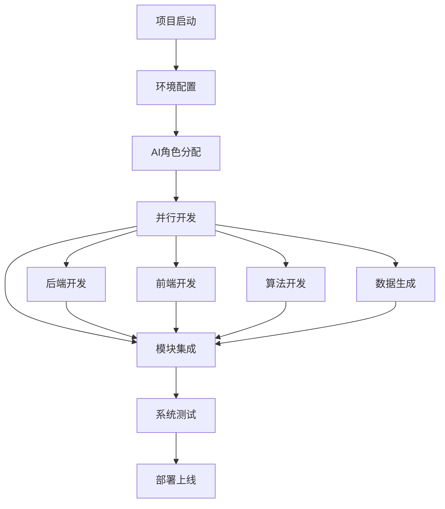

# 校园课程表管理工具 - 项目实施指南与AI协同开发流程

## 一、项目概述

本项目旨在开发一个基于Python的校园课程表管理工具，采用现代化的技术栈和AI协同开发模式，实现高效、智能的课程表管理功能。

### 1.1 项目目标
- 构建稳定可靠的课程表管理系统
- 实现智能化的自动排课算法
- 提供美观大气的用户界面
- 支持大规模用户并发访问
- 具备良好的扩展性和维护性

### 1.2 技术特色
- **后端**: Django + PostgreSQL + Redis
- **前端**: React + TypeScript + Ant Design
- **算法**: 遗传算法 + 启发式算法
- **部署**: Docker + Nginx + Gunicorn

## 二、AI协同开发流程

### 2.1 开发模式说明
本项目采用多AI协同开发模式，将复杂的系统开发任务分解为多个专业模块，每个模块由专门的AI助手负责，确保开发质量和效率。

### 2.2 AI角色分工

#### AI-1: 后端架构师
**职责**: 负责后端核心功能开发
**技能**: Django、PostgreSQL、Redis、API设计
**输入**: `模块1-后端核心开发提示词.md`
**输出**: 完整的后端代码和API文档

#### AI-2: 前端设计师
**职责**: 负责前端界面开发
**技能**: React、TypeScript、UI/UX设计
**输入**: `模块2-前端界面开发提示词.md`
**输出**: 美观的前端界面和组件库

#### AI-3: 算法工程师
**职责**: 负责智能排课算法实现
**技能**: 遗传算法、优化算法、数据结构
**输入**: `模块3-智能排课算法提示词.md`
**输出**: 高效的排课算法和优化策略

#### AI-4: 数据工程师
**职责**: 负责测试数据生成
**技能**: 数据建模、数据生成、性能测试
**输入**: `模块4-测试数据生成提示词.md`
**输出**: 大规模真实测试数据

### 2.3 协同工作流程



## 三、详细实施步骤

### 3.1 第一阶段：环境准备 (第1-2周)

#### 3.1.1 系统环境配置
```bash
# 1. 更新系统
sudo apt update && sudo apt upgrade -y

# 2. 安装基础工具
sudo apt install -y git curl wget vim build-essential

# 3. 安装Python 3.11
sudo apt install -y python3.11 python3.11-dev python3.11-venv

# 4. 安装Node.js 18
curl -fsSL https://deb.nodesource.com/setup_18.x | sudo -E bash -
sudo apt install -y nodejs

# 5. 安装PostgreSQL
sudo apt install -y postgresql-15 postgresql-contrib-15

# 6. 安装Redis
sudo apt install -y redis-server

# 7. 安装Docker
curl -fsSL https://get.docker.com -o get-docker.sh
sudo sh get-docker.sh
```

#### 3.1.2 项目目录结构创建
```bash
mkdir course-management-system
cd course-management-system

# 创建后端目录
mkdir backend
cd backend
python3.11 -m venv venv
source venv/bin/activate
pip install django djangorestframework psycopg2-binary redis celery

# 创建前端目录
cd ..
mkdir frontend
cd frontend
npm create vite@latest . -- --template react-ts
npm install antd @reduxjs/toolkit react-redux react-router-dom

# 创建算法目录
cd ..
mkdir algorithms
mkdir data-generator
mkdir docs
mkdir deployment
```

### 3.2 第二阶段：后端开发 (第3-6周)

#### 3.2.1 AI-1 工作任务
使用 `模块1-后端核心开发提示词.md` 指导AI-1完成以下任务：

1. **Django项目初始化**
```bash
cd backend
django-admin startproject course_management .
python manage.py startapp users
python manage.py startapp courses
python manage.py startapp schedules
python manage.py startapp classrooms
python manage.py startapp analytics
```

2. **数据库设计与模型创建**
- 用户模型 (User)
- 课程模型 (Course)
- 教室模型 (Classroom)
- 排课模型 (Schedule)
- 选课模型 (Enrollment)

3. **API接口开发**
- 用户认证API
- 课程管理API
- 排课管理API
- 数据统计API

4. **权限系统实现**
- 基于角色的权限控制
- JWT认证机制
- API权限装饰器

#### 3.2.2 质量检查清单
- [ ] 所有API接口正常工作
- [ ] 数据库迁移无错误
- [ ] 单元测试覆盖率 > 80%
- [ ] API文档完整
- [ ] 代码符合PEP 8规范

### 3.3 第三阶段：前端开发 (第7-10周)

#### 3.3.1 AI-2 工作任务
使用 `模块2-前端界面开发提示词.md` 指导AI-2完成以下任务：

1. **项目架构搭建**
```typescript
// 配置路由
import { BrowserRouter, Routes, Route } from 'react-router-dom';

// 配置状态管理
import { configureStore } from '@reduxjs/toolkit';

// 配置主题
import { ConfigProvider } from 'antd';
import zhCN from 'antd/locale/zh_CN';
```

2. **核心组件开发**
- 登录页面
- 仪表板页面
- 课程表页面
- 课程管理页面
- 用户管理页面

3. **状态管理实现**
- Redux Toolkit配置
- API状态管理
- 用户状态管理
- 课程表状态管理

4. **UI/UX优化**
- 响应式布局
- 主题定制
- 动画效果
- 无障碍访问

#### 3.3.2 质量检查清单
- [ ] 所有页面正常渲染
- [ ] 响应式布局适配
- [ ] 用户体验流畅
- [ ] 代码类型安全
- [ ] 组件可复用性好

### 3.4 第四阶段：算法开发 (第11-13周)

#### 3.4.1 AI-3 工作任务
使用 `模块3-智能排课算法提示词.md` 指导AI-3完成以下任务：

1. **约束条件定义**
```python
class HardConstraints:
    @staticmethod
    def teacher_conflict_check(schedule, assignment):
        # 教师时间冲突检查
        pass
    
    @staticmethod
    def classroom_conflict_check(schedule, assignment):
        # 教室时间冲突检查
        pass
```

2. **遗传算法实现**
```python
class GeneticAlgorithm:
    def __init__(self, population_size=100, mutation_rate=0.1):
        self.population_size = population_size
        self.mutation_rate = mutation_rate
    
    def evolve(self, courses, teachers, classrooms):
        # 进化算法主逻辑
        pass
```

3. **冲突检测机制**
```python
class ConflictDetector:
    def detect_conflicts(self, assignments):
        # 冲突检测逻辑
        pass
```

4. **性能优化**
- 并行计算
- 缓存机制
- 算法调优

#### 3.4.2 质量检查清单
- [ ] 算法正确性验证
- [ ] 性能基准测试
- [ ] 大规模数据测试
- [ ] 算法参数调优
- [ ] 代码文档完整

### 3.5 第五阶段：数据生成 (第14周)

#### 3.5.1 AI-4 工作任务
使用 `模块4-测试数据生成提示词.md` 指导AI-4完成以下任务：

1. **基础数据生成**
```python
def generate_complete_dataset(scale='large'):
    # 生成院系、专业、用户、课程等数据
    departments = generate_departments(20)
    students = generate_students(25000, majors)
    teachers = generate_teachers(1500, departments)
    courses = generate_courses(3000, departments, teachers)
    return dataset
```

2. **复杂场景模拟**
- 选课冲突场景
- 教师时间偏好
- 教室容量限制
- 课程先修关系

3. **数据验证与导出**
- 数据完整性检查
- 多格式导出 (JSON, SQL, CSV)
- 性能测试数据集

#### 3.5.2 质量检查清单
- [ ] 数据规模符合要求
- [ ] 数据关系正确
- [ ] 复杂场景覆盖全面
- [ ] 导出格式正确
- [ ] 性能测试通过

### 3.6 第六阶段：系统集成 (第15-16周)

#### 3.6.1 集成任务
1. **前后端联调**
- API接口对接
- 数据格式统一
- 错误处理机制

2. **算法集成**
- 排课算法接入
- 实时计算优化
- 结果展示优化

3. **系统测试**
- 功能测试
- 性能测试
- 安全测试
- 兼容性测试

#### 3.6.2 部署准备
```dockerfile
# Dockerfile for backend
FROM python:3.11-slim
WORKDIR /app
COPY requirements.txt .
RUN pip install -r requirements.txt
COPY . .
CMD ["gunicorn", "course_management.wsgi:application"]
```

```dockerfile
# Dockerfile for frontend
FROM node:18-alpine
WORKDIR /app
COPY package*.json ./
RUN npm install
COPY . .
RUN npm run build
FROM nginx:alpine
COPY --from=0 /app/dist /usr/share/nginx/html
```

### 3.7 第七阶段：部署上线 (第17周)

#### 3.7.1 生产环境部署
```yaml
# docker-compose.yml
version: '3.8'
services:
  db:
    image: postgres:15
    environment:
      POSTGRES_DB: course_management
      POSTGRES_USER: admin
      POSTGRES_PASSWORD: secure_password
  
  redis:
    image: redis:7-alpine
  
  backend:
    build: ./backend
    depends_on:
      - db
      - redis
  
  frontend:
    build: ./frontend
    ports:
      - "80:80"
    depends_on:
      - backend
```

#### 3.7.2 监控与维护
- 日志监控 (ELK Stack)
- 性能监控 (Prometheus + Grafana)
- 错误追踪 (Sentry)
- 备份策略

## 四、AI协同开发最佳实践

### 4.1 提示词优化原则
1. **明确性**: 提示词描述清晰、具体
2. **完整性**: 包含所有必要的技术细节
3. **可执行性**: 提供具体的代码示例
4. **可验证性**: 包含质量检查标准

### 4.2 协作沟通机制
1. **定期同步**: 每周进行模块间接口对齐
2. **文档共享**: 实时更新技术文档
3. **代码审查**: 交叉检查代码质量
4. **问题追踪**: 及时记录和解决问题

### 4.3 质量保证措施
1. **自动化测试**: 单元测试、集成测试、端到端测试
2. **代码规范**: 统一的编码标准和格式化工具
3. **持续集成**: 自动化构建和部署流程
4. **性能监控**: 实时监控系统性能指标

## 五、项目交付标准

### 5.1 功能完整性
- [ ] 用户管理功能完整
- [ ] 课程管理功能完整
- [ ] 智能排课功能正常
- [ ] 数据统计功能准确
- [ ] 系统权限控制有效

### 5.2 性能指标
- [ ] 支持1000+并发用户
- [ ] API响应时间 < 200ms
- [ ] 页面加载时间 < 3s
- [ ] 排课算法执行时间 < 30s
- [ ] 系统可用性 > 99.9%

### 5.3 代码质量
- [ ] 单元测试覆盖率 > 80%
- [ ] 代码重复率 < 5%
- [ ] 代码复杂度合理
- [ ] 文档完整性 > 90%
- [ ] 安全漏洞数量 = 0

### 5.4 用户体验
- [ ] 界面美观大气
- [ ] 操作流程简洁
- [ ] 响应式设计适配
- [ ] 错误提示友好
- [ ] 帮助文档完善

---

通过以上详细的实施指南和AI协同开发流程，可以确保校园课程表管理工具项目的高质量交付。每个AI助手按照专门的提示词文件进行开发，最终集成为一个完整、稳定、高效的系统。
